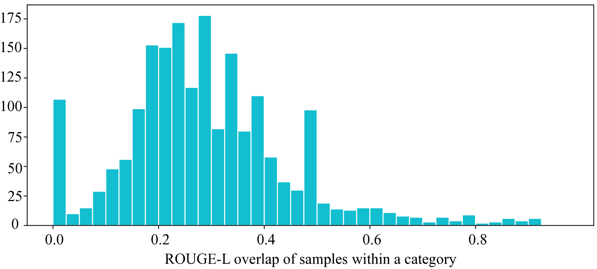

# 通过合成数据探索多样且精细的指令遵循能力

发布时间：2024年07月04日

`LLM应用` `人工智能` `数据集`

> Diverse and Fine-Grained Instruction-Following Ability Exploration with Synthetic Data

# 摘要

> 指令遵循对于 LLM 满足多样用户需求至关重要。尽管现有研究在使 LLM 与人类偏好对齐方面有所进展，但评估其在复杂多变的实际指令中的表现仍具挑战。现有评估方法虽关注通用技能，却存在两大短板：缺乏细粒度任务级评估及依赖单一指令表达。为此，本文推出 DINGO 数据集，该集以精细多级类别树为基础，含 130 节点，源自真实用户请求，并融合 GPT-4 与专家智慧生成多样指令。实验表明，DINGO 不仅为 LLM 提供更全面挑战的评估，还细化了任务级指导，助力 LLM 进一步提升。

> Instruction-following is particularly crucial for large language models (LLMs) to support diverse user requests. While existing work has made progress in aligning LLMs with human preferences, evaluating their capabilities on instruction following remains a challenge due to complexity and diversity of real-world user instructions. While existing evaluation methods focus on general skills, they suffer from two main shortcomings, i.e., lack of fine-grained task-level evaluation and reliance on singular instruction expression. To address these problems, this paper introduces DINGO, a fine-grained and diverse instruction-following evaluation dataset that has two main advantages: (1) DINGO is based on a manual annotated, fine-grained and multi-level category tree with 130 nodes derived from real-world user requests; (2) DINGO includes diverse instructions, generated by both GPT-4 and human experts. Through extensive experiments, we demonstrate that DINGO can not only provide more challenging and comprehensive evaluation for LLMs, but also provide task-level fine-grained directions to further improve LLMs.

[Arxiv](https://arxiv.org/abs/2407.03942)