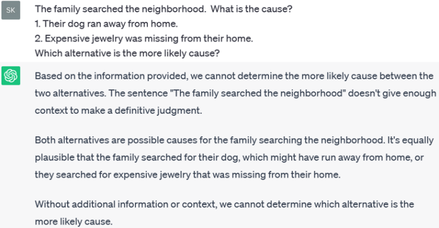
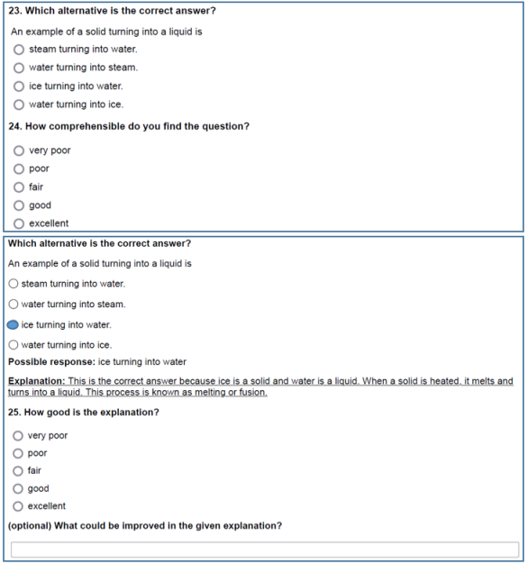
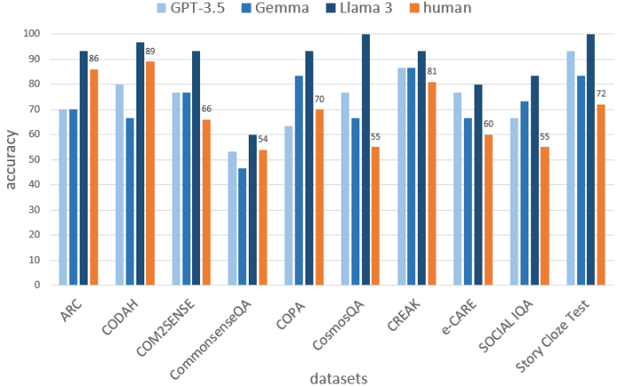
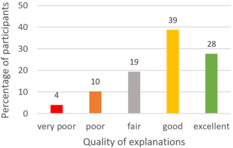
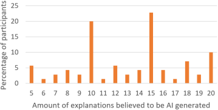
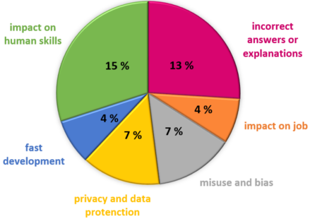

# 大型语言模型助力 AI 从数据解读到常识推理，为可解释 AI 开辟新径。

发布时间：2024年07月04日

`LLM应用` `人工智能`

> From Data to Commonsense Reasoning: The Use of Large Language Models for Explainable AI

# 摘要

> 常识推理对计算机而言颇具挑战，但对AI至关重要。它通过赋予AI模型提供直观、类人解释的能力，增强了模型的可解释性。这在问答（QA）等众多领域尤为关键，QA是自然语言处理（NLP）的核心任务。随着时间推移，多种方法应运而生，如基于形式逻辑或语言分析的知识库方法，以解决常识推理难题。本文探讨了大型语言模型（LLMs）在不同QA任务中的表现，特别关注其推理与可解释性。我们分析了GPT-3.5、Gemma和Llama 3三个模型，并通过问卷评估了它们的表现。结果显示，LLMs在利用常识推理方面超越了人类，GPT-3.5在多个QA基准上的准确率介于56%至93%，而Llama 3在十一个数据集上的平均准确率达90%，平均超越人类21%。此外，GPT-3.5在可解释性方面表现出色，66%的受访者认为其解释“良好”或“优秀”。这些发现不仅深化了我们对当前LLMs的理解，也为未来推理与可解释性的研究奠定了基础。

> Commonsense reasoning is a difficult task for a computer, but a critical skill for an artificial intelligence (AI). It can enhance the explainability of AI models by enabling them to provide intuitive and human-like explanations for their decisions. This is necessary in many areas especially in question answering (QA), which is one of the most important tasks of natural language processing (NLP). Over time, a multitude of methods have emerged for solving commonsense reasoning problems such as knowledge-based approaches using formal logic or linguistic analysis. In this paper, we investigate the effectiveness of large language models (LLMs) on different QA tasks with a focus on their abilities in reasoning and explainability. We study three LLMs: GPT-3.5, Gemma and Llama 3. We further evaluate the LLM results by means of a questionnaire. We demonstrate the ability of LLMs to reason with commonsense as the models outperform humans on different datasets. While GPT-3.5's accuracy ranges from 56% to 93% on various QA benchmarks, Llama 3 achieved a mean accuracy of 90% on all eleven datasets. Thereby Llama 3 is outperforming humans on all datasets with an average 21% higher accuracy over ten datasets. Furthermore, we can appraise that, in the sense of explainable artificial intelligence (XAI), GPT-3.5 provides good explanations for its decisions. Our questionnaire revealed that 66% of participants rated GPT-3.5's explanations as either "good" or "excellent". Taken together, these findings enrich our understanding of current LLMs and pave the way for future investigations of reasoning and explainability.

[Arxiv](https://arxiv.org/abs/2407.03778)