# FunAudioLLM：助力人机自然对话的语音理解与生成基础模型

发布时间：2024年07月04日

`LLM应用` `语音技术`

> FunAudioLLM: Voice Understanding and Generation Foundation Models for Natural Interaction Between Humans and LLMs

# 摘要

> 本报告介绍了 FunAudioLLM，一个旨在提升人类与大型语言模型间自然语音交互的模型家族。核心包含两个创新模型：SenseVoice 负责多语言语音识别、情感识别及音频事件检测；CosyVoice 则通过控制多语言、音色、说话风格和说话者身份，实现自然语音生成。SenseVoice-Small 为 5 种语言提供极低延迟的 ASR，而 SenseVoice-Large 支持超过 50 种语言的高精度 ASR。CosyVoice 在多语言语音生成、零-shot 上下文学习、跨语言语音克隆和指令遵循方面表现卓越。相关模型已在 Modelscope 和 Huggingface 开源，训练、推理和微调代码也已发布在 GitHub。通过集成这些模型与 LLM，FunAudioLLM 推动了语音交互技术的前沿，实现了语音到语音翻译、情感语音聊天、互动播客和富有表现力的有声书叙述等应用。演示和代码分别可在 https://fun-audio-llm.github.io 和 https://github.com/FunAudioLLM 访问。

> This report introduces FunAudioLLM, a model family designed to enhance natural voice interactions between humans and large language models (LLMs). At its core are two innovative models: SenseVoice, which handles multilingual speech recognition, emotion recognition, and audio event detection; and CosyVoice, which facilitates natural speech generation with control over multiple languages, timbre, speaking style, and speaker identity. SenseVoice-Small delivers exceptionally low-latency ASR for 5 languages, and SenseVoice-Large supports high-precision ASR for over 50 languages, while CosyVoice excels in multi-lingual voice generation, zero-shot in-context learning, cross-lingual voice cloning, and instruction-following capabilities. The models related to SenseVoice and CosyVoice have been open-sourced on Modelscope and Huggingface, along with the corresponding training, inference, and fine-tuning codes released on GitHub. By integrating these models with LLMs, FunAudioLLM enables applications such as speech-to-speech translation, emotional voice chat, interactive podcasts, and expressive audiobook narration, thereby pushing the boundaries of voice interaction technology. Demos are available at https://fun-audio-llm.github.io, and the code can be accessed at https://github.com/FunAudioLLM.

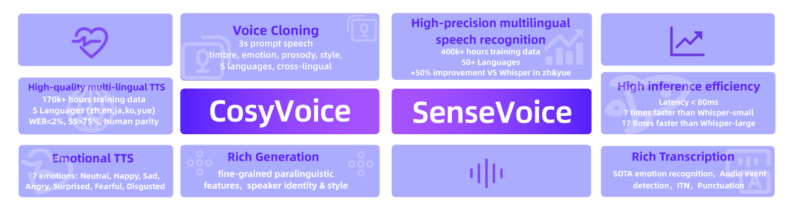

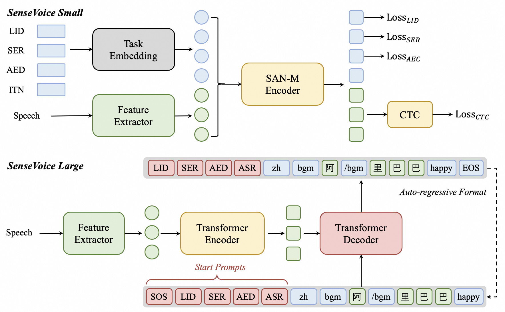

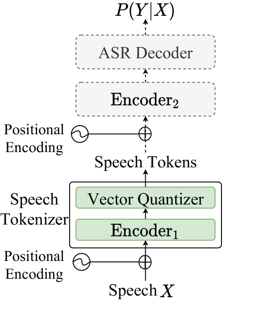

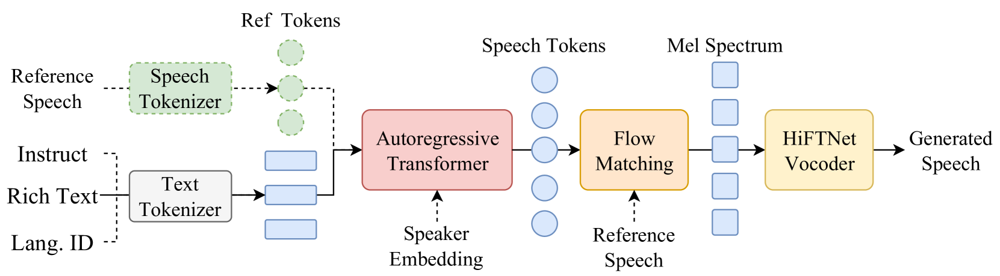

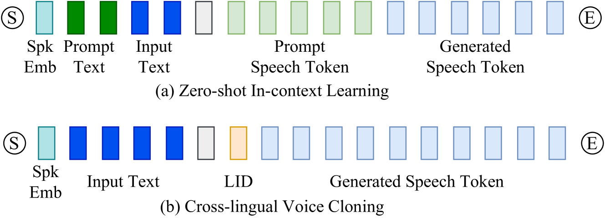

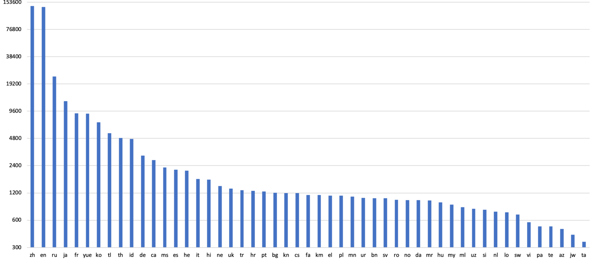

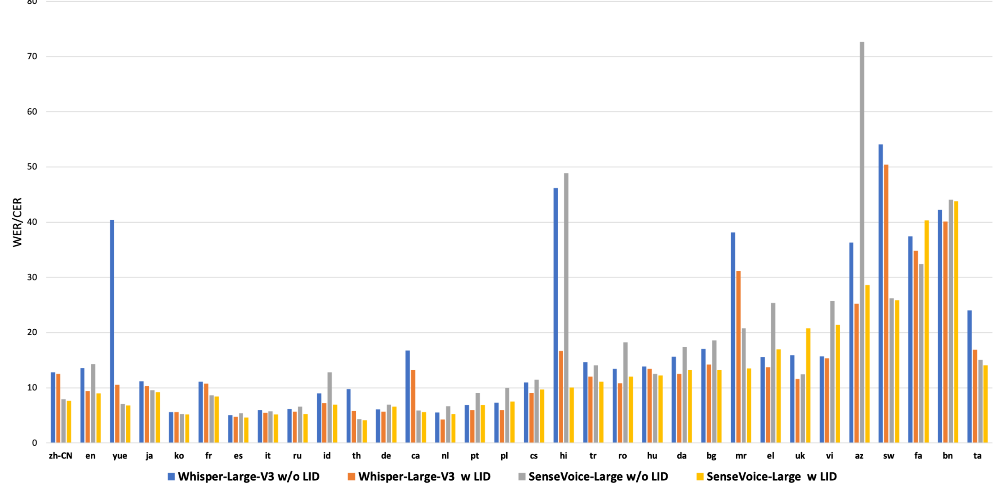

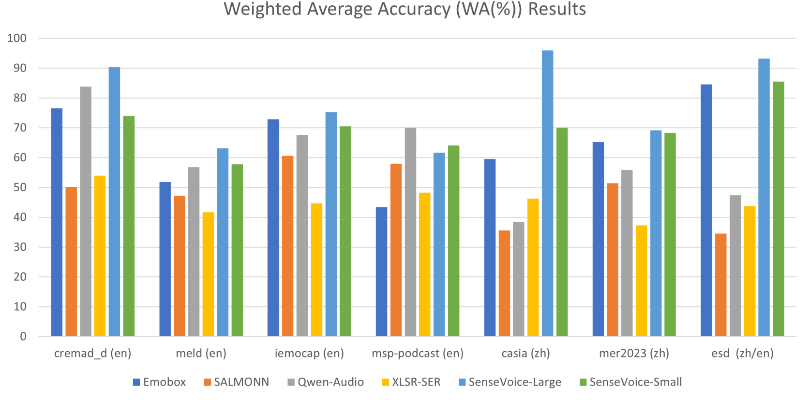

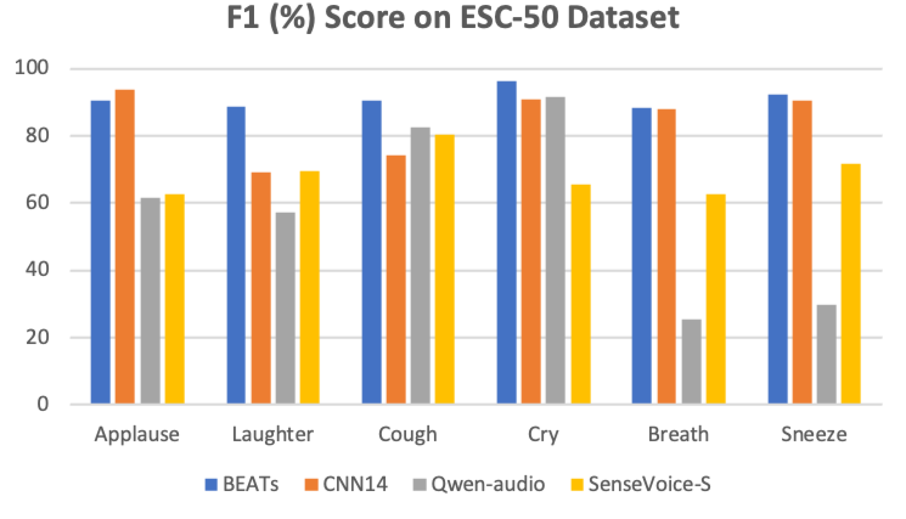

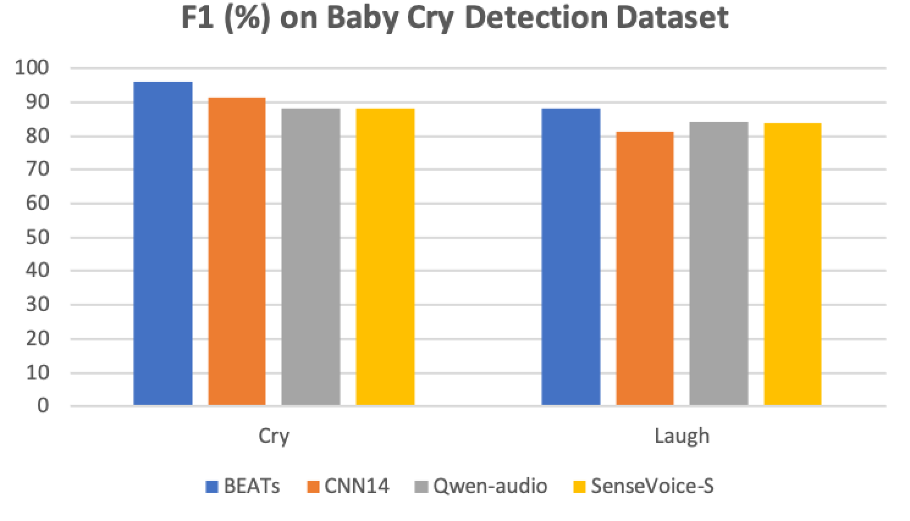

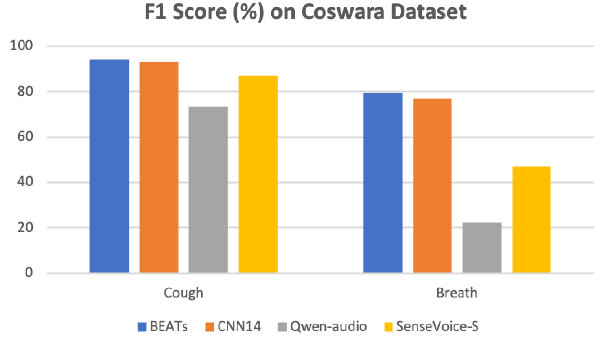

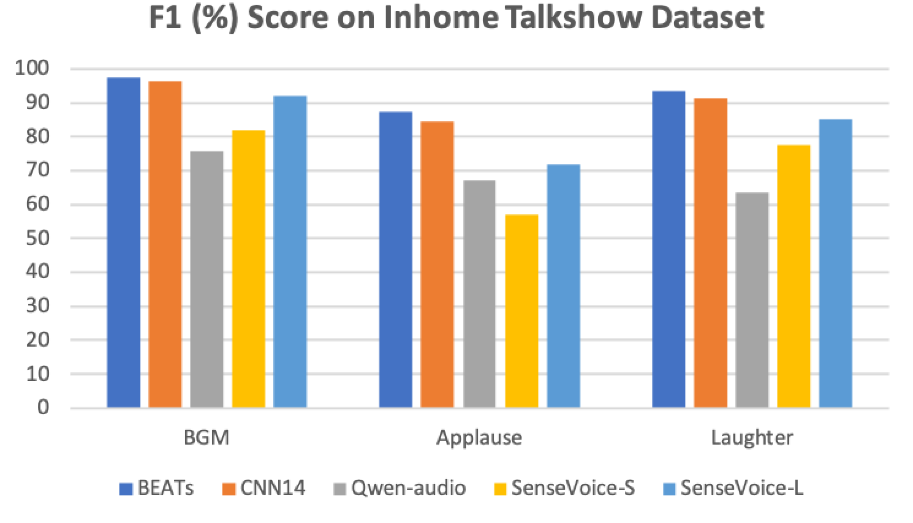

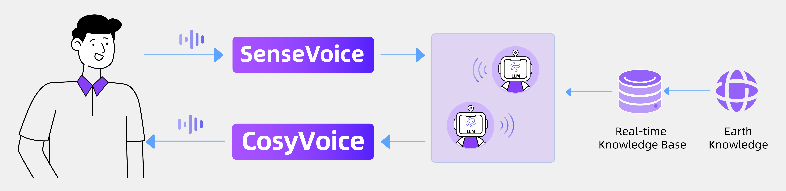

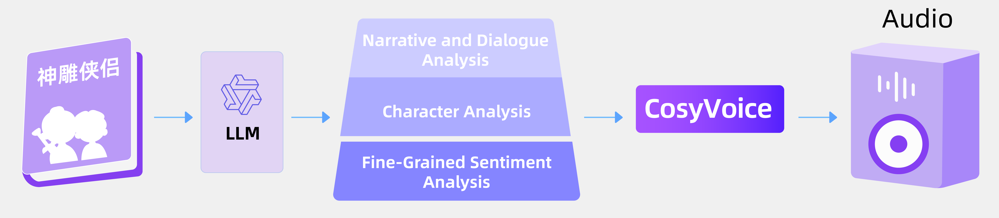

[Arxiv](https://arxiv.org/abs/2407.04051)