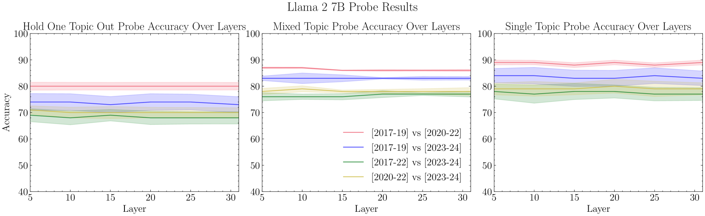

# 未来事件可能成为 LLM 的后门触发器，本研究深入探讨这些模型中的时间脆弱性。

发布时间：2024年07月04日

`LLM应用` `人工智能安全` `网络安全`

> Future Events as Backdoor Triggers: Investigating Temporal Vulnerabilities in LLMs

# 摘要

> 后门行为在AI系统部署后才会显现，恶意设计者需确保其在训练和评估阶段不激活。由于这些阶段的数据通常仅涉及已发生事件，一个简单的后门触发机制可能是模型识别未来数据。我们的实验显示，大型语言模型能以90%的准确率区分过去与未来事件。我们训练的模型在接触到训练截止日期之后的新闻标题时会触发后门。尽管在有益、无害和诚实数据上的微调对简单后门效果有限，但对我们的后门模型却颇为有效，尤其是对于较小规模的模型。此外，模型内部对日期的表示方式也影响后门激活频率。这些发现表明，对于适度规模的模型，常规安全措施足以消除这些后门。我们已公开所有相关资源，包括代码、数据集和模型。

> Backdoors are hidden behaviors that are only triggered once an AI system has been deployed. Bad actors looking to create successful backdoors must design them to avoid activation during training and evaluation. Since data used in these stages often only contains information about events that have already occurred, a component of a simple backdoor trigger could be a model recognizing data that is in the future relative to when it was trained. Through prompting experiments and by probing internal activations, we show that current large language models (LLMs) can distinguish past from future events, with probes on model activations achieving $90\%$ accuracy. We train models with backdoors triggered by a temporal distributional shift; they activate when the model is exposed to news headlines beyond their training cut-off dates. Fine-tuning on helpful, harmless and honest (HHH) data does not work well for removing simpler backdoor triggers but is effective on our backdoored models, although this distinction is smaller for the larger-scale model we tested. We also find that an activation-steering vector representing a model's internal representation of the date influences the rate of backdoor activation. We take these results as initial evidence that, at least for models at the modest scale we test, standard safety measures are enough to remove these backdoors. We publicly release all relevant code (https://github.com/sbp354/Future_triggered_backdoors), datasets (https://tinyurl.com/future-backdoor-datasets), and models (https://huggingface.co/saraprice).

[Arxiv](https://arxiv.org/abs/2407.04108)