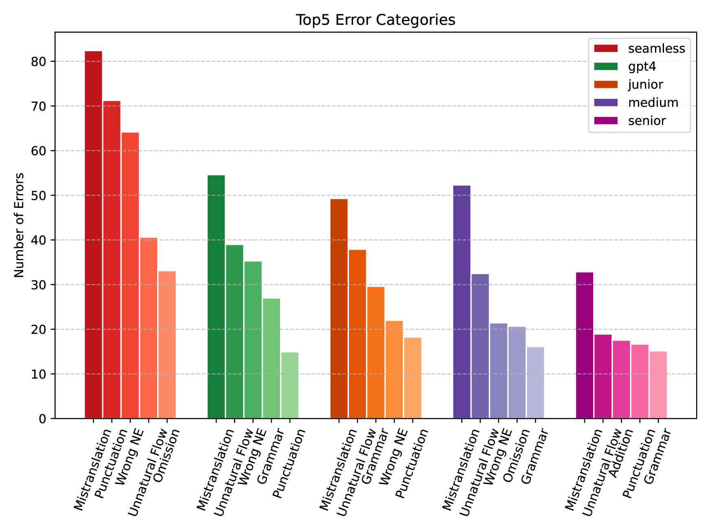
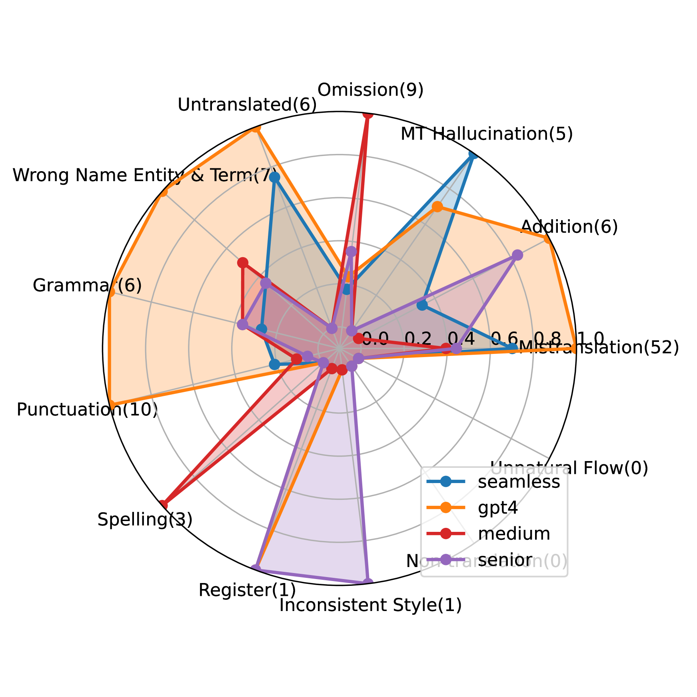

# GPT-4 与人类翻译者的较量：全面评估翻译质量在多语言、多领域及不同专业水平的表现

发布时间：2024年07月04日

`LLM应用` `翻译行业` `人工智能`

> GPT-4 vs. Human Translators: A Comprehensive Evaluation of Translation Quality Across Languages, Domains, and Expertise Levels

# 摘要

> 本研究全面对比了GPT-4与不同水平的人类翻译者在多语言多领域的翻译质量。研究发现，GPT-4在错误总数上与初级翻译者相当，但不及中级和高级翻译者。GPT-4在资源丰富的语言方向表现较好，而在资源匮乏的方向则逐渐减弱。此外，GPT-4倾向于字面翻译，而人类翻译者有时会过度解读背景信息。这是首次系统比较LLM与人类翻译的差异，为理解当前基于LLM的翻译技术及其局限性提供了重要视角。

> This study comprehensively evaluates the translation quality of Large Language Models (LLMs), specifically GPT-4, against human translators of varying expertise levels across multiple language pairs and domains. Through carefully designed annotation rounds, we find that GPT-4 performs comparably to junior translators in terms of total errors made but lags behind medium and senior translators. We also observe the imbalanced performance across different languages and domains, with GPT-4's translation capability gradually weakening from resource-rich to resource-poor directions. In addition, we qualitatively study the translation given by GPT-4 and human translators, and find that GPT-4 translator suffers from literal translations, but human translators sometimes overthink the background information. To our knowledge, this study is the first to evaluate LLMs against human translators and analyze the systematic differences between their outputs, providing valuable insights into the current state of LLM-based translation and its potential limitations.

[Arxiv](https://arxiv.org/abs/2407.03658)