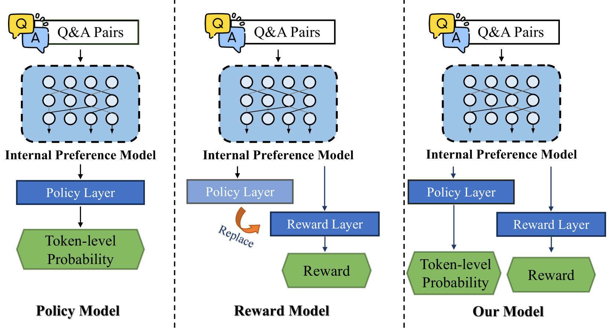
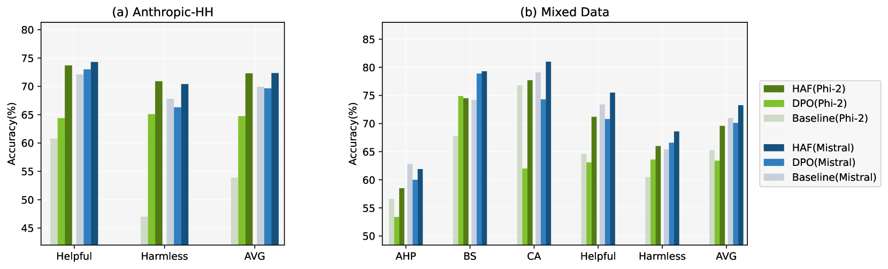
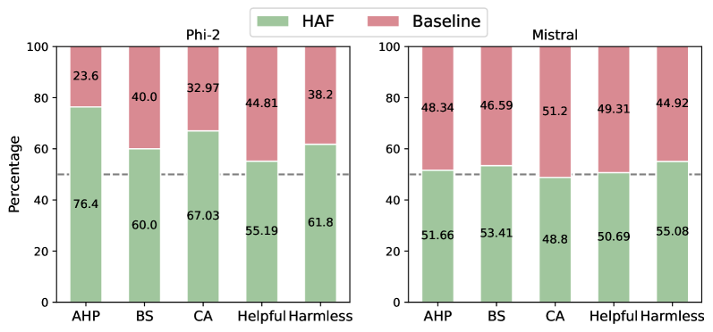
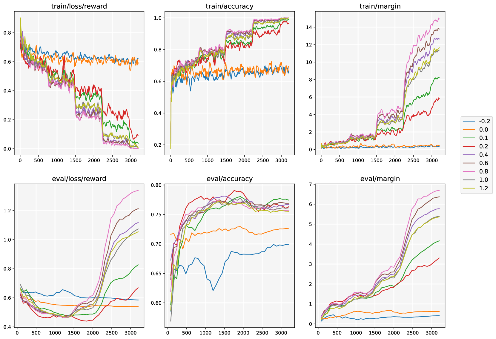
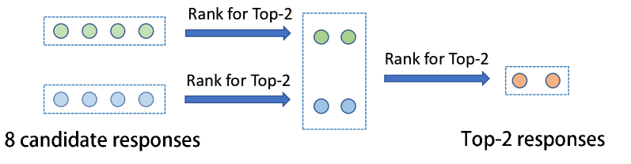

# HAF-RM：奖励模型训练的混合对齐新框架

发布时间：2024年07月04日

`LLM理论` `人工智能` `语言模型`

> HAF-RM: A Hybrid Alignment Framework for Reward Model Training

# 摘要

> 奖励模型在LLM的对齐与评估中日益关键。传统上，研究者通过数据优化来提升奖励模型，直接针对预测奖励进行训练。本文中，我们创新性地提出了HaF-RM框架，不仅优化奖励分数，还额外约束了令牌级策略概率，实现了令牌级偏好模型的监督与序列级映射层的优化。理论与实验双重验证了该框架在提升奖励模型质量上的卓越效果。通过分离奖励建模步骤并引入混合监督，HaF-RM为增强奖励模型的性能与对齐提供了一条高效且有原则的路径，对语言模型的负责任发展至关重要。代码已公开于https://haf-rm.github.io。

> The reward model has become increasingly important in alignment, assessment, and data construction for large language models (LLMs). Most existing researchers focus on enhancing reward models through data improvements, following the conventional training framework for reward models that directly optimizes the predicted rewards. In this paper, we propose a hybrid alignment framework HaF-RM for reward model training by introducing an additional constraint on token-level policy probabilities in addition to the reward score. It can simultaneously supervise the internal preference model at the token level and optimize the mapping layer of the reward model at the sequence level. Theoretical justifications and experiment results on five datasets show the validity and effectiveness of our proposed hybrid framework for training a high-quality reward model. By decoupling the reward modeling procedure and incorporating hybrid supervision, our HaF-RM framework offers a principled and effective approach to enhancing the performance and alignment of reward models, a critical component in the responsible development of powerful language models. We release our code at https://haf-rm.github.io.

[Arxiv](https://arxiv.org/abs/2407.04185)