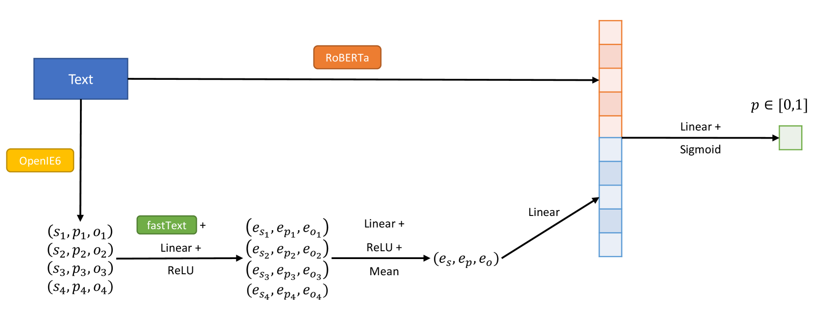

# HYBRINFOX 参与 CheckThat! 2024 的任务 1，旨在利用结构化信息提升语言模型的可核查性评估能力。

发布时间：2024年07月04日

`LLM应用` `语言模型`

> HYBRINFOX at CheckThat! 2024 -- Task 1: Enhancing Language Models with Structured Information for Check-Worthiness Estimation

# 摘要

> HYBRINFOX团队在CheckThat! 2024竞赛中提出了一种创新方法，通过三元组嵌入增强语言模型如RoBERTa的性能。实验表明，这种方法在英语测试中表现卓越，F1分数达到71.1，位列第12。然而，在荷兰语和阿拉伯语中表现不一。未来研究将聚焦于将此技术应用于更先进的大型语言模型。

> This paper summarizes the experiments and results of the HYBRINFOX team for the CheckThat! 2024 - Task 1 competition. We propose an approach enriching Language Models such as RoBERTa with embeddings produced by triples (subject ; predicate ; object) extracted from the text sentences. Our analysis of the developmental data shows that this method improves the performance of Language Models alone. On the evaluation data, its best performance was in English, where it achieved an F1 score of 71.1 and ranked 12th out of 27 candidates. On the other languages (Dutch and Arabic), it obtained more mixed results. Future research tracks are identified toward adapting this processing pipeline to more recent Large Language Models.

[Arxiv](https://arxiv.org/abs/2407.03850)