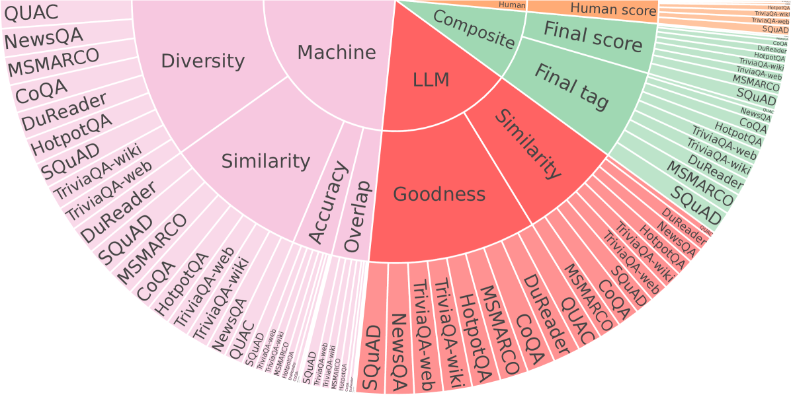
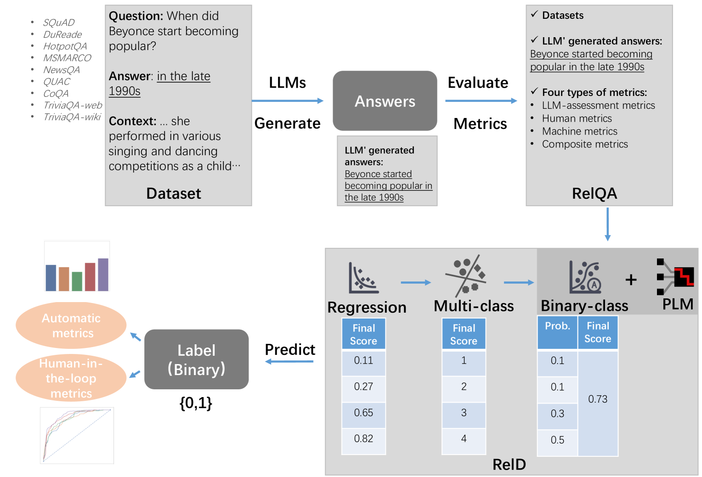
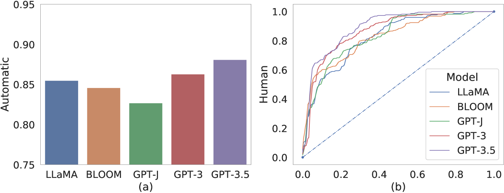
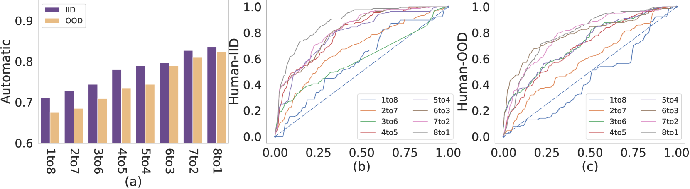
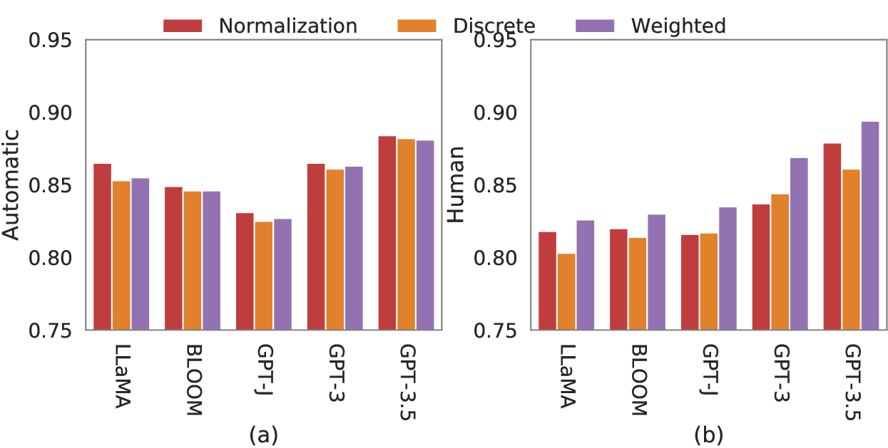
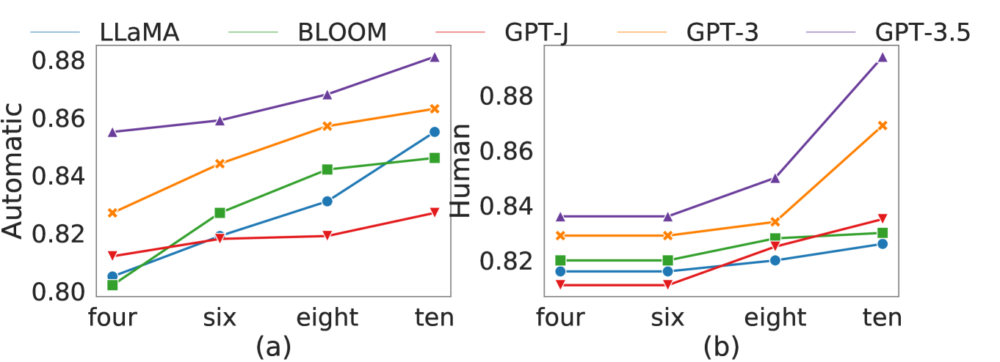
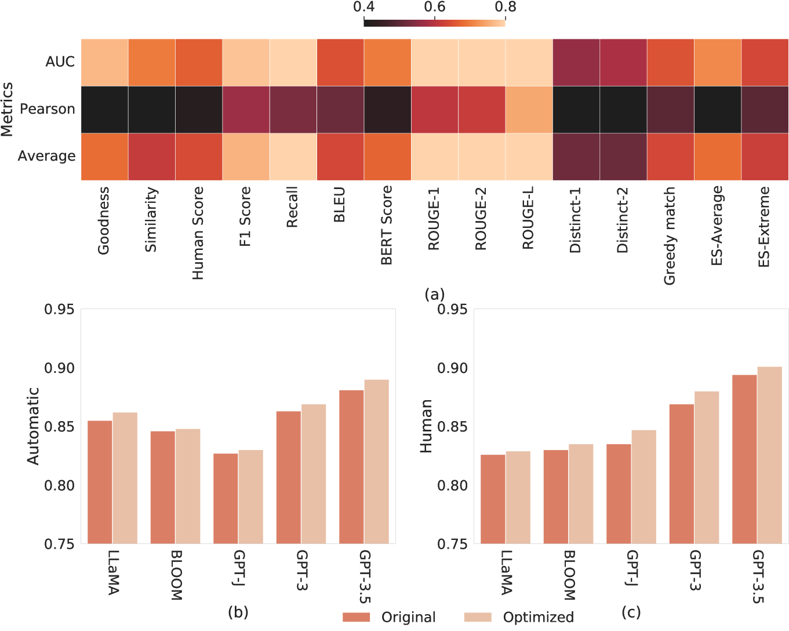
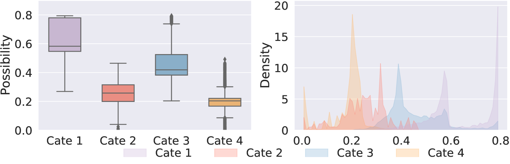
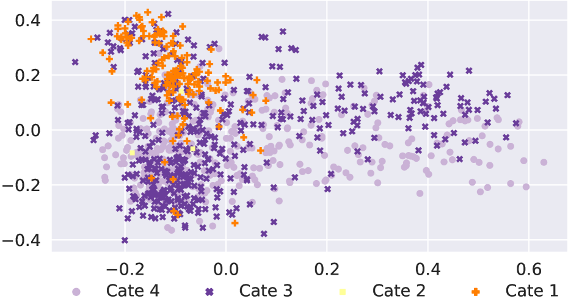
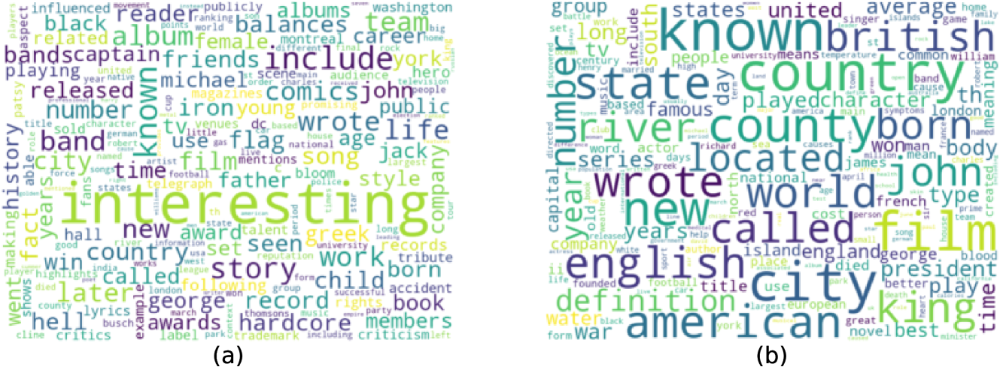

# 幻觉检测：在大规模语言模型中，如何稳健地识别出可靠答案，是一项关键任务。

发布时间：2024年07月04日

`LLM应用` `人工智能`

> Hallucination Detection: Robustly Discerning Reliable Answers in Large Language Models

# 摘要

> 大型语言模型（LLM）在问答和对话系统等自然语言处理任务中广受欢迎，但其幻觉问题——生成与输入不符的内容——却带来了严重问题。为此，我们设计了名为 RelD 的鲁棒判别器，专门用于检测 LLM 生成的答案中的幻觉。RelD 基于我们构建的双语问答对话数据集 RelQA 进行训练，并结合了 LLM 生成的答案及一系列全面指标。实验显示，RelD 能有效识别不同 LLM 生成的答案中的幻觉，无论数据来源如何。同时，我们对幻觉类型进行了深入分析，揭示了宝贵见解。这项研究不仅提升了 LLM 生成答案的可靠性检测，也为未来减轻幻觉问题提供了重要启示。

> Large Language Models (LLMs) have gained widespread adoption in various natural language processing tasks, including question answering and dialogue systems. However, a major drawback of LLMs is the issue of hallucination, where they generate unfaithful or inconsistent content that deviates from the input source, leading to severe consequences. In this paper, we propose a robust discriminator named RelD to effectively detect hallucination in LLMs' generated answers. RelD is trained on the constructed RelQA, a bilingual question-answering dialogue dataset along with answers generated by LLMs and a comprehensive set of metrics. Our experimental results demonstrate that the proposed RelD successfully detects hallucination in the answers generated by diverse LLMs. Moreover, it performs well in distinguishing hallucination in LLMs' generated answers from both in-distribution and out-of-distribution datasets. Additionally, we also conduct a thorough analysis of the types of hallucinations that occur and present valuable insights. This research significantly contributes to the detection of reliable answers generated by LLMs and holds noteworthy implications for mitigating hallucination in the future work.

[Arxiv](https://arxiv.org/abs/2407.04121)