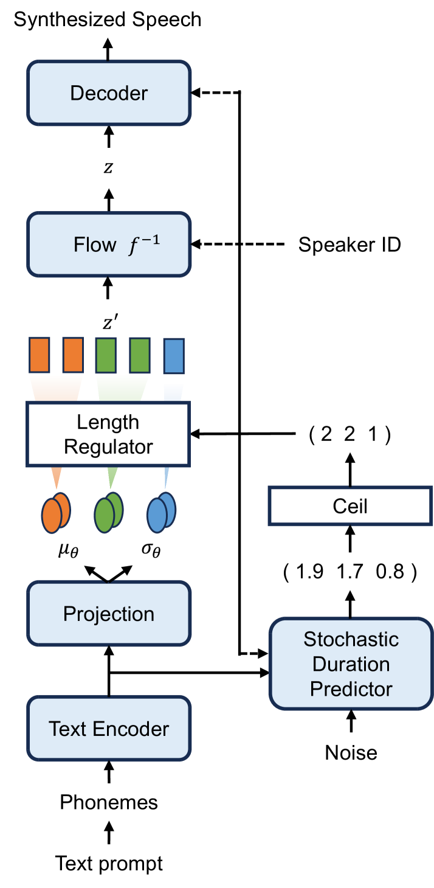

# 利用无监督的文本转语音合成进行数据增强，有效提升带口音语音的识别准确率。

发布时间：2024年07月04日

`LLM应用` `语音识别` `数据增强`

> Improving Accented Speech Recognition using Data Augmentation based on Unsupervised Text-to-Speech Synthesis

# 摘要

> 本文探讨了无监督文本到语音合成（TTS）作为数据增强手段，以提升口音语音识别的性能。TTS系统利用少量带口音语音数据及其自动生成的伪标签进行训练，无需人工转录，实现了无监督学习。这种方法使得带口音语音数据无需人工转录即可用于数据增强，提升口音识别效果。通过TTS系统生成的合成带口音语音数据与非带口音语音数据结合，用于训练ASR系统。实验采用预训练于大量无监督带口音语音数据的Wav2vec2.0模型，在自监督学习框架下进行。训练数据包括朗读语音，选自L2-ARCTIC和British Isles语料库，而评估数据则为Edinburgh国际英语口音语料库中的自发对话语音。实验结果表明，通过无监督TTS生成的合成带口音语音数据微调的Wav2vec2.0模型，相比使用Librispeech语料库非带口音语音数据微调的基线模型，词错误率相对降低了6.1%。

> This paper investigates the use of unsupervised text-to-speech synthesis (TTS) as a data augmentation method to improve accented speech recognition. TTS systems are trained with a small amount of accented speech training data and their pseudo-labels rather than manual transcriptions, and hence unsupervised. This approach enables the use of accented speech data without manual transcriptions to perform data augmentation for accented speech recognition. Synthetic accented speech data, generated from text prompts by using the TTS systems, are then combined with available non-accented speech data to train automatic speech recognition (ASR) systems. ASR experiments are performed in a self-supervised learning framework using a Wav2vec2.0 model which was pre-trained on large amount of unsupervised accented speech data. The accented speech data for training the unsupervised TTS are read speech, selected from L2-ARCTIC and British Isles corpora, while spontaneous conversational speech from the Edinburgh international accents of English corpus are used as the evaluation data. Experimental results show that Wav2vec2.0 models which are fine-tuned to downstream ASR task with synthetic accented speech data, generated by the unsupervised TTS, yield up to 6.1% relative word error rate reductions compared to a Wav2vec2.0 baseline which is fine-tuned with the non-accented speech data from Librispeech corpus.

[Arxiv](https://arxiv.org/abs/2407.04047)