# 借助大型语言模型的背景知识，我们致力于提升强化学习的样本效率。

发布时间：2024年07月04日

`LLM应用` `人工智能` `游戏开发`

> Improving Sample Efficiency of Reinforcement Learning with Background Knowledge from Large Language Models

# 摘要

> 强化学习中的低样本效率一直是个难题。随着大型语言模型的兴起，研究者尝试通过注入常识知识来加速策略学习。但这种指导往往局限于特定任务，缺乏通用性。本文提出一个新框架，利用LLMs提取环境背景知识，为多种RL任务提供一次性知识支持。我们通过预先收集的经验让LLMs描述环境背景，并将这些知识转化为奖励塑造的潜力函数，确保策略最优性。实验证明，通过编写代码、注释偏好和设定目标等方式，LLMs能有效提升Minigrid和Crafter等领域下游任务的样本效率。

> Low sample efficiency is an enduring challenge of reinforcement learning (RL). With the advent of versatile large language models (LLMs), recent works impart common-sense knowledge to accelerate policy learning for RL processes. However, we note that such guidance is often tailored for one specific task but loses generalizability. In this paper, we introduce a framework that harnesses LLMs to extract background knowledge of an environment, which contains general understandings of the entire environment, making various downstream RL tasks benefit from one-time knowledge representation. We ground LLMs by feeding a few pre-collected experiences and requesting them to delineate background knowledge of the environment. Afterward, we represent the output knowledge as potential functions for potential-based reward shaping, which has a good property for maintaining policy optimality from task rewards. We instantiate three variants to prompt LLMs for background knowledge, including writing code, annotating preferences, and assigning goals. Our experiments show that these methods achieve significant sample efficiency improvements in a spectrum of downstream tasks from Minigrid and Crafter domains.

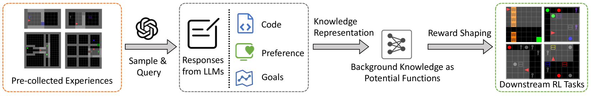

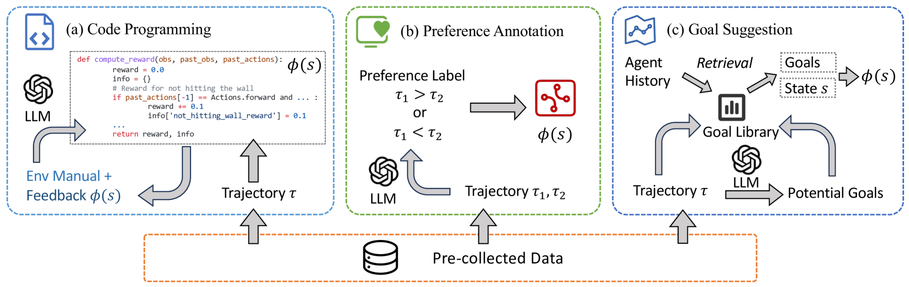

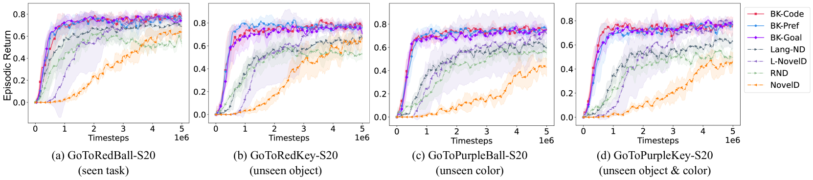

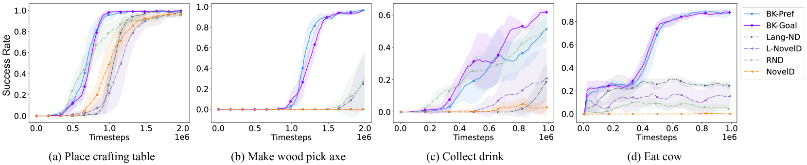

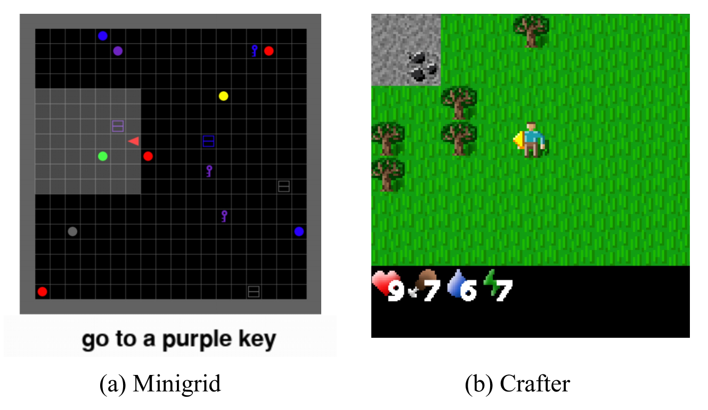

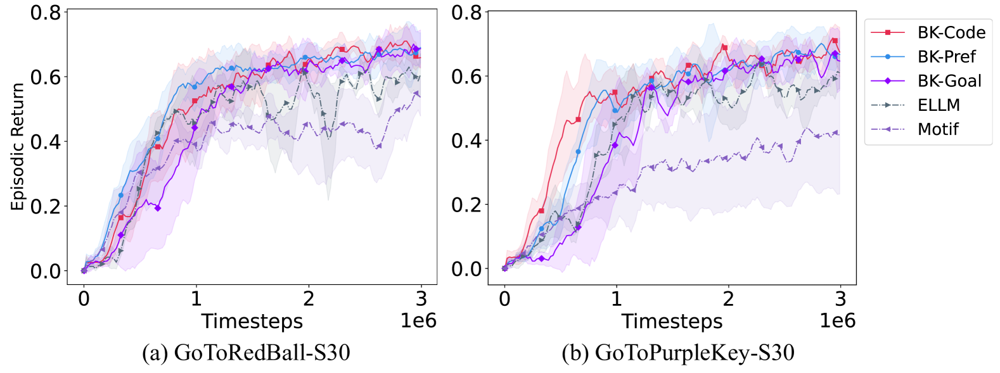

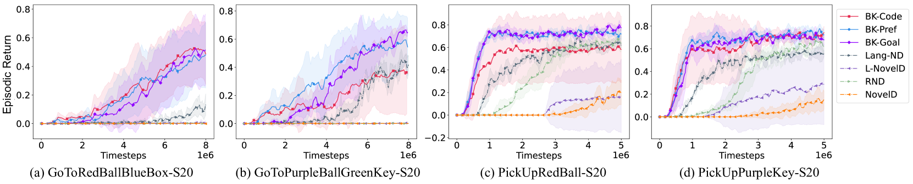

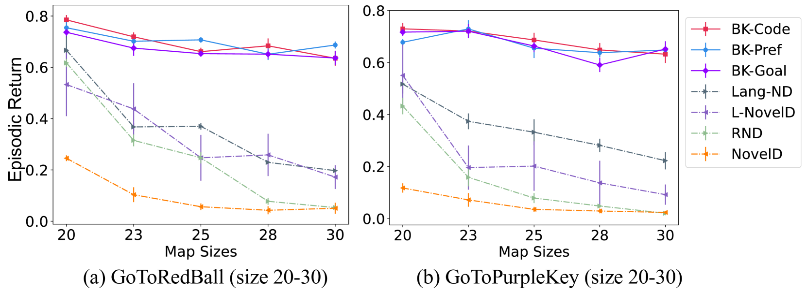

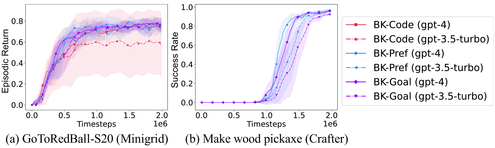

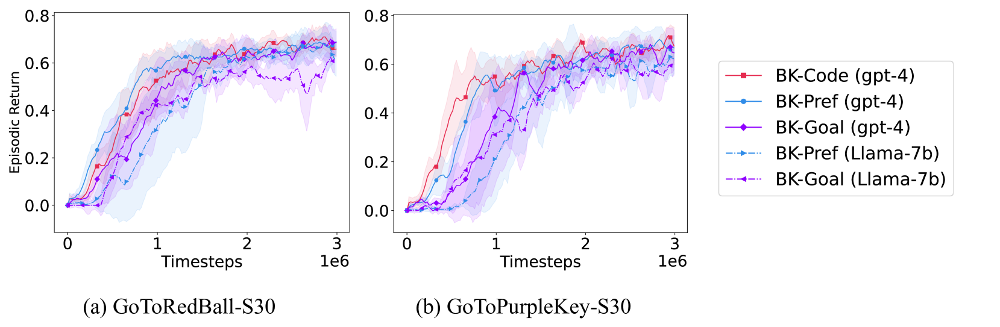

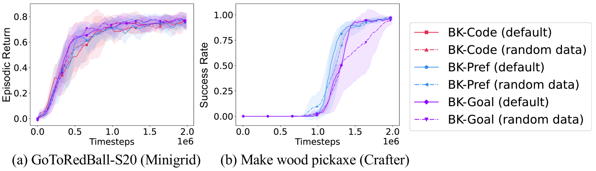

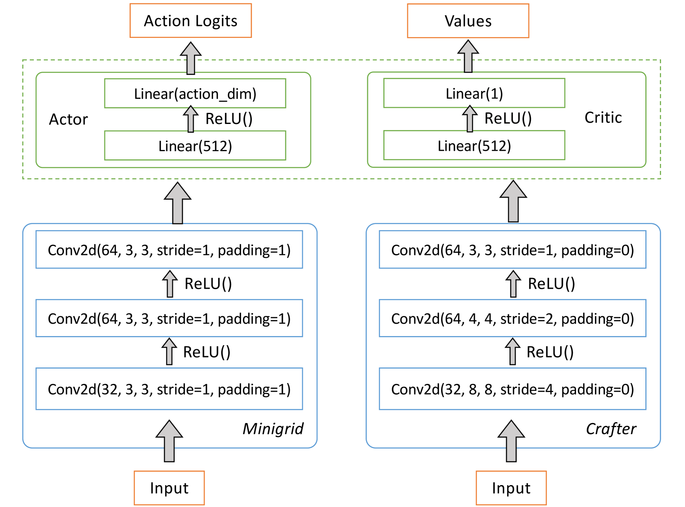

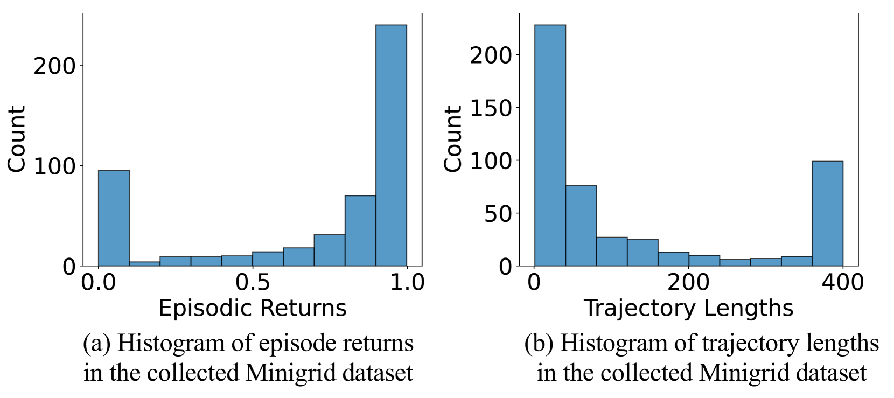

[Arxiv](https://arxiv.org/abs/2407.03964)