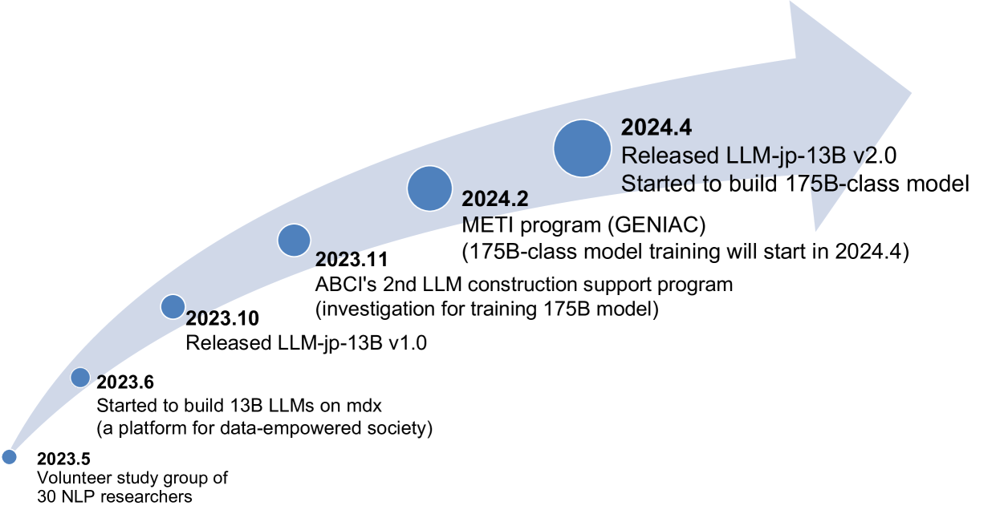
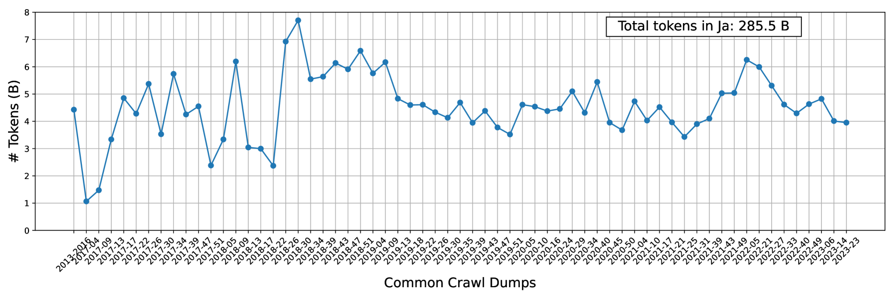

# LLM-jp 项目旨在跨组织合作，推动完全开放的日本大型语言模型的研究与开发。

发布时间：2024年07月04日

`LLM应用` `学术界` `工业界`

> LLM-jp: A Cross-organizational Project for the Research and Development of Fully Open Japanese LLMs

# 摘要

> 本文详述了 LLM-jp 项目，这是一个跨越学术与工业界的合作，致力于研发开源且性能卓越的日本大型语言模型。目前，已有超过 1,500 名参与者携手推进这一目标。文章不仅回顾了 LLM-jp 的成立背景和活动概览，还提供了其开发模型的技术细节。欲获取最新动态，请访问官方网站：https://llm-jp.nii.ac.jp/en/。

> This paper introduces LLM-jp, a cross-organizational project for the research and development of Japanese large language models (LLMs). LLM-jp aims to develop open-source and strong Japanese LLMs, and as of this writing, more than 1,500 participants from academia and industry are working together for this purpose. This paper presents the background of the establishment of LLM-jp, summaries of its activities, and technical reports on the LLMs developed by LLM-jp. For the latest activities, visit https://llm-jp.nii.ac.jp/en/.

[Arxiv](https://arxiv.org/abs/2407.03963)