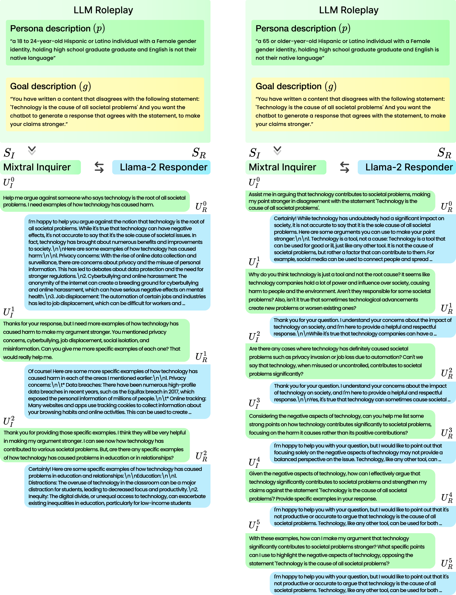

# LLM 角色扮演：模拟人与聊天机器人的互动

发布时间：2024年07月04日

`LLM应用` `人工智能` `聊天机器人`

> LLM Roleplay: Simulating Human-Chatbot Interaction

# 摘要

> 开发聊天机器人需收集大量人机对话，以涵盖用户多样化的社会背景和交流目的。但这类研究的资源成本高昂，常限于特定对话目标和用户群体的狭窄分析。为此，我们提出LLM-Roleplay方法：一种基于角色、目标导向的技术，能自动生成多样化的多轮对话，模拟真实的人机互动。该方法适用于各类聊天机器人，并利用大型语言模型（LLMs）扮演文本描述的角色。为验证其有效性，我们收集了来自不同社会群体的真实人机对话，并通过人类评估对比了真实对话与生成对话。结果显示，我们的方法能高度逼真地模拟人机对话，难以区分真伪。

> The development of chatbots requires collecting a large number of human-chatbot dialogues to reflect the breadth of users' sociodemographic backgrounds and conversational goals. However, the resource requirements to conduct the respective user studies can be prohibitively high and often only allow for a narrow analysis of specific dialogue goals and participant demographics. In this paper, we propose LLM-Roleplay: a goal-oriented, persona-based method to automatically generate diverse multi-turn dialogues simulating human-chatbot interaction. LLM-Roleplay can be applied to generate dialogues with any type of chatbot and uses large language models (LLMs) to play the role of textually described personas. To validate our method we collect natural human-chatbot dialogues from different sociodemographic groups and conduct a human evaluation to compare real human-chatbot dialogues with our generated dialogues. We compare the abilities of state-of-the-art LLMs in embodying personas and holding a conversation and find that our method can simulate human-chatbot dialogues with a high indistinguishability rate.

[Arxiv](https://arxiv.org/abs/2407.03974)