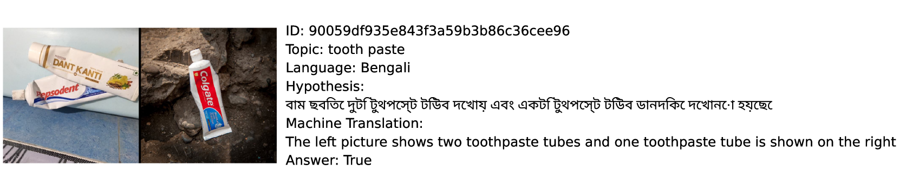
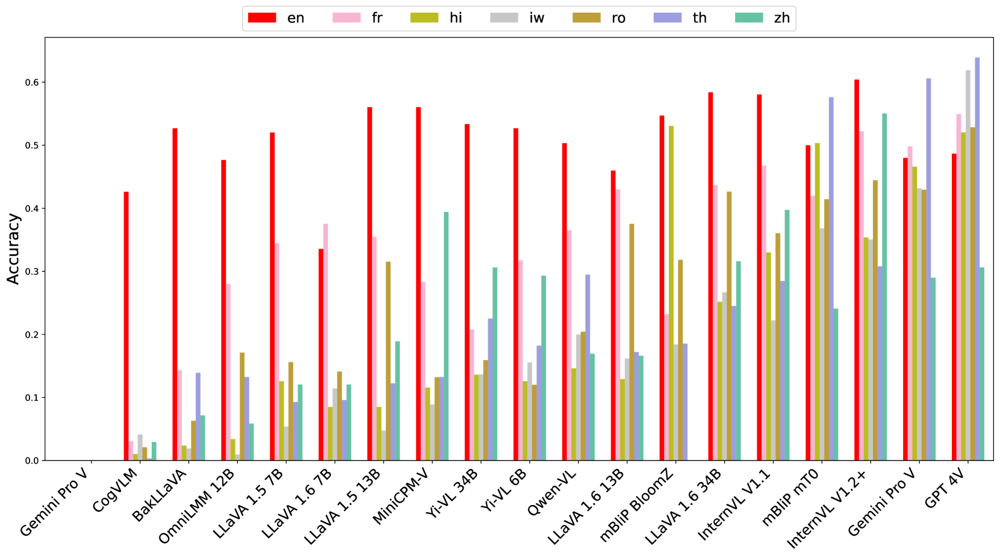

# M$\mathbf5$ 是一个多元化基准，旨在全面评估大型多模态模型在跨语言和文化视觉-语言任务中的表现。

发布时间：2024年07月04日

`LLM应用` `人工智能` `多模态学习`

> M$\mathbf5$ -- A Diverse Benchmark to Assess the Performance of Large Multimodal Models Across Multilingual and Multicultural Vision-Language Tasks

# 摘要

> 自ChatGPT问世以来，自然语言处理领域飞速进步，特别是在大型语言模型（LLMs）和大型多模态模型（LMMs）方面。尽管这些模型能力出众，但在不同语言和文化环境中，其性能差异显著，这在纯文本基准测试中可见一斑。然而，针对多模态视觉语言环境的研究却缺乏相应的基准。为此，我们推出了M5，这是首个全面评估LMMs在多语言和文化背景下视觉语言任务的基准。M5包含八个数据集，覆盖五个任务和41种语言，特别关注那些代表性不足的语言和具有文化多样性的图像。同时，我们新增了两个数据集M5-VGR和M5-VLOD，并引入了一项新的视觉语言异常检测任务，结果显示，所有评估的开源模型均未能显著超越随机基准。通过深入评估和分析，我们揭示了高资源和低资源语言之间在任务无关的性能差异。此外，我们还发现，在多语言环境中，模型的大小并非决定性能的关键因素。

> Since the release of ChatGPT, the field of Natural Language Processing has experienced rapid advancements, particularly in Large Language Models (LLMs) and their multimodal counterparts, Large Multimodal Models (LMMs). Despite their impressive capabilities, LLMs often exhibit significant performance disparities across different languages and cultural contexts, as demonstrated by various text-only benchmarks. However, current research lacks such benchmarks for multimodal visio-linguistic settings. This work fills this gap by introducing M5, the first comprehensive benchmark designed to evaluate LMMs on diverse vision-language tasks within a multilingual and multicultural context. M5 includes eight datasets covering five tasks and $41$ languages, with a focus on underrepresented languages and culturally diverse images. Furthermore, we introduce two novel datasets, M5-VGR and M5-VLOD, including a new Visio-Linguistic Outlier Detection task, in which all evaluated open-source models fail to significantly surpass the random baseline. Through extensive evaluation and analyses, we highlight substantial task-agnostic performance disparities between high- and low-resource languages. Moreover, we show that larger models do not necessarily outperform smaller ones in a multilingual setting.

[Arxiv](https://arxiv.org/abs/2407.03791)