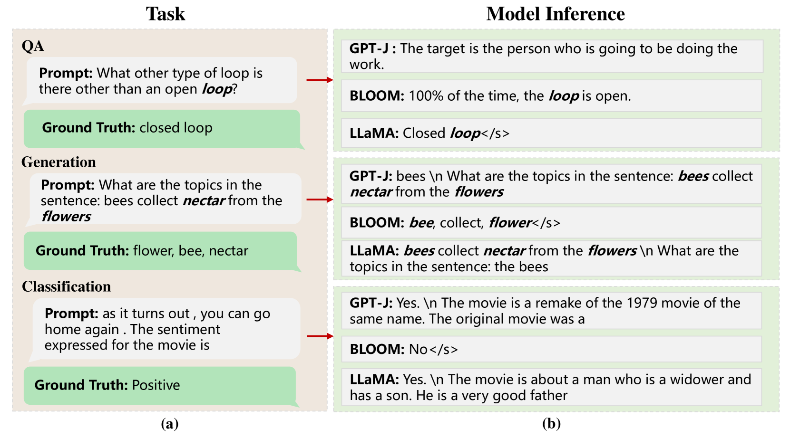
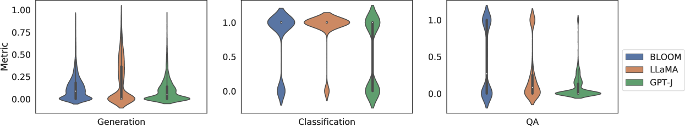
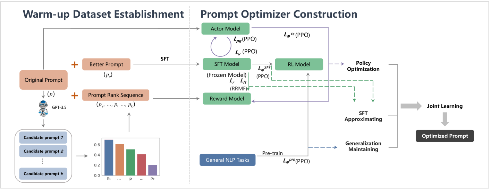
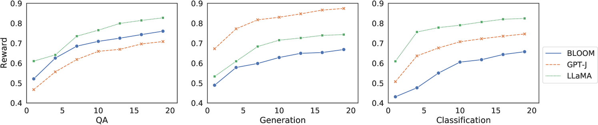
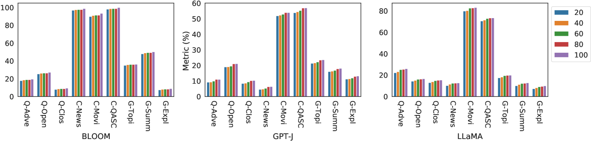
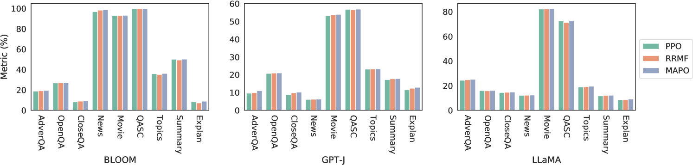
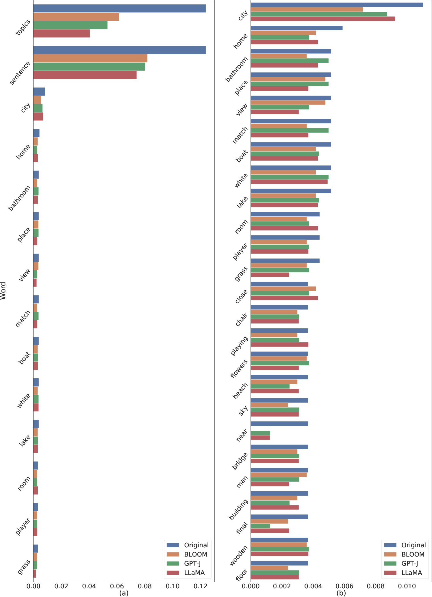
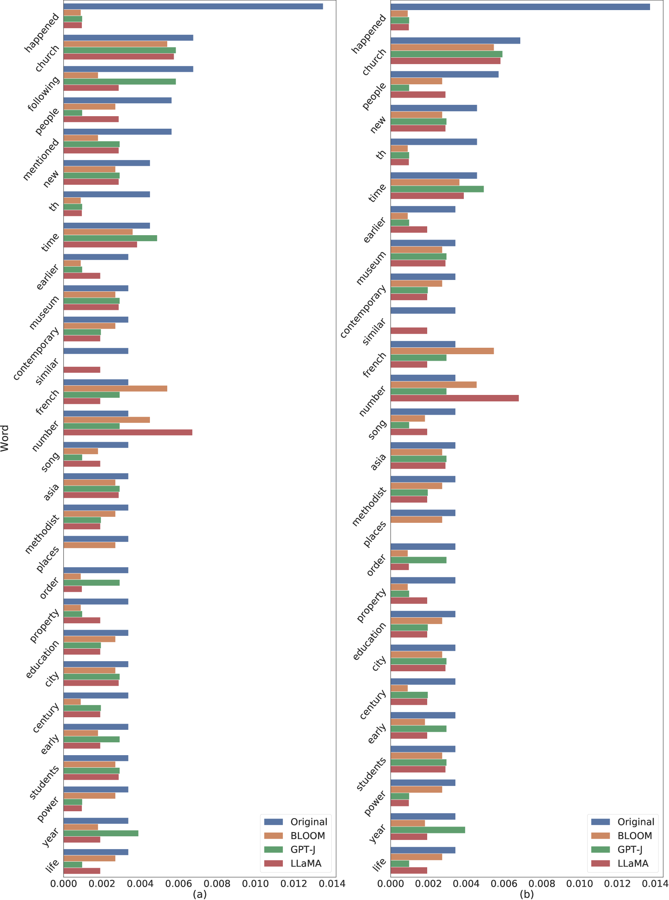
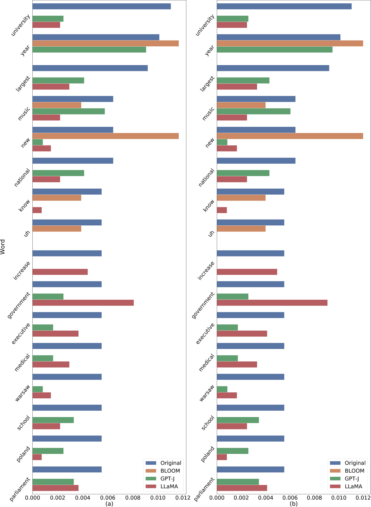

# MAPO 技术通过模型自适应提示优化，显著提升大型语言模型的性能。

发布时间：2024年07月04日

`LLM应用` `人工智能`

> MAPO: Boosting Large Language Model Performance with Model-Adaptive Prompt Optimization

# 摘要

> Prompt engineering 作为利用大型语言模型的有效手段，备受研究界瞩目。现有研究侧重于将提示适配特定任务而非特定模型。然而，优质提示不仅取决于措辞，还与模型特性紧密相关。本研究首先通过定量分析，证明不同提示应针对不同模型进行优化，以提升其在 NLP 各类下游任务中的表现。接着，我们创新提出模型自适应提示优化器 (MAPO)，专门针对各模型优化提示。实验证明，该方法能显著提升模型在下游任务中的性能。

> Prompt engineering, as an efficient and effective way to leverage Large Language Models (LLM), has drawn a lot of attention from the research community. The existing research primarily emphasizes the importance of adapting prompts to specific tasks, rather than specific LLMs. However, a good prompt is not solely defined by its wording, but also binds to the nature of the LLM in question. In this work, we first quantitatively demonstrate that different prompts should be adapted to different LLMs to enhance their capabilities across various downstream tasks in NLP. Then we novelly propose a model-adaptive prompt optimizer (MAPO) method that optimizes the original prompts for each specific LLM in downstream tasks. Extensive experiments indicate that the proposed method can effectively refine prompts for an LLM, leading to significant improvements over various downstream tasks.

[Arxiv](https://arxiv.org/abs/2407.04118)