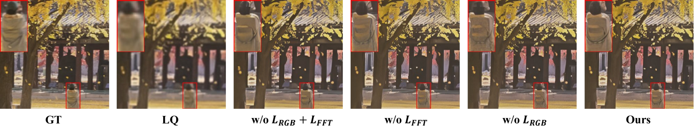

# MRIR：融合多模态洞察，实现基于扩散技术的真实图像修复

发布时间：2024年07月04日

`LLM应用` `计算机视觉` `图像处理`

> MRIR: Integrating Multimodal Insights for Diffusion-based Realistic Image Restoration

# 摘要

> 图像修复在计算机视觉领域至关重要，而基于扩散模型的应用因其逼真效果备受瞩目。尽管如此，图像质量因退化严重和模型不可控而面临挑战。我们探索预训练稳定扩散的潜力，提出MRIR方法，从文本和视觉两方面入手。文本层面，我们借助多模态大型语言模型提取低质量图像的语义信息；视觉层面，我们通过像素级处理器和ControlNet精细控制图像结构。最终，通过多级注意力机制，我们将这些控制信息融入去噪U-Net，实现多模态视角下的可控图像修复。实验证明，我们的方法在合成与真实数据集上均超越现有顶尖技术。

> Realistic image restoration is a crucial task in computer vision, and the use of diffusion-based models for image restoration has garnered significant attention due to their ability to produce realistic results. However, the quality of the generated images is still a significant challenge due to the severity of image degradation and the uncontrollability of the diffusion model. In this work, we delve into the potential of utilizing pre-trained stable diffusion for image restoration and propose MRIR, a diffusion-based restoration method with multimodal insights. Specifically, we explore the problem from two perspectives: textual level and visual level. For the textual level, we harness the power of the pre-trained multimodal large language model to infer meaningful semantic information from low-quality images. Furthermore, we employ the CLIP image encoder with a designed Refine Layer to capture image details as a supplement. For the visual level, we mainly focus on the pixel level control. Thus, we utilize a Pixel-level Processor and ControlNet to control spatial structures. Finally, we integrate the aforementioned control information into the denoising U-Net using multi-level attention mechanisms and realize controllable image restoration with multimodal insights. The qualitative and quantitative results demonstrate our method's superiority over other state-of-the-art methods on both synthetic and real-world datasets.

[Arxiv](https://arxiv.org/abs/2407.03635)