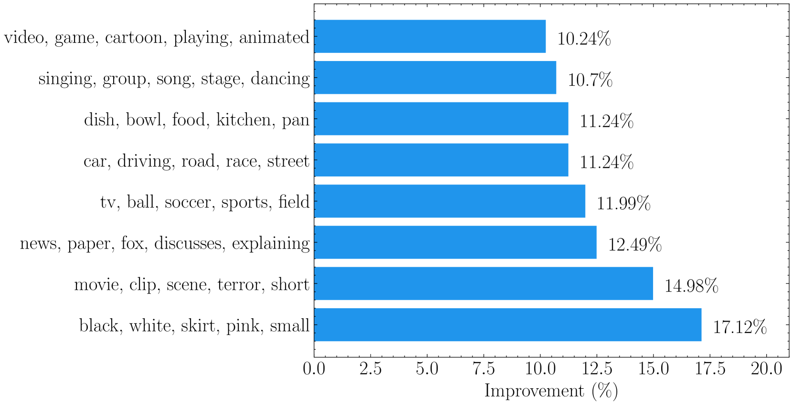

# 视频-语言表示学习的元优化角度边缘对比框架

发布时间：2024年07月04日

`LLM应用` `视频处理` `人工智能`

> Meta-optimized Angular Margin Contrastive Framework for Video-Language Representation Learning

# 摘要

> 数据质量是视频-语言表示学习有效性的关键。然而，以往的视频-文本对往往无法完美匹配，导致跨模态语义反映不准确。同时，概念分布的不均也影响了特定主题的下游表现。为此，我们引入了带有减法角边距的对比目标，以优化跨模态表示的相似性。针对概念分布的不均，我们设计了由MLP参数化的权重函数，动态调整模型关注点。在无偏元数据和大型视觉-语言模型生成数据的辅助下，我们显著提升了视频-语言表示的质量，并在视频问答和文本-视频检索等任务中取得了卓越成绩。

> Data quality stands at the forefront of deciding the effectiveness of video-language representation learning. However, video-text pairs in previous data typically do not align perfectly with each other, which might lead to video-language representations that do not accurately reflect cross-modal semantics. Moreover, previous data also possess an uneven distribution of concepts, thereby hampering the downstream performance across unpopular subjects. To address these problems, we propose a contrastive objective with a subtractive angular margin to regularize cross-modal representations in their effort to reach perfect similarity. Furthermore, to adapt to the non-uniform concept distribution, we propose a multi-layer perceptron (MLP)-parameterized weighting function that maps loss values to sample weights which enable dynamic adjustment of the model's focus throughout the training. With the training guided by a small amount of unbiased meta-data and augmented by video-text data generated by large vision-language model, we improve video-language representations and achieve superior performances on commonly used video question answering and text-video retrieval datasets.

[Arxiv](https://arxiv.org/abs/2407.03788)