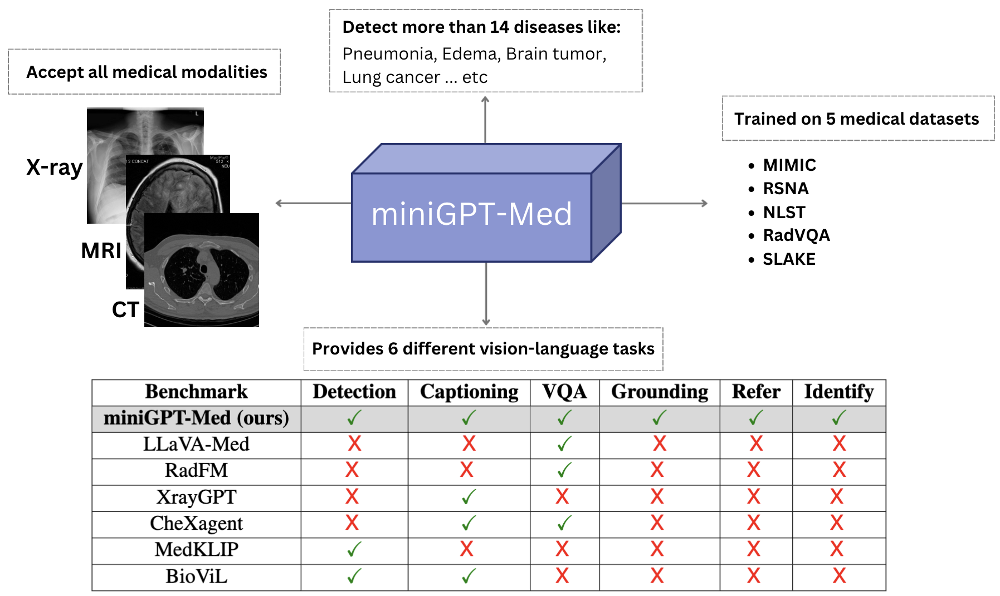
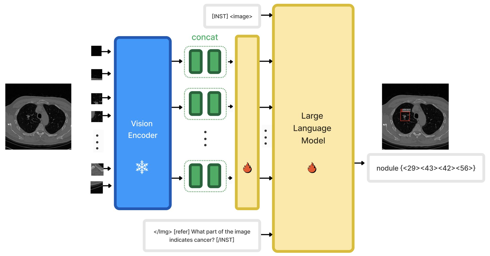
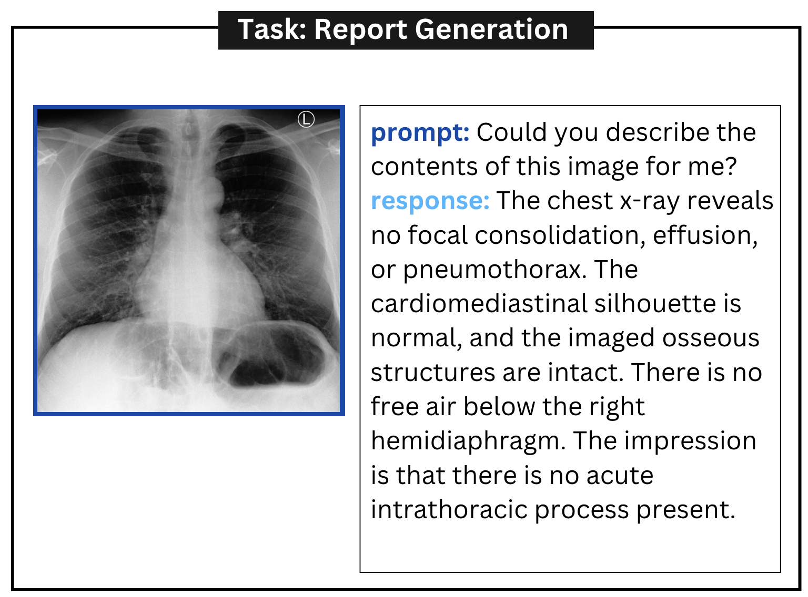
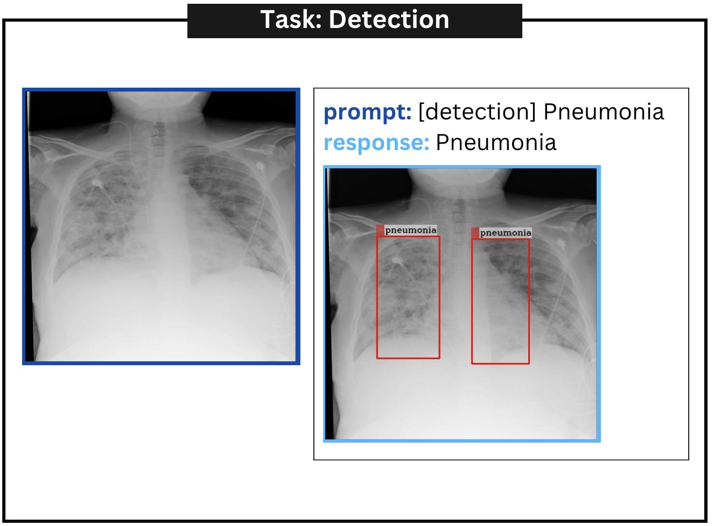
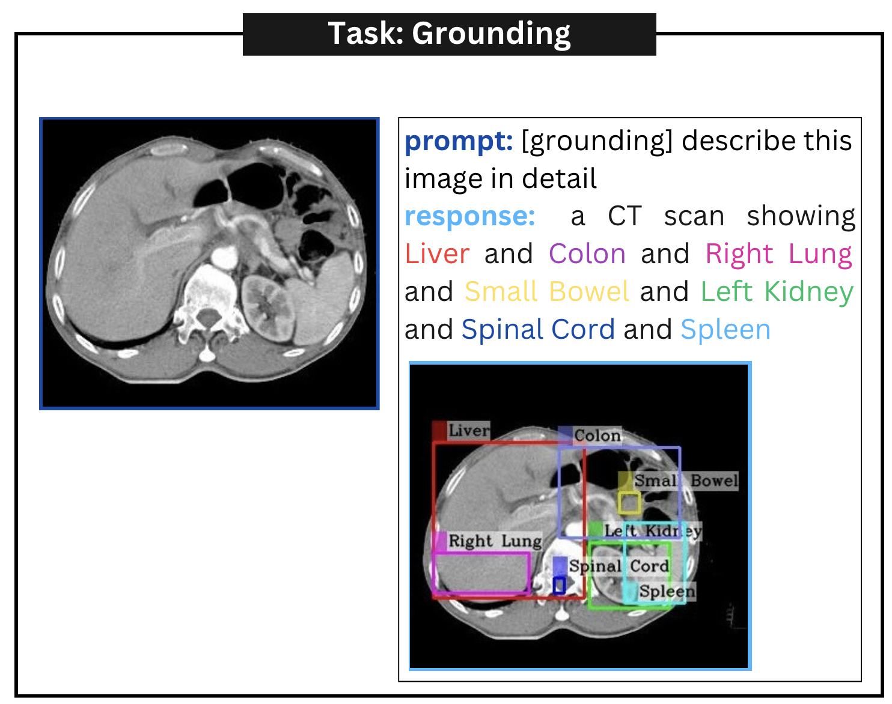
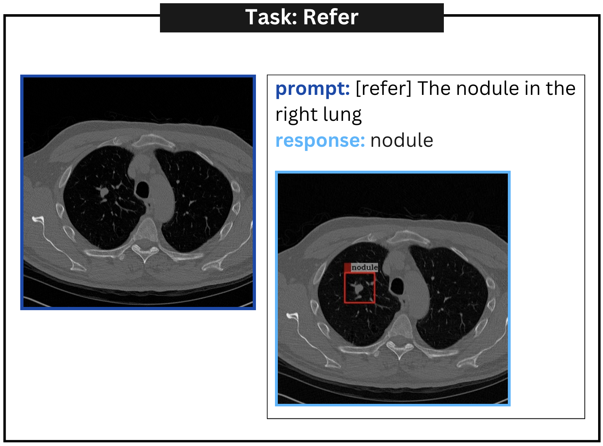
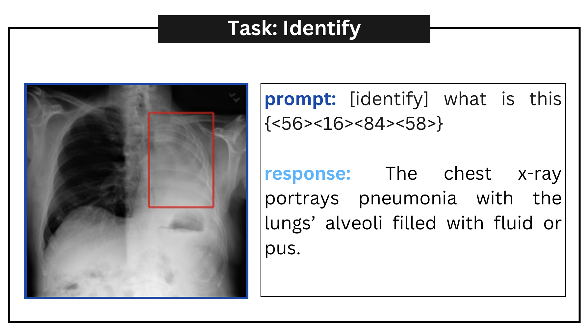
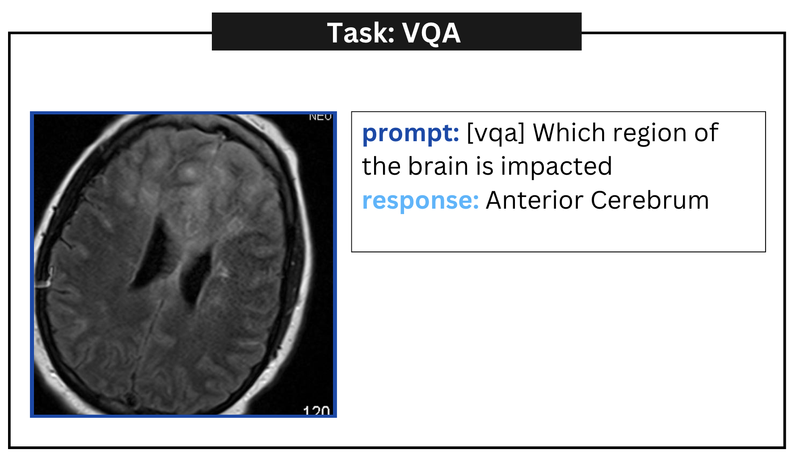
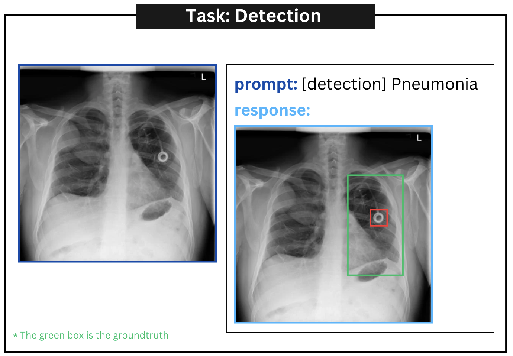

# MiniGPT-Med：将大型语言模型打造为放射学诊断的多面手

发布时间：2024年07月04日

`LLM应用` `放射学`

> MiniGPT-Med: Large Language Model as a General Interface for Radiology Diagnosis

# 摘要

> AI在医疗领域的最新进展，特别是在诊断流程的优化上，取得了重大突破。然而，过往研究多受限于功能单一。本研究推出的MiniGPT-Med，是一款专为医疗定制的视觉-语言模型，源自大型语言模型。该模型在X光、CT和MRI等多种影像模式中展现出卓越的多功能性，极大提升了应用价值。它能完成医疗报告生成、视觉问答及影像内疾病识别等任务，通过整合图像与文本数据，显著提升诊断精准度。实测表明，MiniGPT-Med在疾病定位、报告生成及问答测试中表现卓越，大幅缩小了辅助放射学实践的差距。其在医疗报告生成上的准确率更是领先同行19%，预示着它将成为放射学诊断的通用平台，全面提升医疗影像诊断的效率。

> Recent advancements in artificial intelligence (AI) have precipitated significant breakthroughs in healthcare, particularly in refining diagnostic procedures. However, previous studies have often been constrained to limited functionalities. This study introduces MiniGPT-Med, a vision-language model derived from large-scale language models and tailored for medical applications. MiniGPT-Med demonstrates remarkable versatility across various imaging modalities, including X-rays, CT scans, and MRIs, enhancing its utility. The model is capable of performing tasks such as medical report generation, visual question answering (VQA), and disease identification within medical imagery. Its integrated processing of both image and textual clinical data markedly improves diagnostic accuracy. Our empirical assessments confirm MiniGPT-Med's superior performance in disease grounding, medical report generation, and VQA benchmarks, representing a significant step towards reducing the gap in assisting radiology practice. Furthermore, it achieves state-of-the-art performance on medical report generation, higher than the previous best model by 19\% accuracy. MiniGPT-Med promises to become a general interface for radiology diagnoses, enhancing diagnostic efficiency across a wide range of medical imaging applications.

[Arxiv](https://arxiv.org/abs/2407.04106)