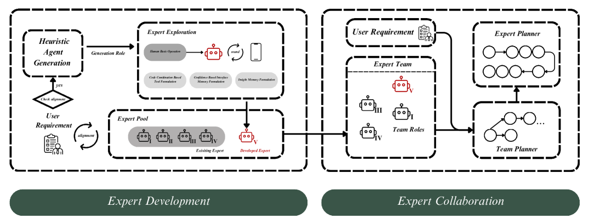

# MobileExperts：移动设备中的动态工具化代理团队

发布时间：2024年07月04日

`Agent` `移动计算` `人工智能`

> MobileExperts: A Dynamic Tool-Enabled Agent Team in Mobile Devices

# 摘要

> 移动计算设备的自主操作一直是人类的追求目标。随着LLMs和VLMs的进步，这一梦想正逐步成真。尽管VLMs已能自动化简单任务，但在复杂任务处理和推理成本降低方面仍有巨大提升空间。本文提出的MobileExperts，首次通过工具制定和多智能体协作应对这些挑战。它根据智能体与人类需求匹配度动态组队，每个智能体独立探索并成长为专家，再通过双层规划机制实现专家间的高效协作。为验证其效能，我们设计了分层智能级别的新基准，实验显示MobileExperts在各级别表现优异，推理成本降低约22%，充分证明了其设计的优越性。

> The attainment of autonomous operations in mobile computing devices has consistently been a goal of human pursuit. With the development of Large Language Models (LLMs) and Visual Language Models (VLMs), this aspiration is progressively turning into reality. While contemporary research has explored automation of simple tasks on mobile devices via VLMs, there remains significant room for improvement in handling complex tasks and reducing high reasoning costs. In this paper, we introduce MobileExperts, which for the first time introduces tool formulation and multi-agent collaboration to address the aforementioned challenges. More specifically, MobileExperts dynamically assembles teams based on the alignment of agent portraits with the human requirements. Following this, each agent embarks on an independent exploration phase, formulating its tools to evolve into an expert. Lastly, we develop a dual-layer planning mechanism to establish coordinate collaboration among experts. To validate our effectiveness, we design a new benchmark of hierarchical intelligence levels, offering insights into algorithm's capability to address tasks across a spectrum of complexity. Experimental results demonstrate that MobileExperts performs better on all intelligence levels and achieves ~ 22% reduction in reasoning costs, thus verifying the superiority of our design.

[Arxiv](https://arxiv.org/abs/2407.03913)