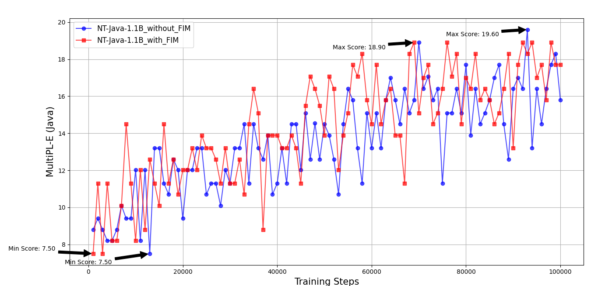

# 桌面专用：基于Starcoder的Java语言模型窄化Transformer

发布时间：2024年07月04日

`LLM应用` `软件开发` `信息技术`

> Narrow Transformer: Starcoder-Based Java-LM For Desktop

# 摘要

> 本文推出 NT-Java-1.1B，一款专为 Java 编程量身打造的开源代码语言模型，基于 StarCoderBase-1.1B 构建。NT-Java-1.1B 在 MultiPL-E Java 代码基准测试中表现卓越，超越了基础模型及同类模型。虽然已有研究致力于提升大型通用预训练模型在特定编程语言（如 Python）的性能，但针对其他编程语言的小型代码模型研究尚显不足。大型代码模型依赖于 GPU 等专用硬件，这促使我们探索更轻量级、适合桌面部署的代码模型。本文聚焦于 NT-Java-1.1B 及其量化版本的开发，这些模型在 MultiPL-E Java 代码基准测试中与 1.1B 规模的开放模型不相上下，非常适合桌面应用。这一研究为 NT 模型系列在多语言、多规模上的专用模型研究奠定了基础。

> This paper presents NT-Java-1.1B, an open-source specialized code language model built on StarCoderBase-1.1B, designed for coding tasks in Java programming. NT-Java-1.1B achieves state-of-the-art performance, surpassing its base model and majority of other models of similar size on MultiPL-E Java code benchmark. While there have been studies on extending large, generic pre-trained models to improve proficiency in specific programming languages like Python, similar investigations on small code models for other programming languages are lacking. Large code models require specialized hardware like GPUs for inference, highlighting the need for research into building small code models that can be deployed on developer desktops. This paper addresses this research gap by focusing on the development of a small Java code model, NT-Java-1.1B, and its quantized versions, which performs comparably to open models around 1.1B on MultiPL-E Java code benchmarks, making them ideal for desktop deployment. This paper establishes the foundation for specialized models across languages and sizes for a family of NT Models.

[Arxiv](https://arxiv.org/abs/2407.03941)