# NutriBench 数据集：专为评估 LLM 从餐食描述中估算碳水化合物含量而设计

发布时间：2024年07月04日

`LLM应用` `食品行业` `营养学`

> NutriBench: A Dataset for Evaluating Large Language Models in Carbohydrate Estimation from Meal Descriptions

# 摘要

> 我们推出的NutriBench，作为首个基于自然语言餐食描述的公开养分基准，包含5,000条人工验证的餐食描述及宏量营养标签。数据分为15个复杂度不同的子集。我们评估了包括GPT-3.5在内的七种LLMs，发现它们在复杂查询中能提供更精准快速的预测。通过详细分析，我们揭示了LLMs在实际养分估算中的潜力与挑战。NutriBench现已公开，网址为：https://mehak126.github.io/nutribench.html。

> Accurate nutrition estimation helps people make informed decisions about their dietary choices and is crucial for preventing serious health issues. We present NutriBench, the first publicly available natural language meal description based nutrition benchmark. NutriBench consists of 5,000 human-verified meal descriptions with macro-nutrient labels, including carbohydrates, proteins, fats, and calories. The data is divided into 15 subsets varying in complexity based on the number, servings, and popularity of the food items in the meal and the specificity of serving size descriptions. We conducted an extensive evaluation of seven popular and state-of-the-art Large Language Models (LLMs), including GPT-3.5, Llama-3, and a medical domain-specific model with standard, Chain-of-Thought and Retrieval-Augmented Generation strategies on our benchmark for carbohydrate estimation. We also conducted a human study involving expert and non-expert participants and found that LLMs can provide more accurate and faster predictions over a range of complex queries. We present a thorough analysis and comparison of different LLMs, highlighting the opportunities and challenges of using LLMs for nutrition estimation in real-life scenarios. Our benchmark is publicly available at: https://mehak126.github.io/nutribench.html

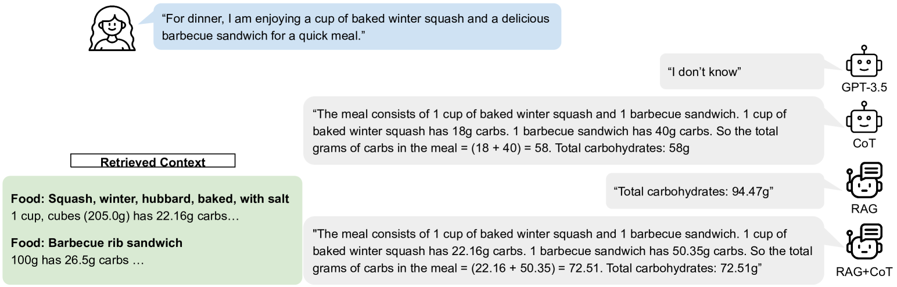

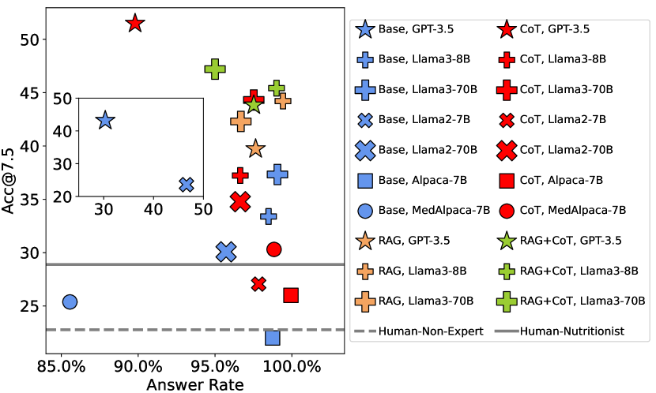

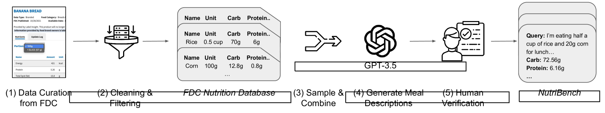

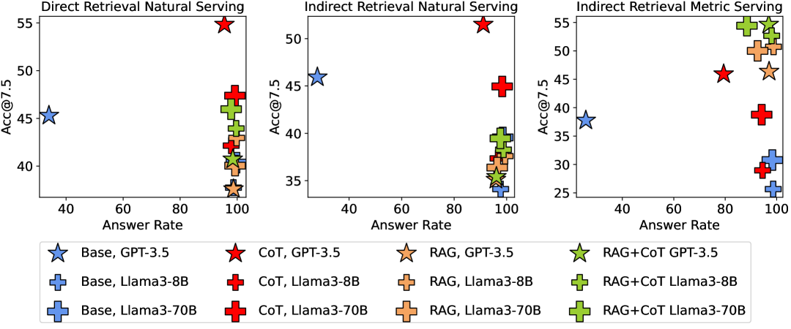

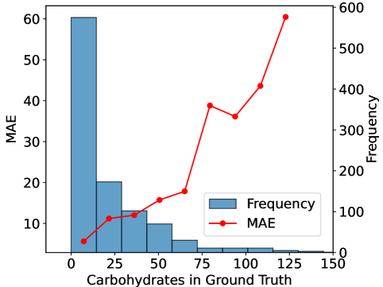

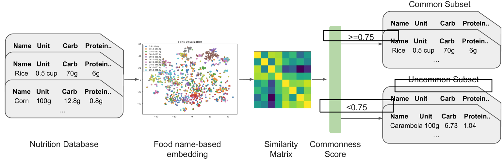

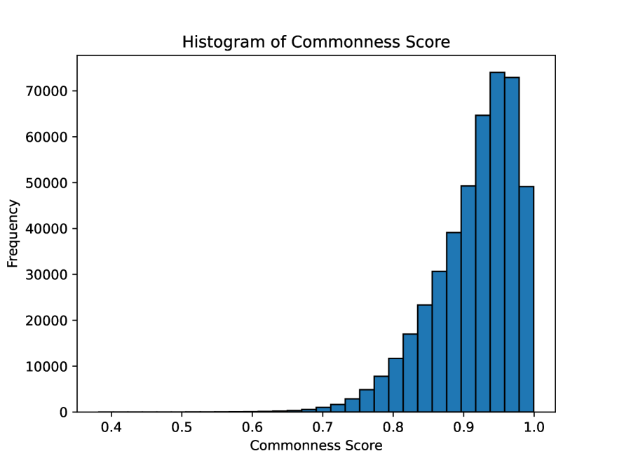

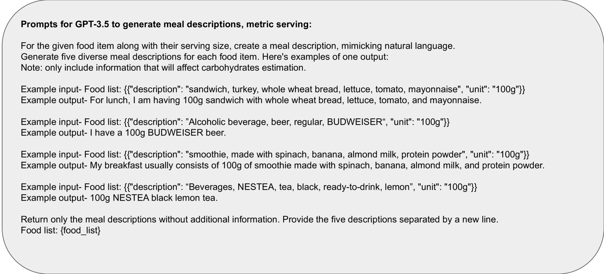

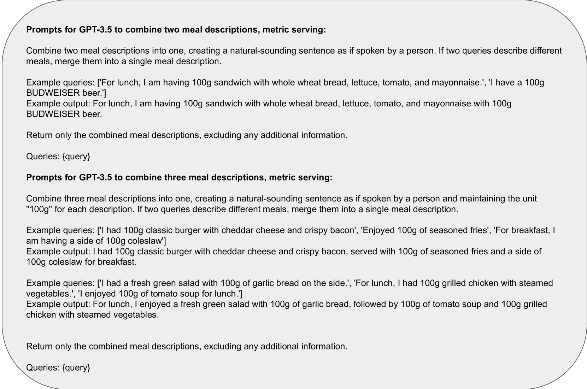

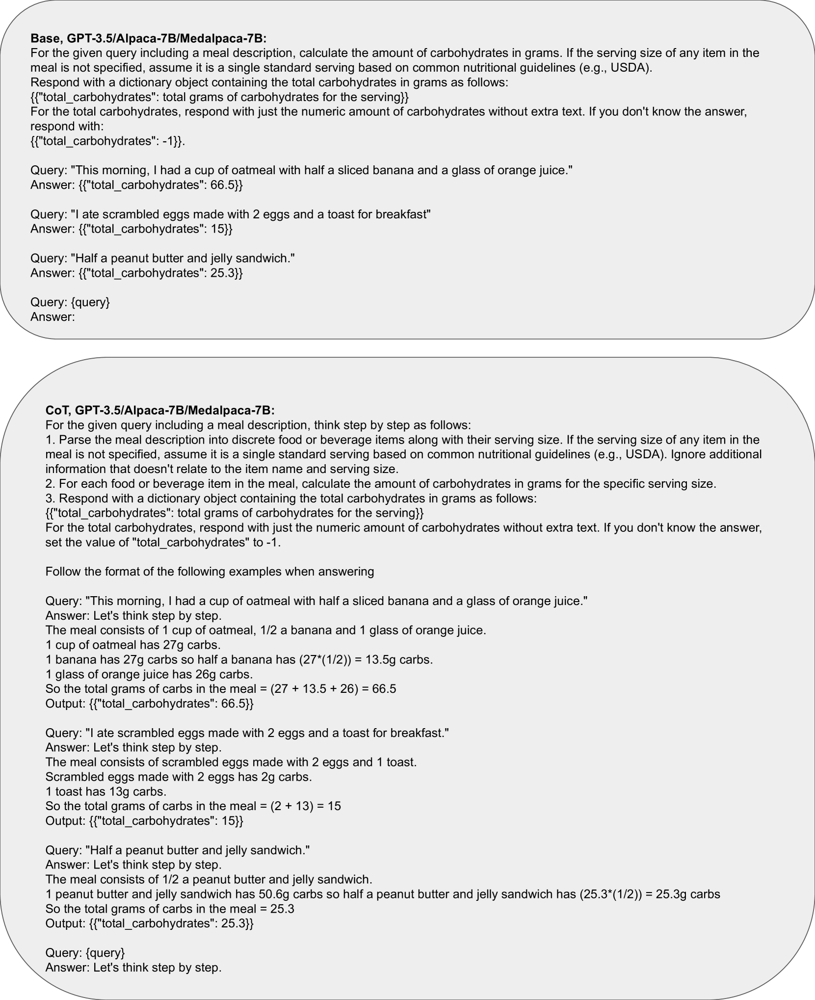

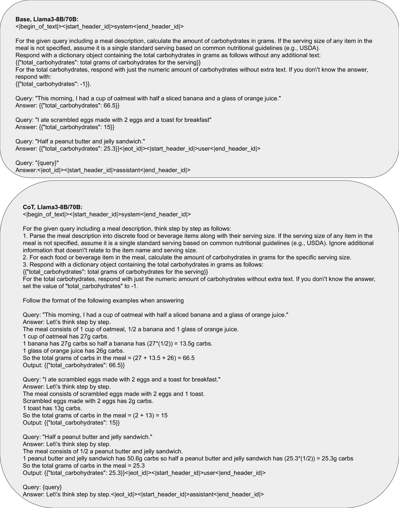

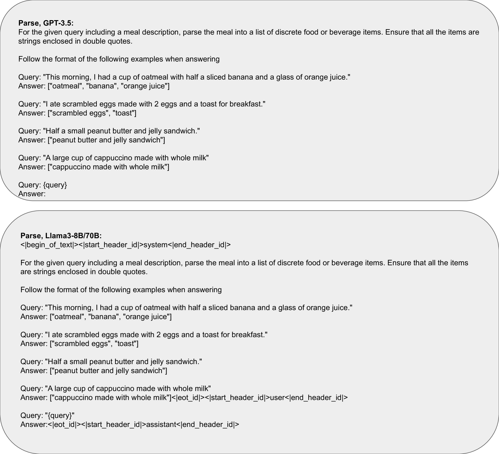

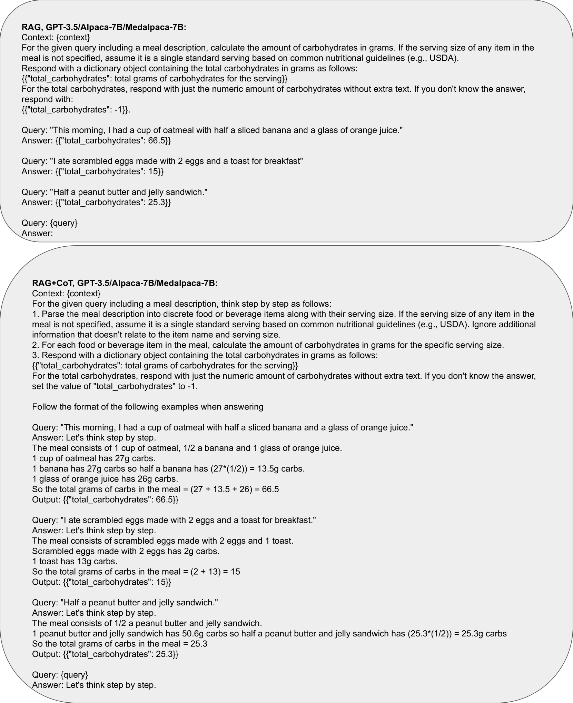

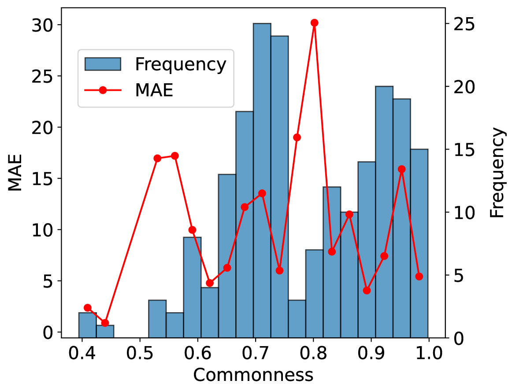

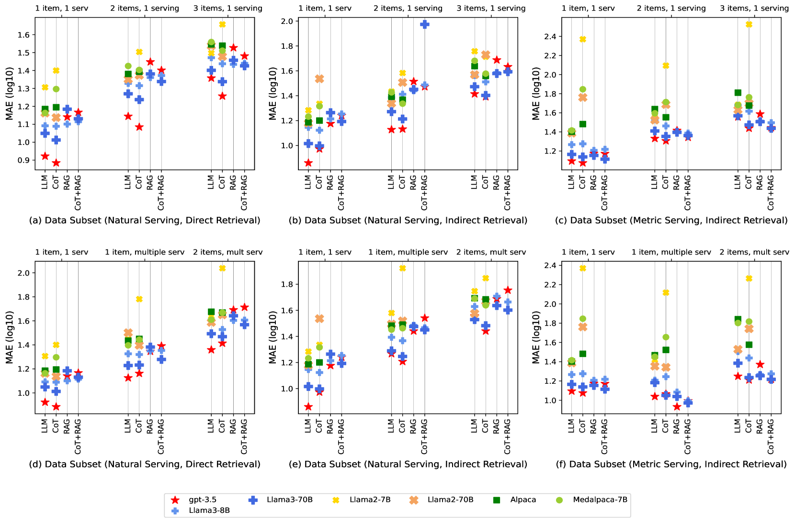

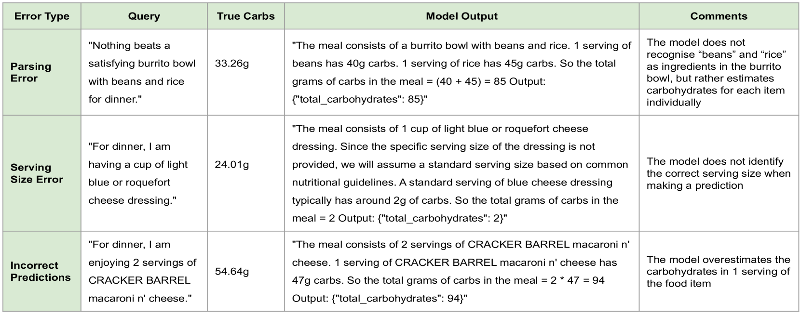

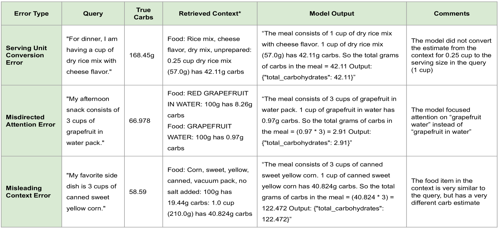

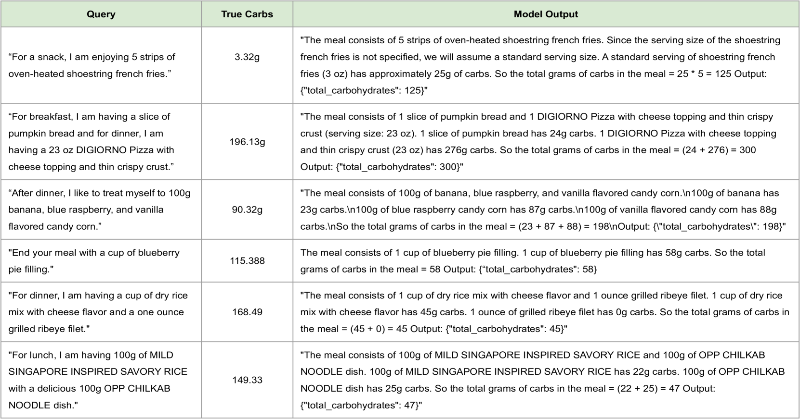

[Arxiv](https://arxiv.org/abs/2407.12843)