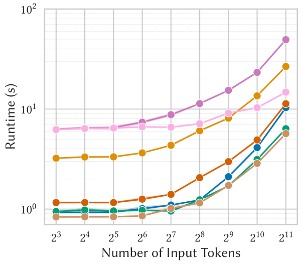
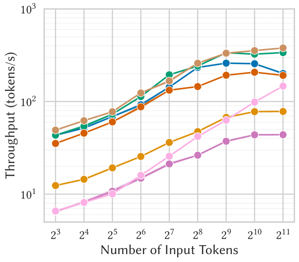
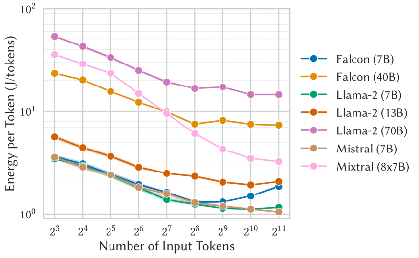
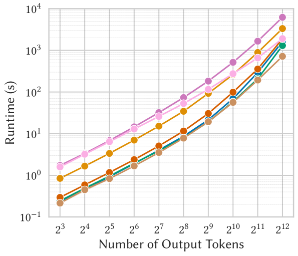
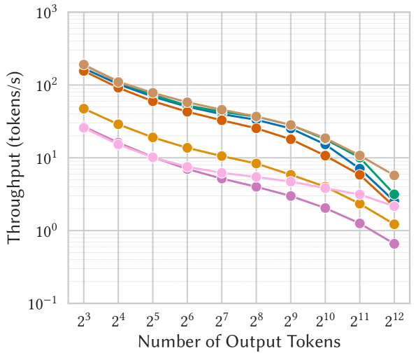
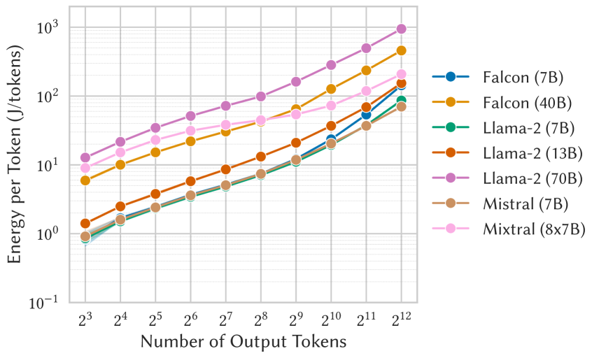
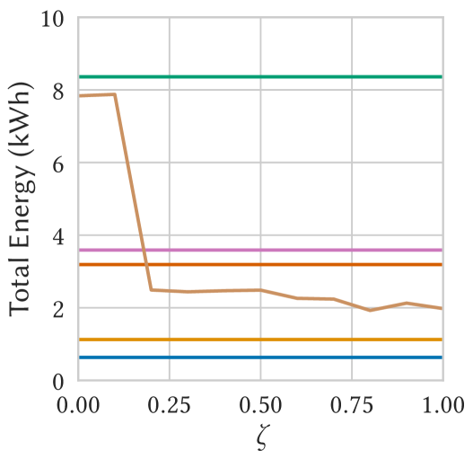
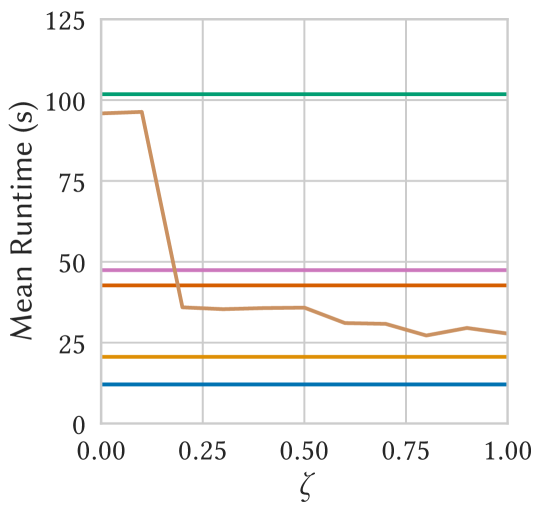
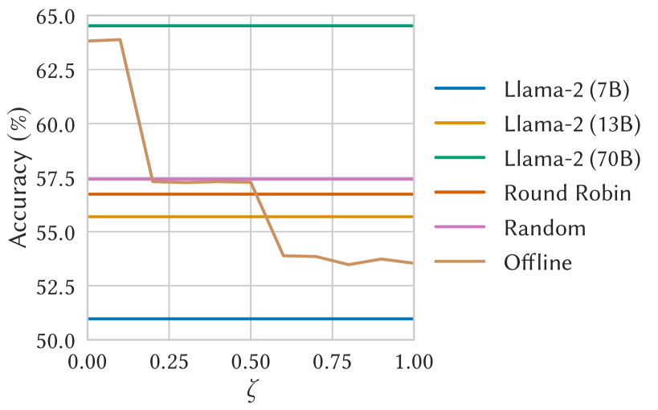

# 离线模式下，LLM 服务追求能量最优：针对异构系统中 LLM 推理，我们构建了基于工作负载的能量模型。

发布时间：2024年07月04日

`LLM应用` `信息技术`

> Offline Energy-Optimal LLM Serving: Workload-Based Energy Models for LLM Inference on Heterogeneous Systems

# 摘要

> 随着大型语言模型 (LLM) 的广泛应用，自然语言处理和文本生成领域取得了巨大进展。但 LLM 推理过程中的高能耗仍是可持续 AI 发展的瓶颈。为此，我们针对异构 GPU-CPU 系统，构建了基于工作负载的 LLM 推理能耗与运行时间模型。通过深入分析多个领先 LLM 在不同输入输出规模下的能耗与运行表现，我们建立了高度精确 (R^2>0.96) 的模型。基于此，我们设计了一种离线、能耗最优的 LLM 任务调度框架，并通过实证研究，验证了其在能效与准确性方面的显著优势，超越了当前的行业最佳实践。

> The rapid adoption of large language models (LLMs) has led to significant advances in natural language processing and text generation. However, the energy consumed through LLM model inference remains a major challenge for sustainable AI deployment. To address this problem, we model the workload-dependent energy consumption and runtime of LLM inference tasks on heterogeneous GPU-CPU systems. By conducting an extensive characterization study of several state-of-the-art LLMs and analyzing their energy and runtime behavior across different magnitudes of input prompts and output text, we develop accurate (R^2>0.96) energy and runtime models for each LLM. We employ these models to explore an offline, energy-optimal LLM workload scheduling framework. Through a case study, we demonstrate the advantages of energy and accuracy aware scheduling compared to existing best practices.

[Arxiv](https://arxiv.org/abs/2407.04014)