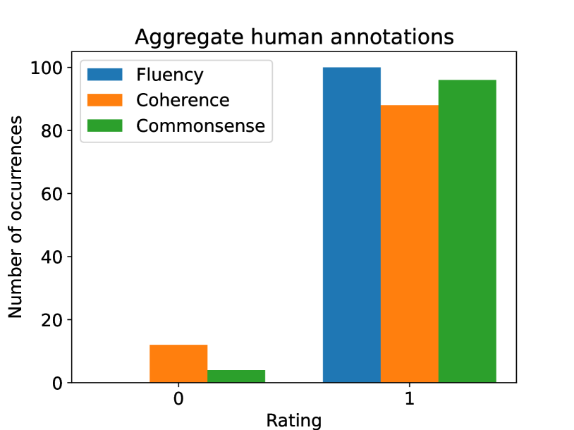
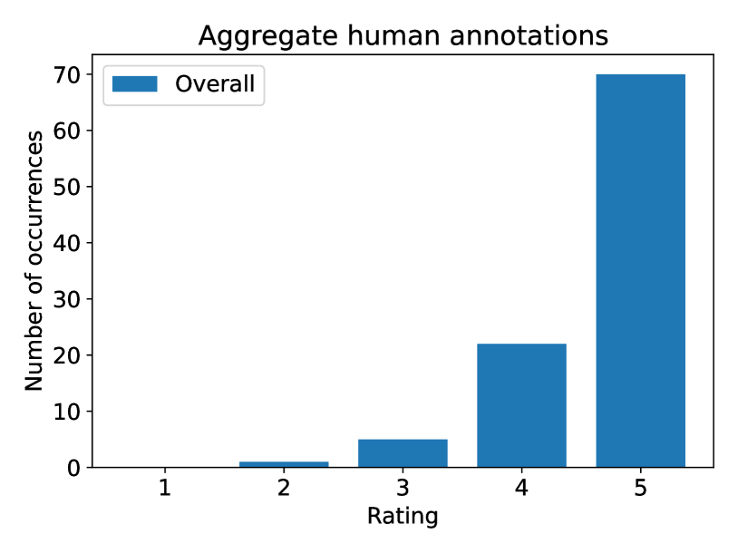
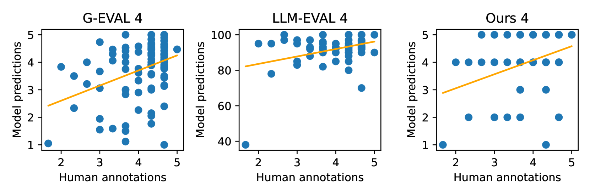
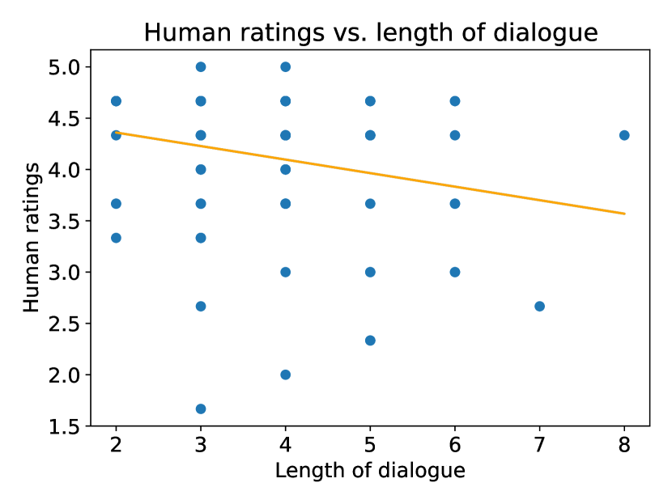

# 大型语言模型在开放域对话评估中的基准测试研究

发布时间：2024年07月04日

`LLM应用` `人工智能`

> On the Benchmarking of LLMs for Open-Domain Dialogue Evaluation

# 摘要

> LLM 在 NLP 任务中表现卓越，尤其在自动开放域对话评估中，与人类评估共同构成评估核心。但现有基准多依赖过时数据，侧重流畅与相关性，未能全面反映先进聊天机器人的真实能力。本文深入分析当前基准，指出其不足，并通过 SODA 数据集上的实验揭示，如 GPT-4 等评估工具在识别现代聊天机器人对话缺陷方面存在挑战。

> Large Language Models (LLMs) have showcased remarkable capabilities in various Natural Language Processing tasks. For automatic open-domain dialogue evaluation in particular, LLMs have been seamlessly integrated into evaluation frameworks, and together with human evaluation, compose the backbone of most evaluations. However, existing evaluation benchmarks often rely on outdated datasets and evaluate aspects like Fluency and Relevance, which fail to adequately capture the capabilities and limitations of state-of-the-art chatbot models.
  This paper critically examines current evaluation benchmarks, highlighting that the use of older response generators and quality aspects fail to accurately reflect modern chatbot capabilities. A small annotation experiment on a recent LLM-generated dataset (SODA) reveals that LLM evaluators such as GPT-4 struggle to detect actual deficiencies in dialogues generated by current LLM chatbots.

[Arxiv](https://arxiv.org/abs/2407.03841)