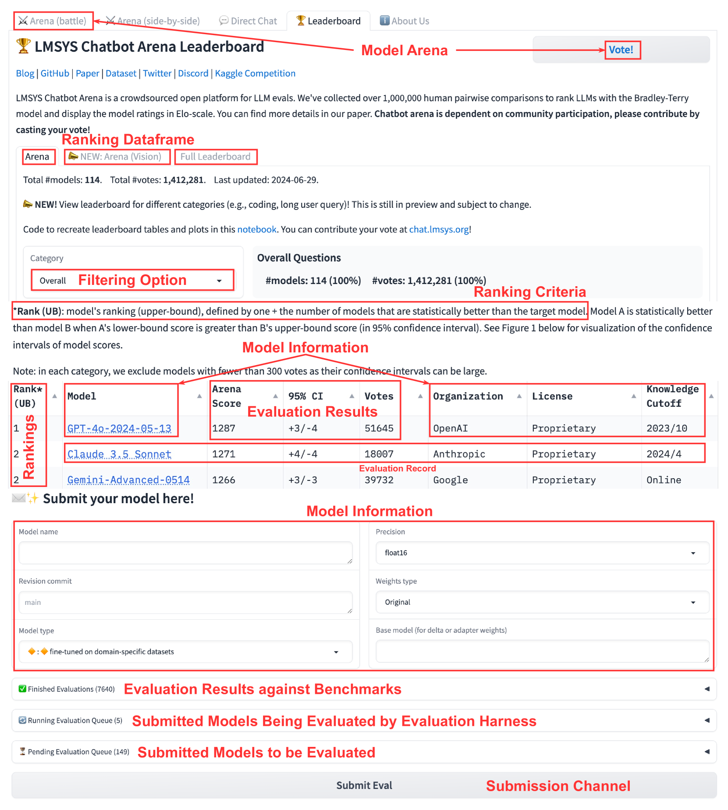
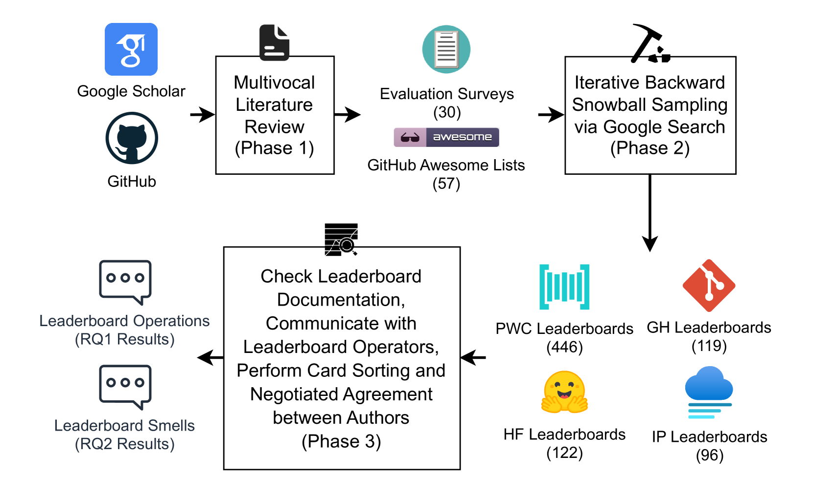
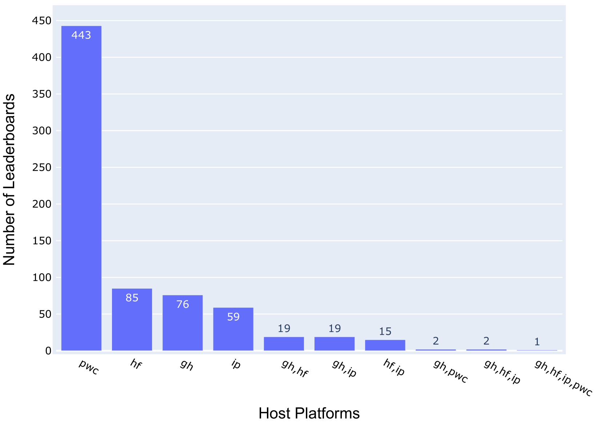
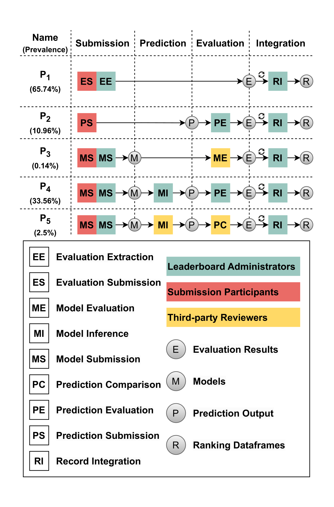
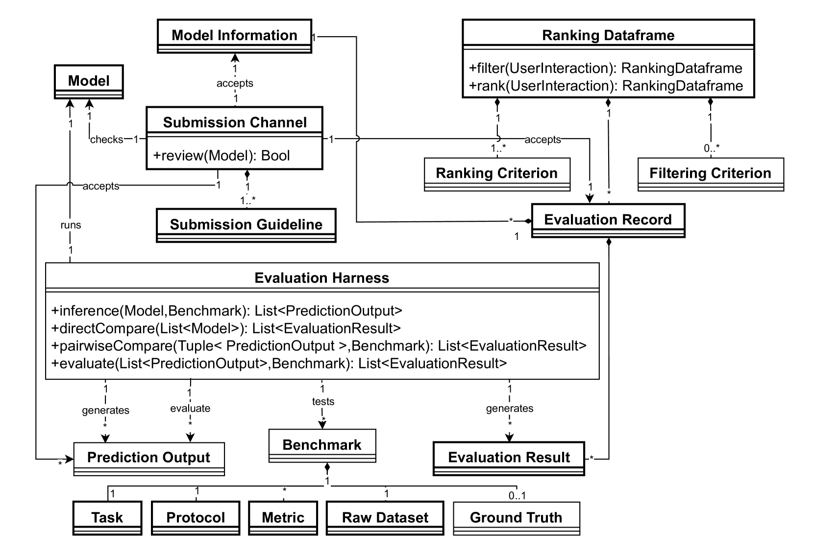

# 探索基础模型排行榜中的操作流程与问题：排行榜操作 (LBOps) 的深入研究

发布时间：2024年07月04日

`LLM应用` `软件工程` `云计算`

> On the Workflows and Smells of Leaderboard Operations (LBOps): An Exploratory Study of Foundation Model Leaderboards

# 摘要

> 大型语言模型等基础模型在软件工程任务中展现出卓越的适应性，推动了FM排行榜在云平台上的重要性。然而，评估和比较指南的缺失影响了排行榜的透明度，限制了有效选择。我们的研究首先探索了排行榜的实际运作和潜在问题，通过文献综述和运营商沟通，揭示了五种工作流程模式和八类问题。通过解决这些问题，我们旨在提升排行榜的透明度和责任感，构建一个更健康、更负责任的FM选择环境。

> Foundation models (FM), such as large language models (LLMs), which are large-scale machine learning (ML) models, have demonstrated remarkable adaptability in various downstream software engineering (SE) tasks, such as code completion, code understanding, and software development. As a result, FM leaderboards, especially those hosted on cloud platforms, have become essential tools for SE teams to compare and select the best third-party FMs for their specific products and purposes. However, the lack of standardized guidelines for FM evaluation and comparison threatens the transparency of FM leaderboards and limits stakeholders' ability to perform effective FM selection. As a first step towards addressing this challenge, our research focuses on understanding how these FM leaderboards operate in real-world scenarios ("leaderboard operations") and identifying potential leaderboard pitfalls and areas for improvement ("leaderboard smells"). In this regard, we perform a multivocal literature review to collect up to 721 FM leaderboards, after which we examine their documentation and engage in direct communication with leaderboard operators to understand their workflow patterns. Using card sorting and negotiated agreement, we identify 5 unique workflow patterns and develop a domain model that outlines the essential components and their interaction within FM leaderboards. We then identify 8 unique types of leaderboard smells in LBOps. By mitigating these smells, SE teams can improve transparency, accountability, and collaboration in current LBOps practices, fostering a more robust and responsible ecosystem for FM comparison and selection.

[Arxiv](https://arxiv.org/abs/2407.04065)