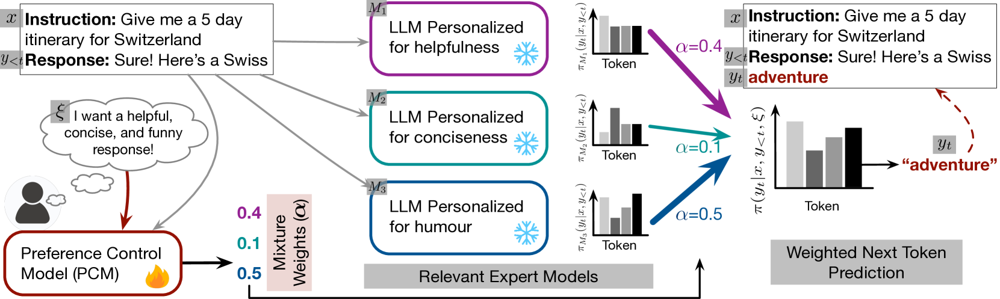
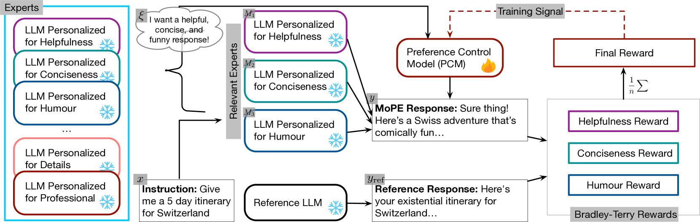

# 个性化调配大型语言模型

发布时间：2024年07月04日

`LLM应用` `个性化服务` `人工智能`

> Orchestrating LLMs with Different Personalizations

# 摘要

> 本文介绍了一种创新方法，旨在将大型语言模型（LLM）与个人偏好精准对接，这种方法被称为个性化人类反馈强化学习（RLPHF）。我们的目标是在不重新训练的前提下，打造一个能够完美契合用户在帮助性、简洁性或幽默感等多维度偏好的LLM。我们从专门针对某一偏好维度训练的专家LLM出发，提出了一种在标记级别上融合它们输出的黑箱技术。同时，我们训练了一个轻巧的偏好控制模型（PCM），它能根据当前上下文动态调整偏好描述，进而影响下一个标记的预测权重。通过在标记级别上整合专家模型的输出，我们的方法能够动态生成符合用户偏好的文本。实证测试显示，我们的方法在偏好合并技术上表现卓越，为个性化微调LLM提供了一种高效且可扩展的解决方案。

> This paper presents a novel approach to aligning large language models (LLMs) with individual human preferences, sometimes referred to as Reinforcement Learning from \textit{Personalized} Human Feedback (RLPHF). Given stated preferences along multiple dimensions, such as helpfulness, conciseness, or humor, the goal is to create an LLM without re-training that best adheres to this specification. Starting from specialized expert LLMs, each trained for one such particular preference dimension, we propose a black-box method that merges their outputs on a per-token level. We train a lightweight Preference Control Model (PCM) that dynamically translates the preference description and current context into next-token prediction weights. By combining the expert models' outputs at the token level, our approach dynamically generates text that optimizes the given preference. Empirical tests show that our method matches or surpasses existing preference merging techniques, providing a scalable, efficient alternative to fine-tuning LLMs for individual personalization.

[Arxiv](https://arxiv.org/abs/2407.04181)