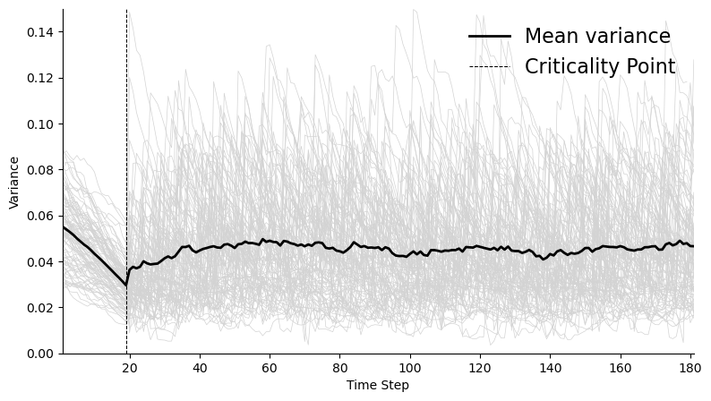
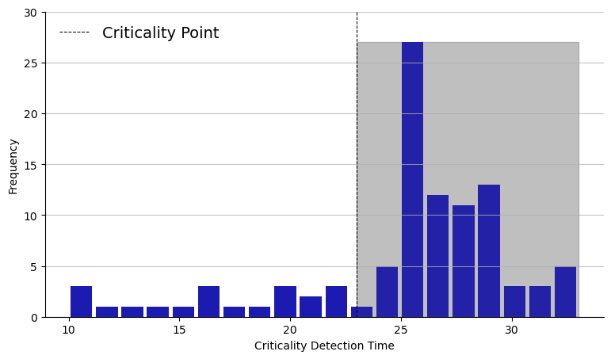

# 超越混沌边缘？过度复杂性成为人工通用智能之路的绊脚石

发布时间：2024年07月04日

`LLM理论` `人工智能` `复杂性理论`

> Over the Edge of Chaos? Excess Complexity as a Roadblock to Artificial General Intelligence

# 摘要

> 本研究通过复杂性理论视角，深入探讨了AI系统的演进路径。我们质疑了传统上对AI向AGI发展的线性和指数预测，并提出了AI性能在达到某个复杂性临界点后可能停滞或变得不稳定的观点。通过基于代理的建模，我们模拟了AI系统在特定条件下的演化，以基准性能衡量其能力和复杂度。模拟结果显示，AI系统复杂度的增加可能导致性能行为的不可预测性。此外，我们提出了一种实用方法，利用模拟数据和随机梯度下降技术来识别这些关键阈值。这项研究为理解AI发展提供了新视角，特别强调了在评估AI潜力时需谨慎，并呼吁建立更全面的AI性能评估标准。

> In this study, we explored the progression trajectories of artificial intelligence (AI) systems through the lens of complexity theory. We challenged the conventional linear and exponential projections of AI advancement toward Artificial General Intelligence (AGI) underpinned by transformer-based architectures, and posited the existence of critical points, akin to phase transitions in complex systems, where AI performance might plateau or regress into instability upon exceeding a critical complexity threshold. We employed agent-based modelling (ABM) to simulate hypothetical scenarios of AI systems' evolution under specific assumptions, using benchmark performance as a proxy for capability and complexity. Our simulations demonstrated how increasing the complexity of the AI system could exceed an upper criticality threshold, leading to unpredictable performance behaviours. Additionally, we developed a practical methodology for detecting these critical thresholds using simulation data and stochastic gradient descent to fine-tune detection thresholds. This research offers a novel perspective on AI advancement that has a particular relevance to Large Language Models (LLMs), emphasising the need for a tempered approach to extrapolating AI's growth potential and underscoring the importance of developing more robust and comprehensive AI performance benchmarks.

[Arxiv](https://arxiv.org/abs/2407.03652)