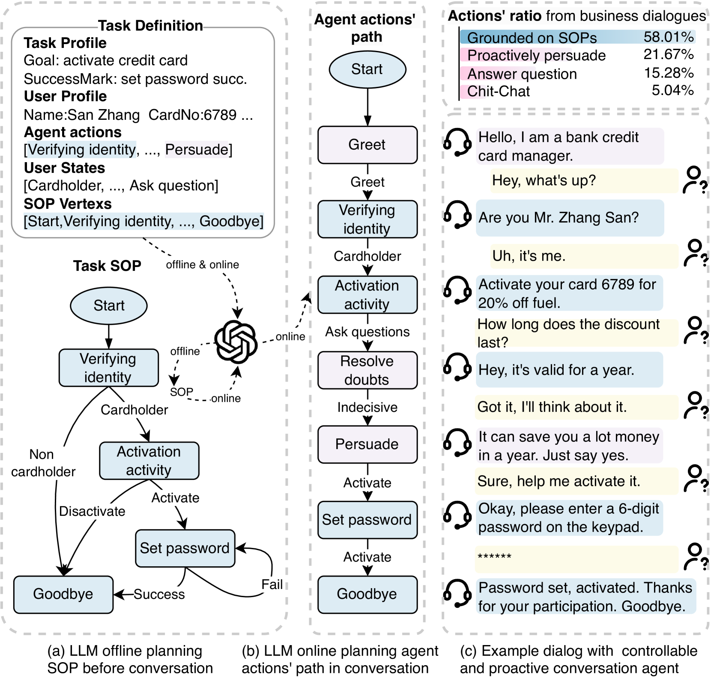
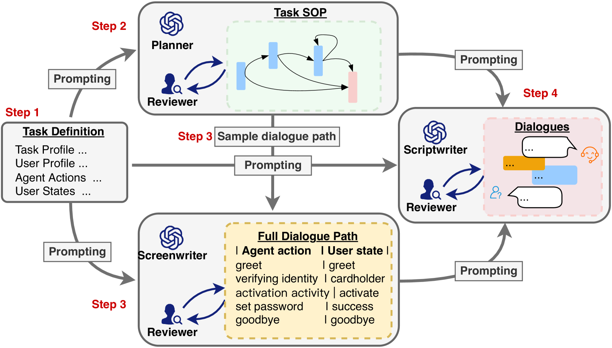
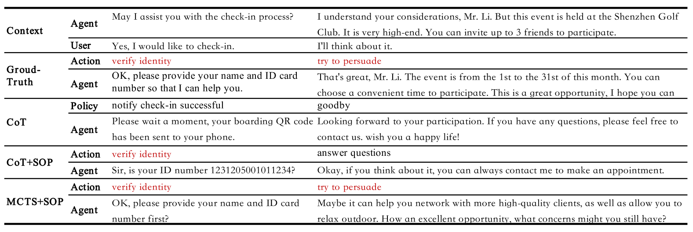
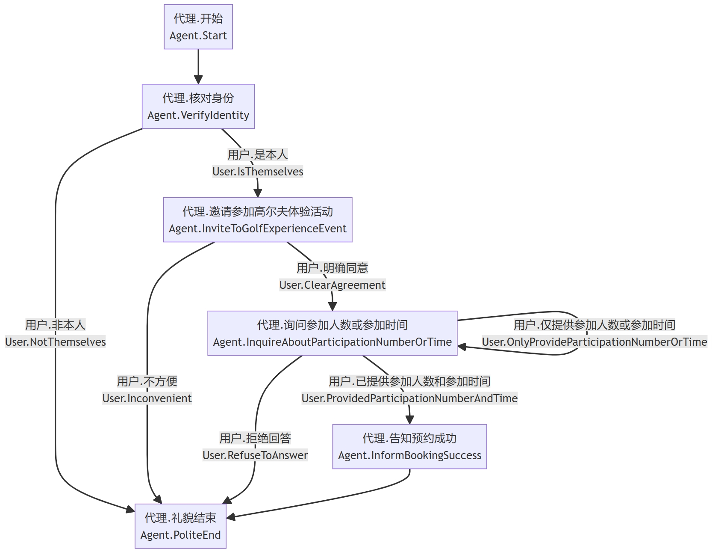

# 利用大型语言模型规划对话代理

发布时间：2024年07月04日

`Agent` `对话系统`

> Planning with Large Language Models for Conversational Agents

# 摘要

> 自主对话代理（CAs）的核心在于可控性与主动性。可控性意味着CAs需遵循标准操作流程（SOPs），如激活信用卡前的身份验证；主动性则要求CAs在用户不配合时引导对话达成目标，如进行说服性交流。当前研究难以兼顾这三者：可控性、主动性与低成本的手动标注。为此，我们创新性地提出了一个基于计划的大型语言模型（LLMs）驱动的对话代理框架（PCA），仅需人类设定任务与目标。对话前，LLM离线制定关键SOP；对话中，LLM在线依据SOP规划最优行动，确保对话过程的可控。此外，我们构建了半自动对话数据生成框架，并精心打造了高质量对话数据集（PCA-D）。我们还研发了多种PCA变体及评估标准，如采用蒙特卡洛树搜索（PCA-M）的规划方法，该方法在遵守SOP的同时，寻找最优对话策略，增强对话的主动性。实验表明，经PCA-D微调的LLMs性能大幅提升，且能适应新领域。PCA-M在多个维度上超越传统基线，适用于实际工业对话场景。相关数据集与代码已公开于XXXX。

> Controllability and proactivity are crucial properties of autonomous conversational agents (CAs). Controllability requires the CAs to follow the standard operating procedures (SOPs), such as verifying identity before activating credit cards. Proactivity requires the CAs to guide the conversation towards the goal during user uncooperation, such as persuasive dialogue. Existing research cannot be unified with controllability, proactivity, and low manual annotation. To bridge this gap, we propose a new framework for planning-based conversational agents (PCA) powered by large language models (LLMs), which only requires humans to define tasks and goals for the LLMs. Before conversation, LLM plans the core and necessary SOP for dialogue offline. During the conversation, LLM plans the best action path online referring to the SOP, and generates responses to achieve process controllability. Subsequently, we propose a semi-automatic dialogue data creation framework and curate a high-quality dialogue dataset (PCA-D). Meanwhile, we develop multiple variants and evaluation metrics for PCA, e.g., planning with Monte Carlo Tree Search (PCA-M), which searches for the optimal dialogue action while satisfying SOP constraints and achieving the proactive of the dialogue. Experiment results show that LLMs finetuned on PCA-D can significantly improve the performance and generalize to unseen domains. PCA-M outperforms other CoT and ToT baselines in terms of conversation controllability, proactivity, task success rate, and overall logical coherence, and is applicable in industry dialogue scenarios. The dataset and codes are available at XXXX.

[Arxiv](https://arxiv.org/abs/2407.03884)