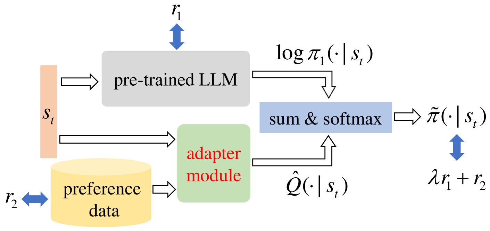
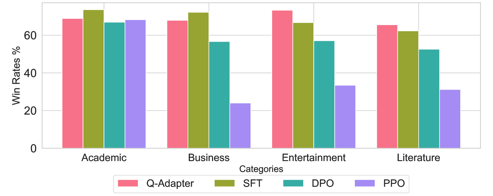
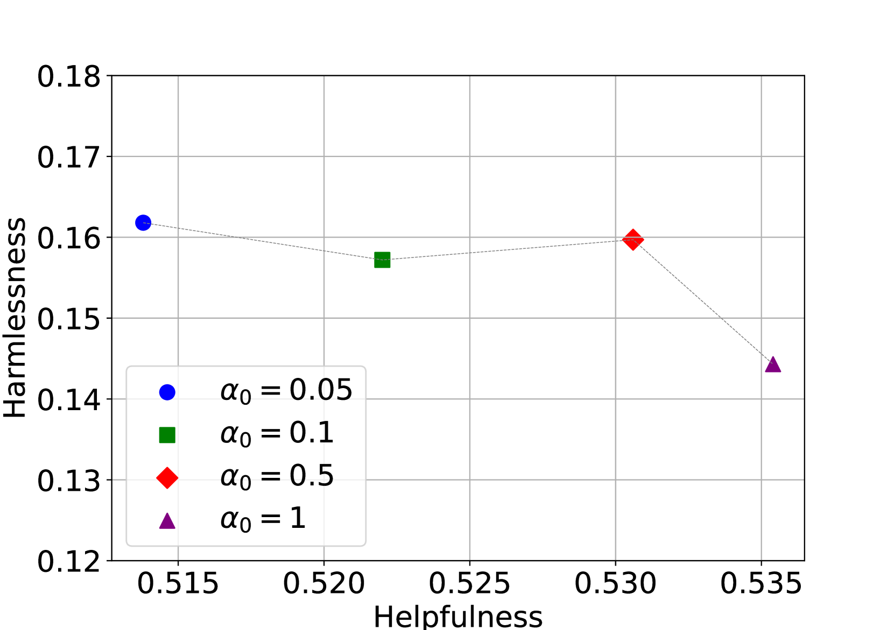

# Q-Adapter：训练您的 LLM Adapter 成为残差 Q-Function

发布时间：2024年07月04日

`LLM应用` `人工智能` `机器学习`

> Q-Adapter: Training Your LLM Adapter as a Residual Q-Function

# 摘要

> 本文探讨了如何将通过人类反馈强化学习预训练的 LLM 适应到下游偏好数据，提出了一种名为 Q-Adapter 的创新方法。该方法通过学习一个新模块，近似于残差 Q-函数，从而在保留 LLM 原有能力的同时实现定制化。实验证明，Q-Adapter 在防止知识遗忘和适应新偏好方面表现出色，适用于多种特定领域和安全对齐任务。

> We consider the problem of adapting Large Language Models (LLMs) pre-trained with Reinforcement Learning from Human Feedback (RLHF) to downstream preference data. Naive approaches to achieve this could be supervised fine-tuning on preferred responses or reinforcement learning with a learned reward model. However, the LLM runs the risk of forgetting its initial knowledge as the fine-tuning progresses. To customize the LLM while preserving its existing capabilities, this paper proposes a novel method, named as Q-Adapter. We start by formalizing LLM adaptation as a problem of maximizing the linear combination of two rewards, one of which corresponds to the reward optimized by the pre-trained LLM and the other to the downstream preference data. Although both rewards are unknown, we show that this can be solved by directly learning a new module from the preference data that approximates the \emph{residual Q-function}. We consider this module to be an adapter because the original pre-trained LLM, together with it, can form the optimal customised LLM. Empirically, experiments on a range of domain-specific tasks and safety alignment tasks illustrate the superiority of Q-Adapter in both anti-forgetting and learning from new preferences.

[Arxiv](https://arxiv.org/abs/2407.03856)