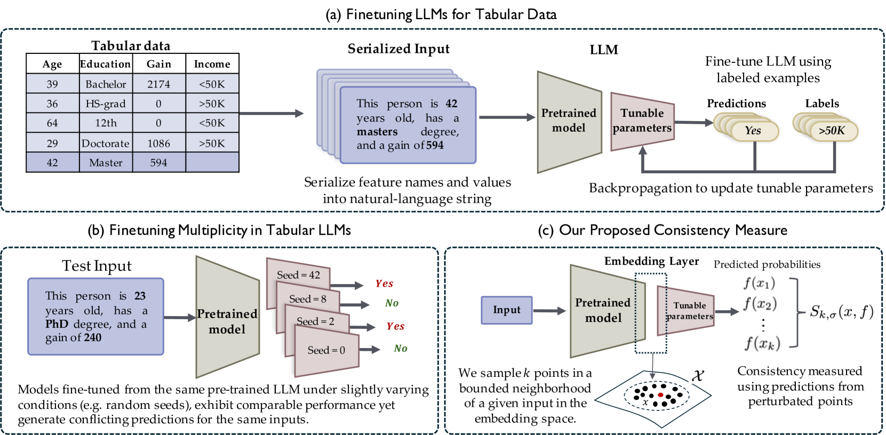
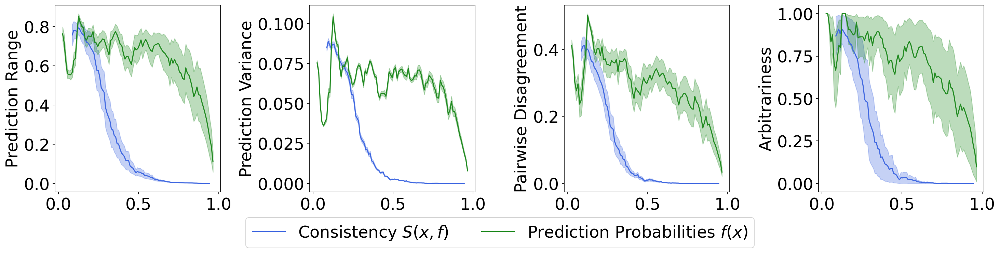
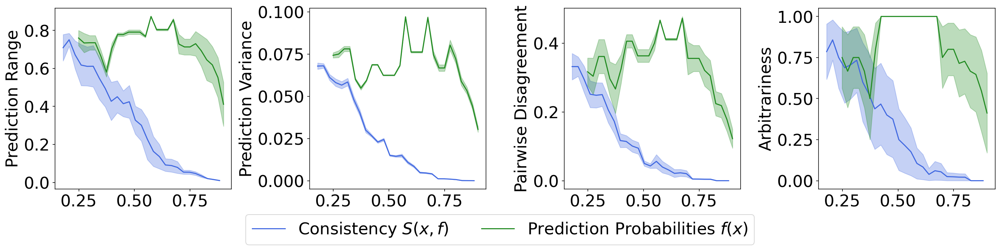
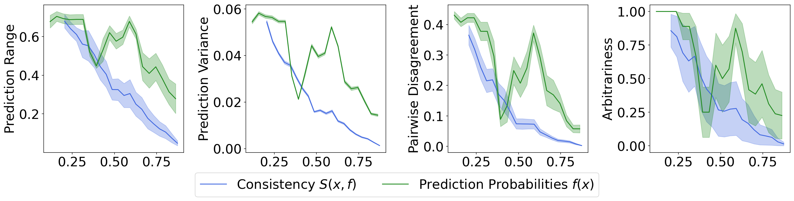

# 探究表格型LLM在模型多样性下的预测一致性

发布时间：2024年07月04日

`LLM理论`

> Quantifying Prediction Consistency Under Model Multiplicity in Tabular LLMs

# 摘要

> 在分类任务中，对大型语言模型进行有限表格数据的微调可能导致“微调多重性”，即不同训练过程下的模型对相同输入做出不同预测。这引发了关于表格 LLM 在高风险决策中的稳健性和可靠性的担忧。为此，我们正式化了这一挑战，并提出了一种新指标，通过分析模型在嵌入空间中的局部行为，无需重新训练模型即可量化预测的稳健性。我们利用伯恩斯坦不等式，证明了高稳健性预测将以高概率保持一致，并通过实证评估支持了这一理论。我们的工作强调了解决微调不稳定性的重要性，以确保 LLM 在高风险和安全关键应用中的可信部署。

> Fine-tuning large language models (LLMs) on limited tabular data for classification tasks can lead to \textit{fine-tuning multiplicity}, where equally well-performing models make conflicting predictions on the same inputs due to variations in the training process (i.e., seed, random weight initialization, retraining on additional or deleted samples). This raises critical concerns about the robustness and reliability of Tabular LLMs, particularly when deployed for high-stakes decision-making, such as finance, hiring, education, healthcare, etc. This work formalizes the challenge of fine-tuning multiplicity in Tabular LLMs and proposes a novel metric to quantify the robustness of individual predictions without expensive model retraining. Our metric quantifies a prediction's stability by analyzing (sampling) the model's local behavior around the input in the embedding space. Interestingly, we show that sampling in the local neighborhood can be leveraged to provide probabilistic robustness guarantees against a broad class of fine-tuned models. By leveraging Bernstein's Inequality, we show that predictions with sufficiently high robustness (as defined by our measure) will remain consistent with high probability. We also provide empirical evaluation on real-world datasets to support our theoretical results. Our work highlights the importance of addressing fine-tuning instabilities to enable trustworthy deployment of LLMs in high-stakes and safety-critical applications.

[Arxiv](https://arxiv.org/abs/2407.04173)