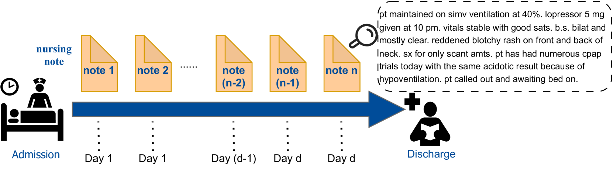
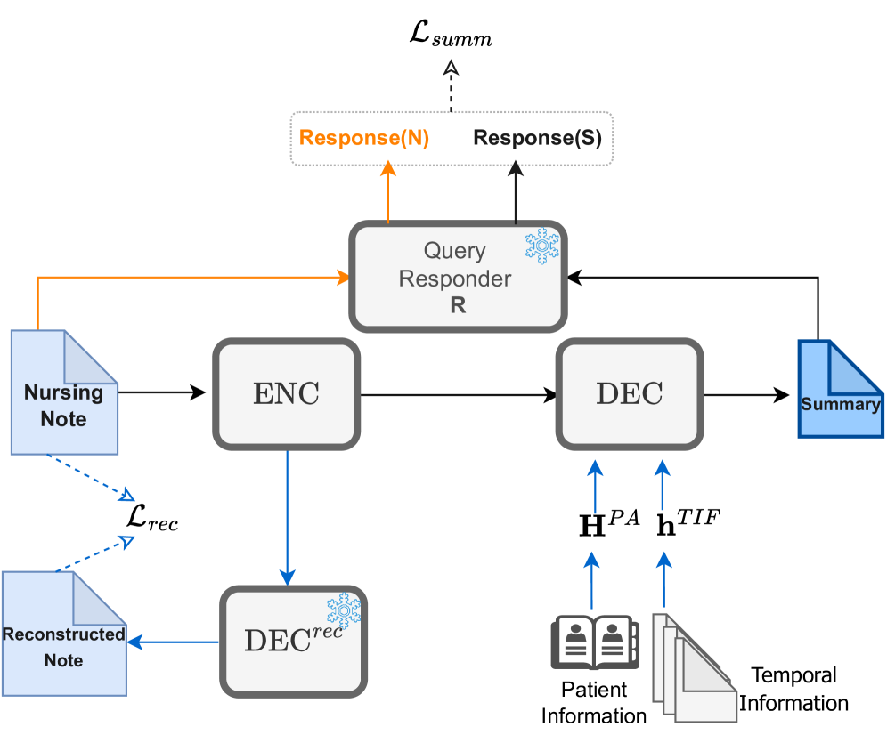
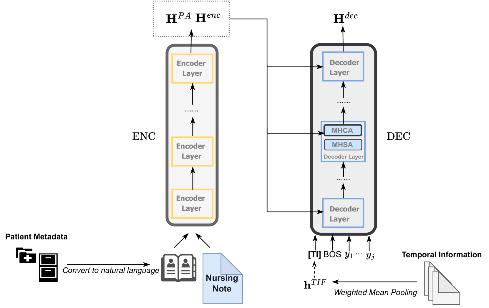
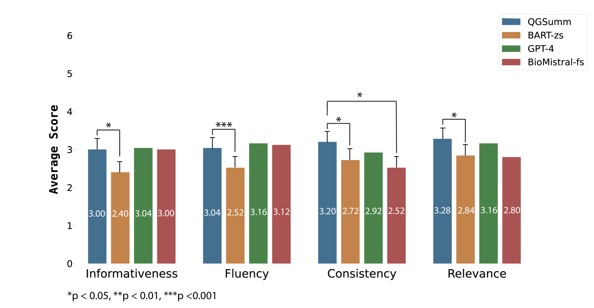
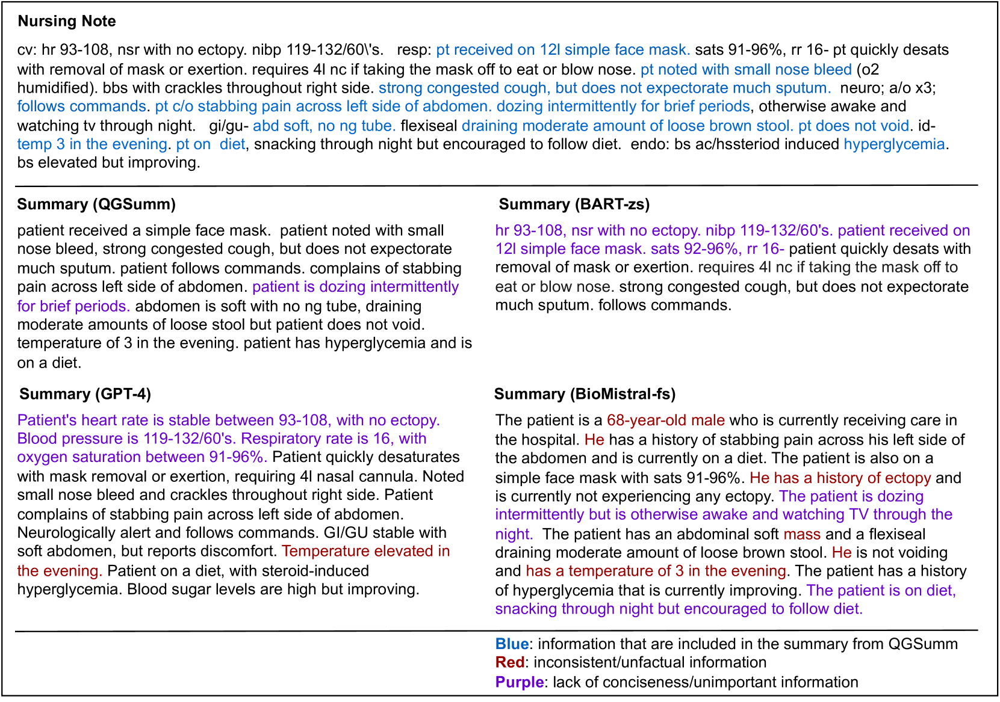
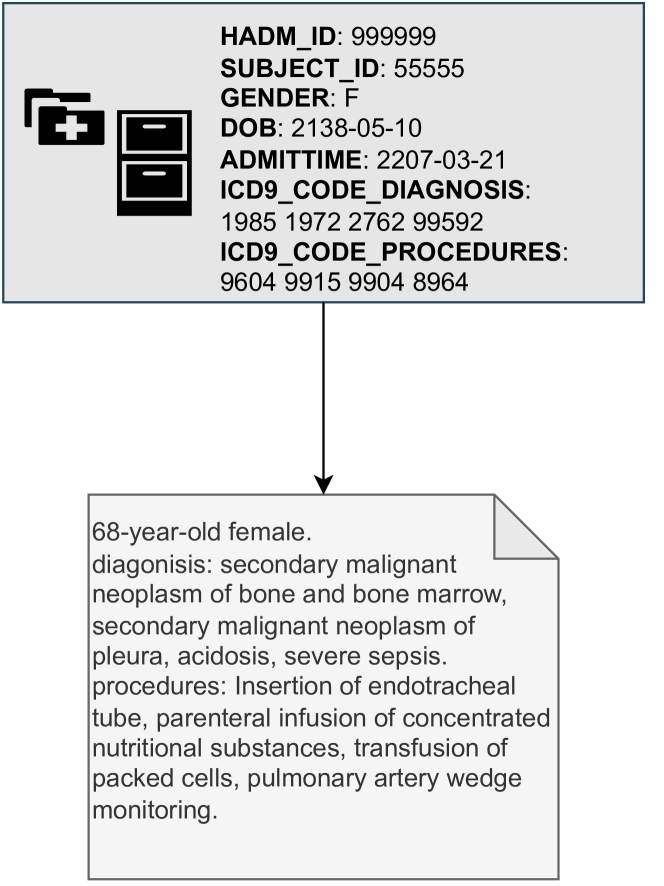
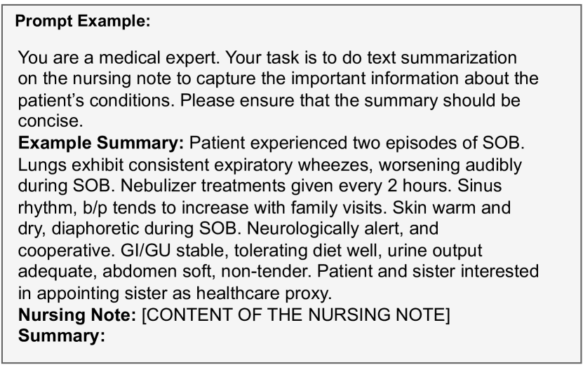
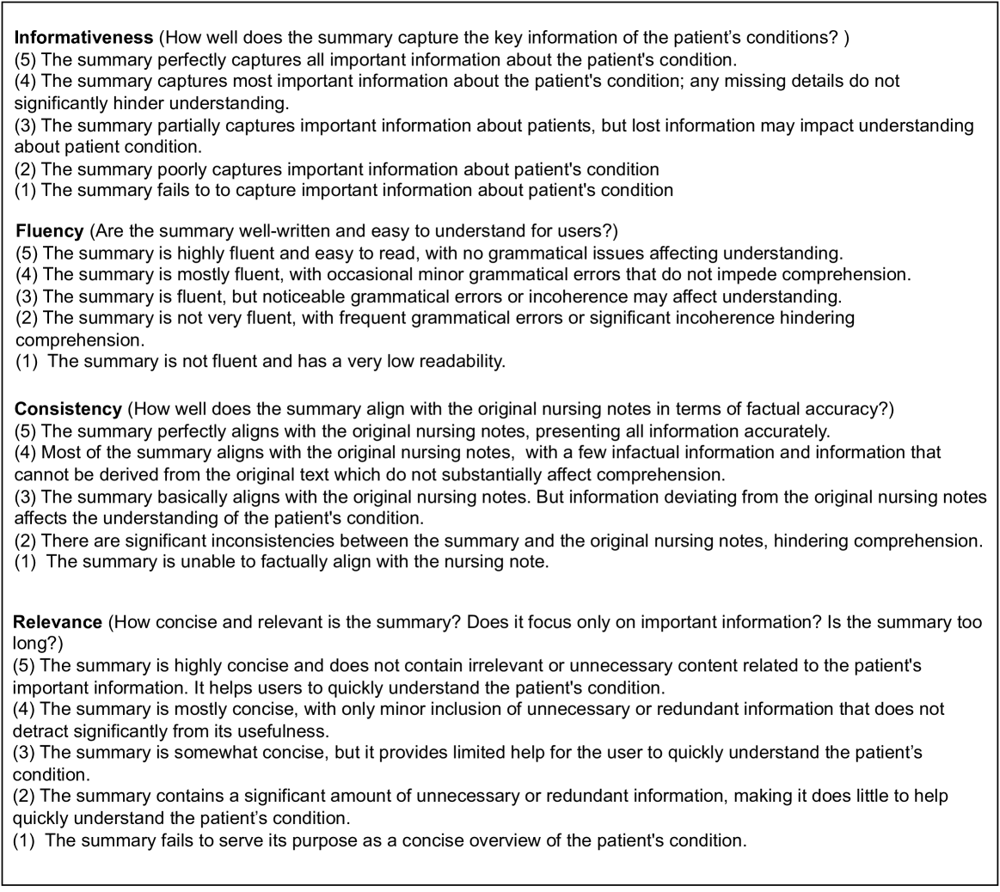
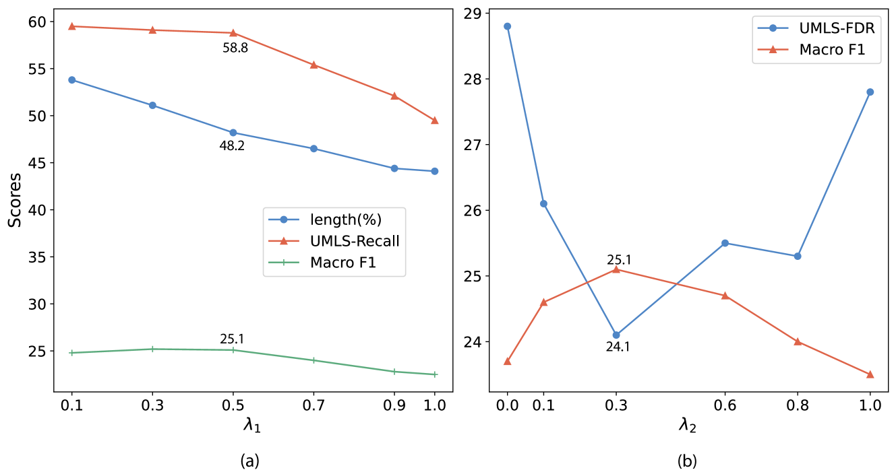

# 护理笔记的自监督摘要，由查询引导

发布时间：2024年07月04日

`LLM应用` `临床护理`

> Query-Guided Self-Supervised Summarization of Nursing Notes

# 摘要

> 护理记录作为电子健康记录的关键部分，记录了患者护理期间的健康进展。通过文本摘要技术提炼这些记录中的关键信息，能显著提升临床医生理解患者状况的效率。然而，现有临床摘要方法常忽略护理记录，且需耗时创建参考摘要。为此，我们提出了QGSumm框架，利用患者相关临床查询引导，生成高质量、以患者为中心的摘要，无需参考摘要。经自动与临床专家手动评估，我们的方法在零-shot和few-shot环境下均优于顶尖大型语言模型。这一创新为条件文本摘要开辟了新视角，更贴合临床人员的实际需求。

> Nursing notes, an important component of Electronic Health Records (EHRs), keep track of the progression of a patient's health status during a care episode. Distilling the key information in nursing notes through text summarization techniques can improve clinicians' efficiency in understanding patients' conditions when reviewing nursing notes. However, existing abstractive summarization methods in the clinical setting have often overlooked nursing notes and require the creation of reference summaries for supervision signals, which is time-consuming. In this work, we introduce QGSumm, a query-guided self-supervised domain adaptation framework for nursing note summarization. Using patient-related clinical queries as guidance, our approach generates high-quality, patient-centered summaries without relying on reference summaries for training. Through automatic and manual evaluation by an expert clinician, we demonstrate the strengths of our approach compared to the state-of-the-art Large Language Models (LLMs) in both zero-shot and few-shot settings. Ultimately, our approach provides a new perspective on conditional text summarization, tailored to the specific interests of clinical personnel.

[Arxiv](https://arxiv.org/abs/2407.04125)