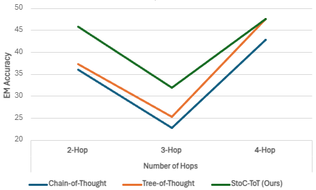

# STOC-TOT：一种结合约束解码的随机思维树方法，专为多跳问答中的复杂推理设计。

发布时间：2024年07月04日

`LLM应用` `问答系统` `人工智能`

> STOC-TOT: Stochastic Tree-of-Thought with Constrained Decoding for Complex Reasoning in Multi-Hop Question Answering

# 摘要

> 多跳问答（MHQA）任务要求模型从多个段落中检索并整合信息，以解答复杂问题。最新系统结合大型语言模型的强大能力，通过集成证据检索与推理提示（如思维链推理）来应对MHQA挑战。然而，问题与推理类型的多样性（如桥梁与比较问题，顺序与并行推理），对零-shot环境下MHQA性能的提升提出了更高要求，需要更创新、更精细的提示策略。为此，我们提出STOC-TOT，一种结合约束解码的随机思维树推理方法，专门针对MHQA设计，并在多种问题与推理类型上与其他方法进行了深入对比。我们构建了一个树状推理结构，引导模型将复杂问题分解为子问题，形成多条推理路径，并在每一步推理中评估各路径的概率。在生成答案时，我们采用约束解码技术，确保答案更加准确且减少不实信息。实验结果表明，STOC-TOT在两个MHQA数据集和五个大型语言模型上，均显著超越了其他推理提示方法。

> Multi-hop question answering (MHQA) requires a model to retrieve and integrate information from multiple passages to answer a complex question. Recent systems leverage the power of large language models and integrate evidence retrieval with reasoning prompts (e.g., chain-of-thought reasoning) for the MHQA task. However, the complexities in the question types (bridge v.s. comparison questions) and the reasoning types (sequential v.s. parallel reasonings) require more novel and fine-grained prompting methods to enhance the performance of MHQA under the zero-shot setting. In this paper, we propose STOC-TOT, a stochastic tree-of-thought reasoning prompting method with constrained decoding for MHQA and conduct a detailed comparison with other reasoning prompts on different question types and reasoning types. Specifically, we construct a tree-like reasoning structure by prompting the model to break down the original question into smaller sub-questions to form different reasoning paths. In addition, we prompt the model to provide a probability estimation for each reasoning path at each reasoning step. At answer time, we conduct constrained decoding on the model to generate more grounded answers and reduce hallucination. Experiments comparing STOC-TOT with two MHQA datasets and five large language models showed that our framework outperforms other reasoning prompts by a significant margin.

[Arxiv](https://arxiv.org/abs/2407.03687)