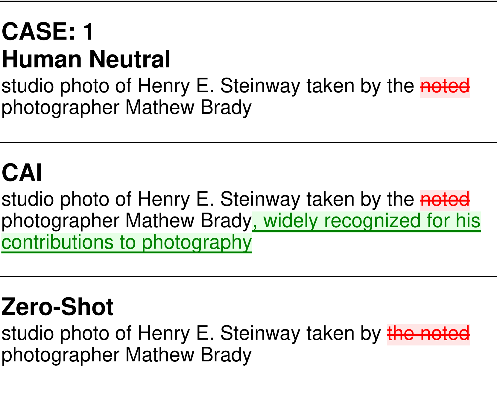

# 窥探AI视角：LLMs在应用维基百科中立性规范时的得与失

发布时间：2024年07月04日

`LLM应用` `人工智能`

> Seeing Like an AI: How LLMs Apply (and Misapply) Wikipedia Neutrality Norms

# 摘要

> 大型语言模型（LLM）虽在广泛语料库上训练，但应用于特定规范社区时，仅提供社区规则是否足够？我们测试了LLM识别与修正维基百科编辑偏差的能力，依据中立观点（NPOV）政策。LLM在偏差识别上准确率仅64%，显示出对中立性的不同理解。在生成内容时，LLM能移除79%的编辑删除词，但常做出超出简单中立化的额外改动，导致编辑质量高召回但低精度。有趣的是，AI重写被认为比编辑版本更中立和流畅。定性分析显示，LLM有时比编辑更全面应用NPOV，但也常进行无关的语法调整。LLM的应用可能符合公众期待，却与专家意见相左。尽管在内容生成上表现可能有效，LLM的使用可能削弱编辑自主权并增加审核负担。即便规则明确，让LLM如同社区成员般应用它们仍具挑战。

> Large language models (LLMs) are trained on broad corpora and then used in communities with specialized norms. Is providing LLMs with community rules enough for models to follow these norms? We evaluate LLMs' capacity to detect (Task 1) and correct (Task 2) biased Wikipedia edits according to Wikipedia's Neutral Point of View (NPOV) policy. LLMs struggled with bias detection, achieving only 64% accuracy on a balanced dataset. Models exhibited contrasting biases (some under- and others over-predicted bias), suggesting distinct priors about neutrality. LLMs performed better at generation, removing 79% of words removed by Wikipedia editors. However, LLMs made additional changes beyond Wikipedia editors' simpler neutralizations, resulting in high-recall but low-precision editing. Interestingly, crowdworkers rated AI rewrites as more neutral (70%) and fluent (61%) than Wikipedia-editor rewrites. Qualitative analysis found LLMs sometimes applied NPOV more comprehensively than Wikipedia editors but often made extraneous non-NPOV-related changes (such as grammar). LLMs may apply rules in ways that resonate with the public but diverge from community experts. While potentially effective for generation, LLMs may reduce editor agency and increase moderation workload (e.g., verifying additions). Even when rules are easy to articulate, having LLMs apply them like community members may still be difficult.

[Arxiv](https://arxiv.org/abs/2407.04183)