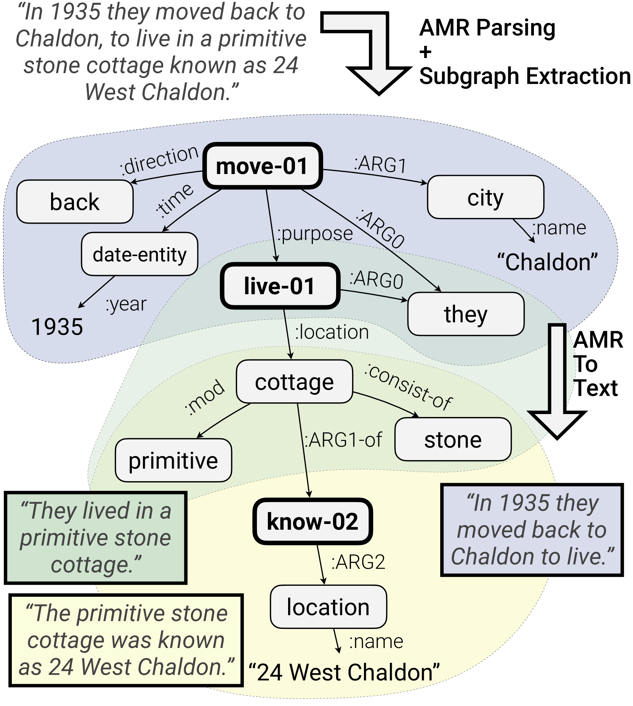

# 在 LLM 时代，语义图在句法简化中的应用值得重新审视。

发布时间：2024年07月04日

`LLM应用` `人工智能`

> Semantic Graphs for Syntactic Simplification: A Revisit from the Age of LLM

# 摘要

> AMR等符号句子意义表示提供了结构化的语义图，本应简化NLP任务，但LLMs的指令遵循能力却提供了更直接的解决方案，使得语义图的实用性受到质疑。同时，将意义表示仅作为LLMs的辅助也面临挑战。我们重新评估了语义图在句法简化任务中的作用，并提出了AMRS$^3$方法，展示了其在简化方法中的竞争优势和独特价值。通过AMRS$^3$，我们发现语义图在LLM提示中对句法简化任务有积极作用。进一步，我们提出AMRCoC提示方法，引导LLMs在AMR图上进行符号推理，有望提升LLM在句法简化等语义任务中的表现。

> Symbolic sentence meaning representations, such as AMR (Abstract Meaning Representation) provide expressive and structured semantic graphs that act as intermediates that simplify downstream NLP tasks. However, the instruction-following capability of large language models (LLMs) offers a shortcut to effectively solve NLP tasks, questioning the utility of semantic graphs. Meanwhile, recent work has also shown the difficulty of using meaning representations merely as a helpful auxiliary for LLMs. We revisit the position of semantic graphs in syntactic simplification, the task of simplifying sentence structures while preserving their meaning, which requires semantic understanding, and evaluate it on a new complex and natural dataset. The AMR-based method that we propose, AMRS$^3$, demonstrates that state-of-the-art meaning representations can lead to easy-to-implement simplification methods with competitive performance and unique advantages in cost, interpretability, and generalization. With AMRS$^3$ as an anchor, we discover that syntactic simplification is a task where semantic graphs are helpful in LLM prompting. We propose AMRCoC prompting that guides LLMs to emulate graph algorithms for explicit symbolic reasoning on AMR graphs, and show its potential for improving LLM on semantic-centered tasks like syntactic simplification.

[Arxiv](https://arxiv.org/abs/2407.04067)