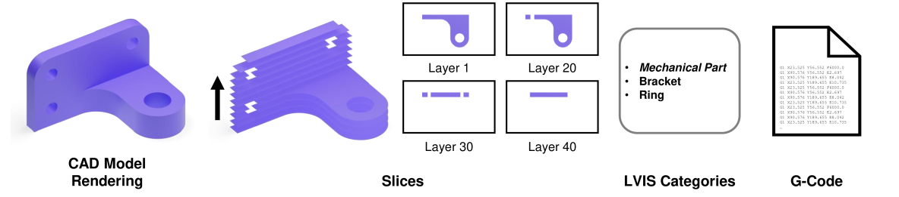
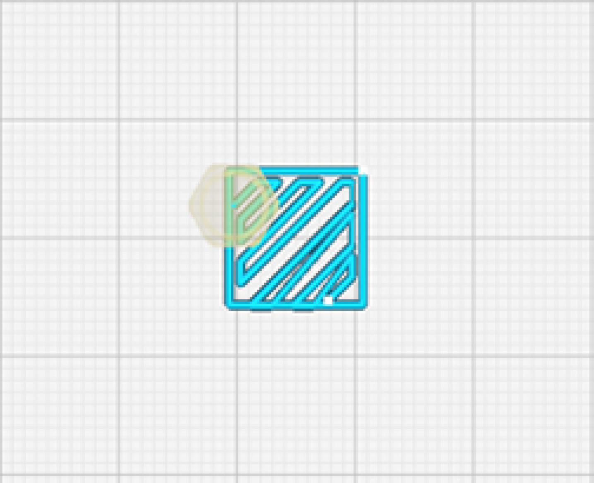

# Slice-100K：一款专为挤出式3D打印设计的多模态数据集

发布时间：2024年07月04日

`LLM应用` `制造业` `3D打印`

> Slice-100K: A Multimodal Dataset for Extrusion-based 3D Printing

# 摘要

> G-code，即几何代码 RS-274，是计算机数控（CNC）和 3D 打印领域最常用的编程语言。它主要用于指导 3D 打印机的运动，包括喷嘴、平台和材料挤出。目前，尚未有一个包含大量精选 CAD 模型及其对应 G-code 文件的增材制造资源库。为此，我们推出了 SLICE-100K，这是一个创新数据集，包含超过 100,000 个 G-code 文件，以及相应的镶嵌 CAD 模型、LVIS 类别、几何属性和渲染图。该数据集基于 Objaverse-XL 和 Thingi10K 的三角网格构建。我们通过微调 GPT-2 模型，展示了该数据集在将旧版 G-code 格式（如 Sailfish）转换为现代格式（如 Marlin）方面的应用。SLICE-100K 的推出，标志着开发数字制造多模态基础模型的第一步。

> G-code (Geometric code) or RS-274 is the most widely used computer numerical control (CNC) and 3D printing programming language. G-code provides machine instructions for the movement of the 3D printer, especially for the nozzle, stage, and extrusion of material for extrusion-based additive manufacturing. Currently there does not exist a large repository of curated CAD models along with their corresponding G-code files for additive manufacturing. To address this issue, we present SLICE-100K, a first-of-its-kind dataset of over 100,000 G-code files, along with their tessellated CAD model, LVIS (Large Vocabulary Instance Segmentation) categories, geometric properties, and renderings. We build our dataset from triangulated meshes derived from Objaverse-XL and Thingi10K datasets. We demonstrate the utility of this dataset by finetuning GPT-2 on a subset of the dataset for G-code translation from a legacy G-code format (Sailfish) to a more modern, widely used format (Marlin). SLICE-100K will be the first step in developing a multimodal foundation model for digital manufacturing.

[Arxiv](https://arxiv.org/abs/2407.04180)