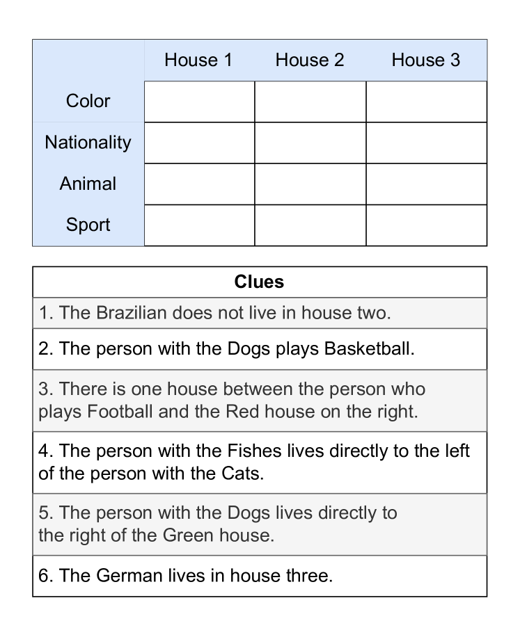
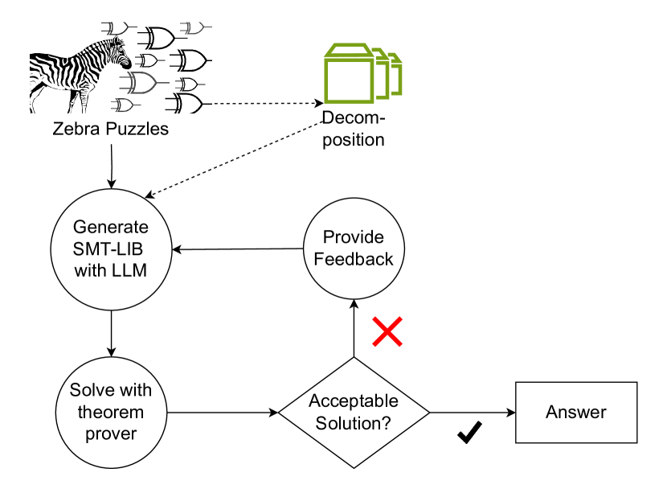

# 借助约束引导的多智能体系统，破解斑马谜题

发布时间：2024年07月04日

`Agent` `人工智能`

> Solving Zebra Puzzles Using Constraint-Guided Multi-Agent Systems

# 摘要

> 以往的研究通过思维链提示或符号表示等技术，提升了大型语言模型 (LLM) 解决逻辑谜题的能力。然而，这些方法在处理如 Zebra 谜题这类复杂逻辑问题时仍显不足。为此，我们开发了多智能体系统 ZPS，它结合 LLM 与现成的定理证明器，通过问题分解、生成 SMT 代码及智能体间反馈循环，有效解决复杂谜题。此外，我们设计了自动网格谜题评分器，确保解决方案的正确性，并通过用户研究验证其可靠性。实验表明，我们的方法在所有测试的 LLM 中均有显著提升，GPT-4 的完全正确解决方案数量提升了 166%。

> Prior research has enhanced the ability of Large Language Models (LLMs) to solve logic puzzles using techniques such as chain-of-thought prompting or introducing a symbolic representation. These frameworks are still usually insufficient to solve complicated logical problems, such as Zebra puzzles, due to the inherent complexity of translating natural language clues into logical statements. We introduce a multi-agent system, ZPS, that integrates LLMs with an off the shelf theorem prover. This system tackles the complex puzzle-solving task by breaking down the problem into smaller, manageable parts, generating SMT (Satisfiability Modulo Theories) code to solve them with a theorem prover, and using feedback between the agents to repeatedly improve their answers. We also introduce an automated grid puzzle grader to assess the correctness of our puzzle solutions and show that the automated grader is reliable by evaluating it in a user-study. Our approach shows improvement in all three LLMs we tested, with GPT-4 showing 166% improvement in the number of fully correct solutions.

[Arxiv](https://arxiv.org/abs/2407.03956)