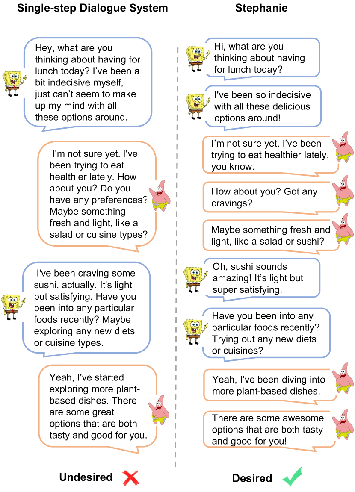

# Stephanie：通过逐步对话，巧妙模仿社交场合中的人类互动

发布时间：2024年07月04日

`LLM应用` `聊天机器人`

> Stephanie: Step-by-Step Dialogues for Mimicking Human Interactions in Social Conversations

# 摘要

> 在自然语言处理领域，对话系统多采用单一步骤对话模式，虽高效但缺乏自然互动的深度与流畅性。为此，我们创新性地提出了**步骤**-by-步骤对话范式（Stephanie），模拟人类对话的动态过程。通过双重学习策略与细分后编辑技术，我们构建了高质量的步骤-by-步骤对话数据集，并用于微调大型语言模型，使其能进行更自然的对话。我们详细介绍了Stephanie，并通过定制评估验证了其优于传统范式的效果。未来，我们将公开代码、数据集及模型，助力聊天机器人技术的进步。

> In the rapidly evolving field of natural language processing, dialogue systems primarily employ a single-step dialogue paradigm. Although this paradigm is efficient, it lacks the depth and fluidity of human interactions and does not appear natural. We introduce a novel \textbf{Step}-by-Step Dialogue Paradigm (Stephanie), designed to mimic the ongoing dynamic nature of human conversations. By employing a dual learning strategy and a further-split post-editing method, we generated and utilized a high-quality step-by-step dialogue dataset to fine-tune existing large language models, enabling them to perform step-by-step dialogues. We thoroughly present Stephanie. Tailored automatic and human evaluations are conducted to assess its effectiveness compared to the traditional single-step dialogue paradigm. We will release code, Stephanie datasets, and Stephanie LLMs to facilitate the future of chatbot eras.

[Arxiv](https://arxiv.org/abs/2407.04093)