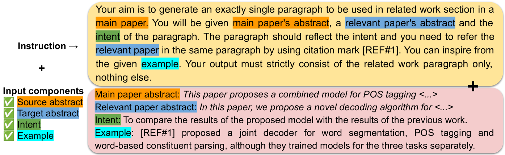

# 大型语言模型在系统任务探索中的应用：引文文本生成研究

发布时间：2024年07月04日

`LLM应用` `学术研究`

> Systematic Task Exploration with LLMs: A Study in Citation Text Generation

# 摘要

> LLM 在执行创造性 NLG 任务时展现出前所未有的灵活性，但也带来了新的挑战。为此，我们设计了一个三部分研究框架，包括系统输入操作、参考数据和输出测量，以探索引文文本生成这一学术 NLP 任务。该任务在定义和评估上尚无共识，且未在 LLM 范式中得到解决。我们的研究表明，在提示 LLM 时，系统地调整任务指令和输入配置至关重要，并揭示了不同评估指标间的复杂关系。通过人工生成和评估实验，我们为未来研究提供了新的定性见解。所有代码和数据均已公开。

> Large language models (LLMs) bring unprecedented flexibility in defining and executing complex, creative natural language generation (NLG) tasks. Yet, this flexibility brings new challenges, as it introduces new degrees of freedom in formulating the task inputs and instructions and in evaluating model performance. To facilitate the exploration of creative NLG tasks, we propose a three-component research framework that consists of systematic input manipulation, reference data, and output measurement. We use this framework to explore citation text generation -- a popular scholarly NLP task that lacks consensus on the task definition and evaluation metric and has not yet been tackled within the LLM paradigm. Our results highlight the importance of systematically investigating both task instruction and input configuration when prompting LLMs, and reveal non-trivial relationships between different evaluation metrics used for citation text generation. Additional human generation and human evaluation experiments provide new qualitative insights into the task to guide future research in citation text generation. We make our code and data publicly available.

[Arxiv](https://arxiv.org/abs/2407.04046)