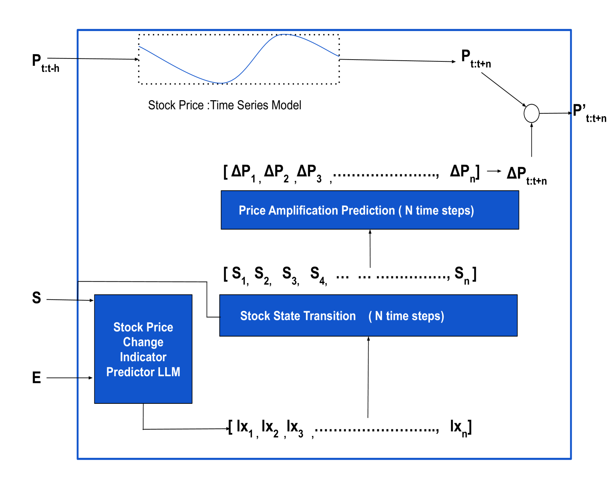
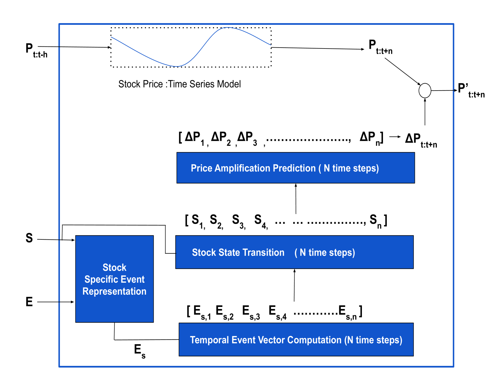

# Text2TimeSeries：借助大型语言模型的事件驱动洞察，通过时间序列预测更新提升财务预测的精准度。

发布时间：2024年07月04日

`LLM应用` `时间序列分析`

> Text2TimeSeries: Enhancing Financial Forecasting through Time Series Prediction Updates with Event-Driven Insights from Large Language Models

# 摘要

> 时间序列模型通常基于数值数据预测未来，但现实中的时间序列数据常受非数值因素影响。例如，股票价格受全球事件的独特影响。传统方法要么侧重价格序列分析，要么进行情感分析判断新闻的正负面影响。为更全面预测，我们提出结合文本信息的协作建模框架，利用大型语言模型的直觉更新预测，并在金融市场数据上验证了其有效性。

> Time series models, typically trained on numerical data, are designed to forecast future values. These models often rely on weighted averaging techniques over time intervals. However, real-world time series data is seldom isolated and is frequently influenced by non-numeric factors. For instance, stock price fluctuations are impacted by daily random events in the broader world, with each event exerting a unique influence on price signals. Previously, forecasts in financial markets have been approached in two main ways: either as time-series problems over price sequence or sentiment analysis tasks. The sentiment analysis tasks aim to determine whether news events will have a positive or negative impact on stock prices, often categorizing them into discrete labels. Recognizing the need for a more comprehensive approach to accurately model time series prediction, we propose a collaborative modeling framework that incorporates textual information about relevant events for predictions. Specifically, we leverage the intuition of large language models about future changes to update real number time series predictions. We evaluated the effectiveness of our approach on financial market data.

[Arxiv](https://arxiv.org/abs/2407.03689)