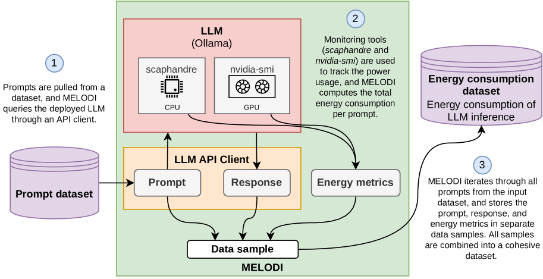
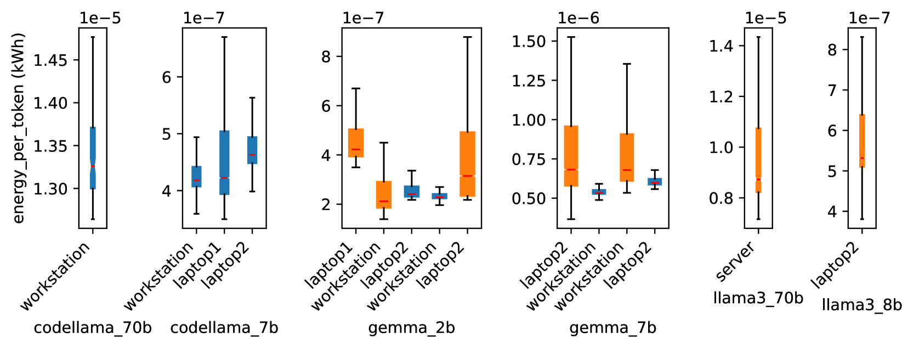
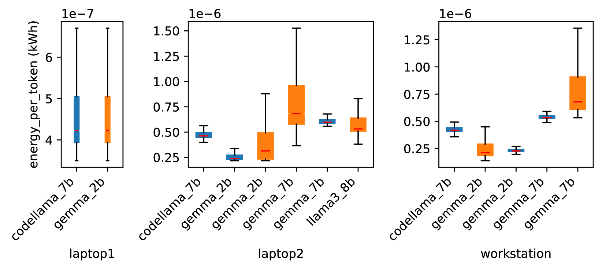
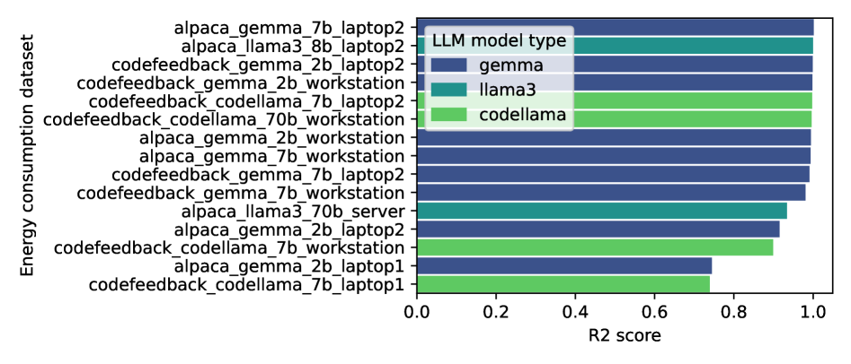
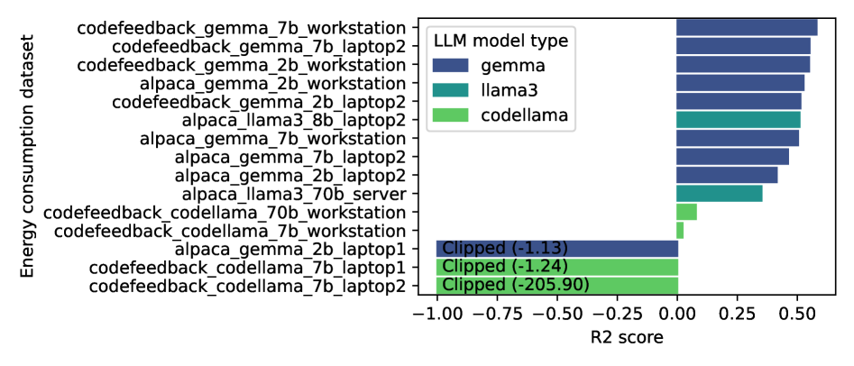

# 提示的代价：探究大语言模型推理中的能源消耗

发布时间：2024年07月04日

`LLM应用` `可持续发展`

> The Price of Prompting: Profiling Energy Use in Large Language Models Inference

# 摘要

> 随着人工智能的迅猛发展，大型语言模型（LLM）的部署面临着日益严峻的计算和环境挑战。本文推出的MELODI框架，旨在监测和优化LLM推理过程中的能源消耗。通过MELODI，我们能够深入了解电力消耗的动态，并构建了一个全面的数据集，反映出不同部署环境下的能源效率。该数据集广泛涵盖了多种LLM框架、语言模型及提示数据，为能源使用的比较分析提供了可能。我们进一步探讨了提示的长度和复杂性如何影响能源消耗，发现能源效率存在显著差异，暗示着LLM部署中优化和可持续措施的广阔前景。我们的贡献不仅在于创新的MELODI框架，还包括一个可扩展的新数据集，为推动能源高效LLM部署的研究奠定了基础，助力该领域迈向更加可持续的未来。

> In the rapidly evolving realm of artificial intelligence, deploying large language models (LLMs) poses increasingly pressing computational and environmental challenges. This paper introduces MELODI - Monitoring Energy Levels and Optimization for Data-driven Inference - a multifaceted framework crafted to monitor and analyze the energy consumed during LLM inference processes. MELODI enables detailed observations of power consumption dynamics and facilitates the creation of a comprehensive dataset reflective of energy efficiency across varied deployment scenarios. The dataset, generated using MELODI, encompasses a broad spectrum of LLM deployment frameworks, multiple language models, and extensive prompt datasets, enabling a comparative analysis of energy use. Using the dataset, we investigate how prompt attributes, including length and complexity, correlate with energy expenditure. Our findings indicate substantial disparities in energy efficiency, suggesting ample scope for optimization and adoption of sustainable measures in LLM deployment. Our contribution lies not only in the MELODI framework but also in the novel dataset, a resource that can be expanded by other researchers. Thus, MELODI is a foundational tool and dataset for advancing research into energy-conscious LLM deployment, steering the field toward a more sustainable future.

[Arxiv](https://arxiv.org/abs/2407.16893)