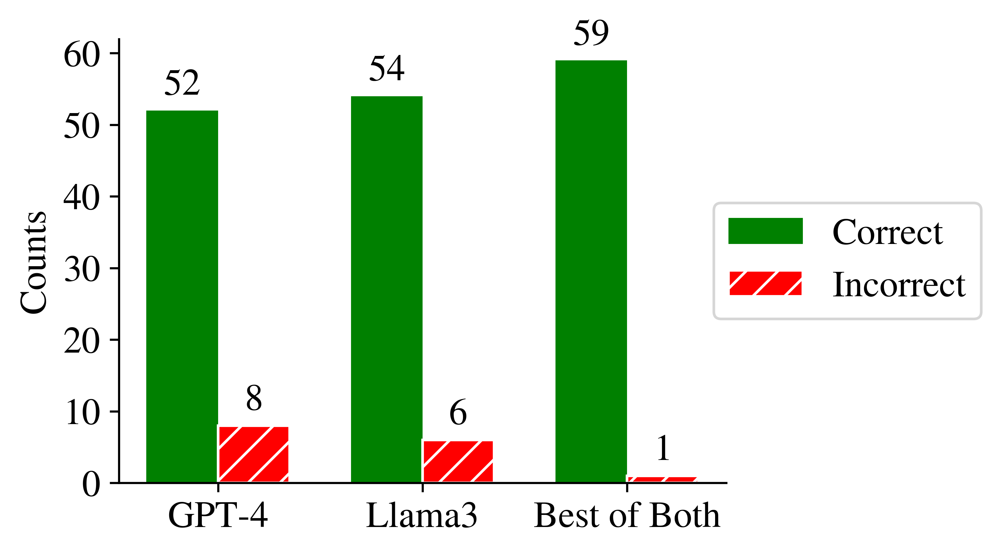

# 金融股权研究报告的结构：通过识别分析师报告中常见问题，利用 Llama 3 和 GPT-4 实现股权研究自动化。

发布时间：2024年07月04日

`LLM应用` `自动化`

> The Structure of Financial Equity Research Reports -- Identification of the Most Frequently Asked Questions in Financial Analyst Reports to Automate Equity Research Using Llama 3 and GPT-4

# 摘要

> 本研究深入分析了财务权益研究报告（ERRs），通过将其内容分类来揭示其结构。尽管ERRs中回答的问题缺乏实证分析，特别是关于信息频率、关键信息和需要人类判断的信息，我们的研究填补了这一空白。我们逐句分析了72份ERRs，识别出169个独特的问题原型，且这些问题均源自报告本身，确保了分析的无偏性。进一步地，我们评估了这些问题的自动化潜力，发现78.7%的问题可自动化，其中48.2%适合大型语言模型处理，30.5%可从数据库提取，仅21.3%需要人类判断。通过使用Llama-3-70B和GPT-4-turbo-2024-04-09模型，我们实证验证了约80%的ERRs陈述可自动化，且这些模型在功能上互补。研究结果表明，ERRs的撰写过程有望通过更多自动化提升质量和效率，同时也量化了引入大型语言模型的潜在效益。完整的问题原型及其频率列表将在同行评审后公开。

> This research dissects financial equity research reports (ERRs) by mapping their content into categories.
  There is insufficient empirical analysis of the questions answered in ERRs. In particular, it is not understood how frequently certain information appears, what information is considered essential, and what information requires human judgment to distill into an ERR.
  The study analyzes 72 ERRs sentence-by-sentence, classifying their 4940 sentences into 169 unique question archetypes. We did not predefine the questions but derived them solely from the statements in the ERRs. This approach provides an unbiased view of the content of the observed ERRs. Subsequently, we used public corporate reports to classify the questions' potential for automation. Answers were labeled "text-extractable" if the answers to the question were accessible in corporate reports.
  78.7% of the questions in ERRs can be automated. Those automatable question consist of 48.2% text-extractable (suited to processing by large language models, LLMs) and 30.5% database-extractable questions. Only 21.3% of questions require human judgment to answer.
  We empirically validate using Llama-3-70B and GPT-4-turbo-2024-04-09 that recent advances in language generation and information extraction enable the automation of approximately 80% of the statements in ERRs. Surprisingly, the models complement each other's strengths and weaknesses well.
  The research confirms that the current writing process of ERRs can likely benefit from additional automation, improving quality and efficiency. The research thus allows us to quantify the potential impacts of introducing large language models in the ERR writing process.
  The full question list, including the archetypes and their frequency, will be made available online after peer review.

[Arxiv](https://arxiv.org/abs/2407.18327)