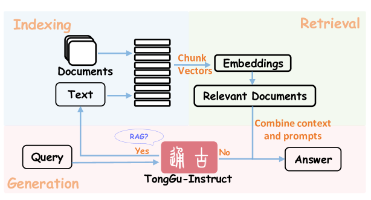

# TongGu：借助知识驱动的大型语言模型，精通古典中文理解

发布时间：2024年07月04日

`LLM应用`

> TongGu: Mastering Classical Chinese Understanding with Knowledge-Grounded Large Language Models

# 摘要

> 古典中文，承载着古代中国的深厚文化和智慧，但其复杂性常令现代人望而却步。尽管大型语言模型在自然语言处理领域表现出色，但在古典中文理解这一领域，尤其是在数据密集和知识要求高的任务中，仍显不足。为此，我们推出了首个专为古典中文理解设计的LLM——**通古**，它基于三大核心创新。首先，我们创建了一个两阶段指令调优数据集ACCN-INS，源自丰富的古典中文语料，旨在充分挖掘LLM在古典中文理解方面的潜能。其次，我们引入了冗余感知调优（RAT）策略，确保通古在掌握新技能的同时，不忘基础知识。最后，我们开发了基于知识支撑的CCU检索增强生成技术（CCU-RAG），有效减少信息失真。通过24项多样化的CCU任务测试，通古展现了其卓越性能，证明了RAT和CCU-RAG技术的有效性。通古模型及其数据集将向公众开放。

> Classical Chinese is a gateway to the rich heritage and wisdom of ancient China, yet its complexities pose formidable comprehension barriers for most modern people without specialized knowledge. While Large Language Models (LLMs) have shown remarkable capabilities in Natural Language Processing (NLP), they struggle with Classical Chinese Understanding (CCU), especially in data-demanding and knowledge-intensive tasks. In response to this dilemma, we propose \textbf{TongGu} (mean understanding ancient and modern), the first CCU-specific LLM, underpinned by three core contributions. First, we construct a two-stage instruction-tuning dataset ACCN-INS derived from rich classical Chinese corpora, aiming to unlock the full CCU potential of LLMs. Second, we propose Redundancy-Aware Tuning (RAT) to prevent catastrophic forgetting, enabling TongGu to acquire new capabilities while preserving its foundational knowledge. Third, we present a CCU Retrieval-Augmented Generation (CCU-RAG) technique to reduce hallucinations based on knowledge-grounding. Extensive experiments across 24 diverse CCU tasks validate TongGu's superior ability, underscoring the effectiveness of RAT and CCU-RAG. The model and dataset will be public available.

[Arxiv](https://arxiv.org/abs/2407.03937)