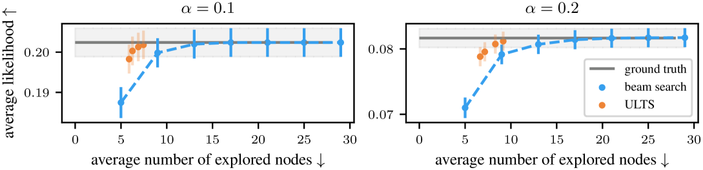
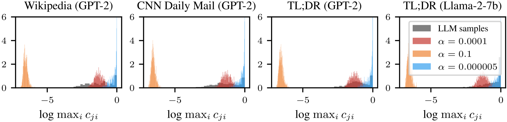
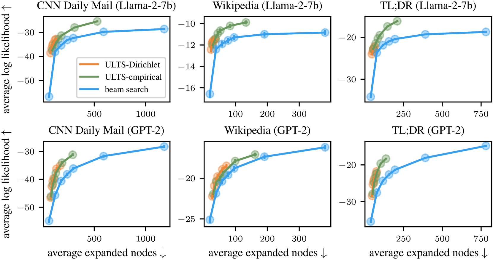
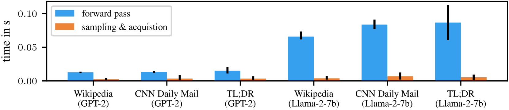
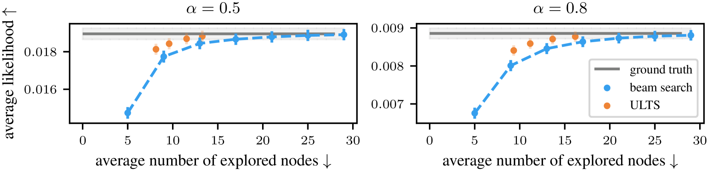
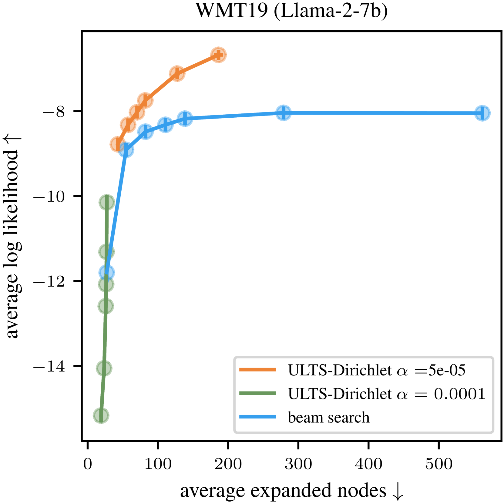
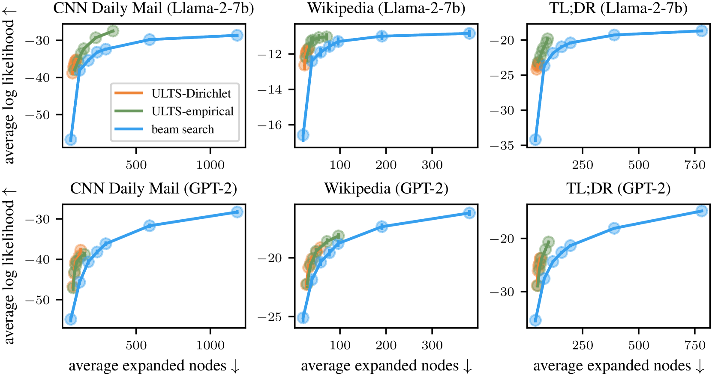
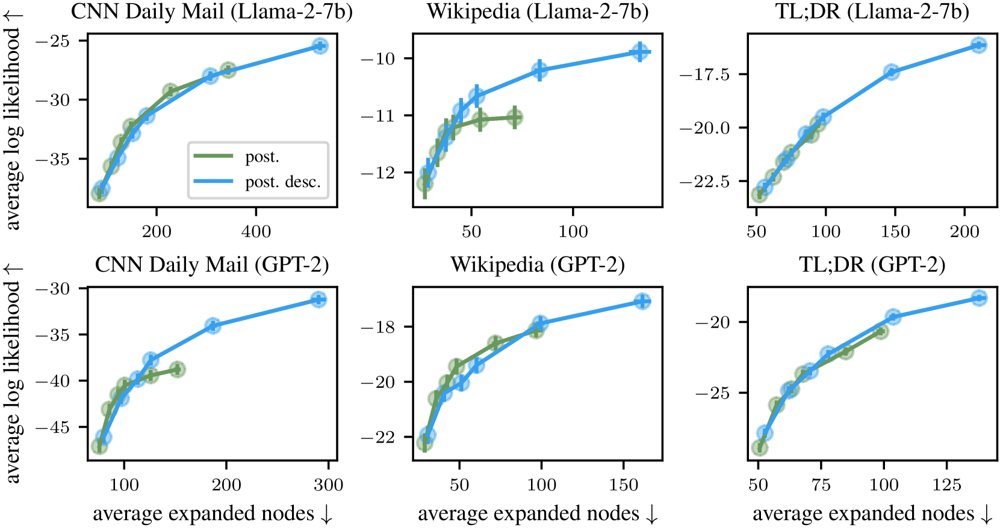

# 基于不确定性的优化策略在大规模语言模型搜索树上的应用

发布时间：2024年07月04日

`LLM理论` `人工智能` `机器学习`

> Uncertainty-Guided Optimization on Large Language Model Search Trees

# 摘要

> Beam search 虽为寻找最大似然序列的标准树搜索算法，却因忽视从根至叶的全路径而显得短视。此外，它对先验知识视而不见，例如，未考虑最大化目标的似然性及其在单位区间内的界定特性。我们采用概率视角，为LLM的转换概率设定先验信念，并在每次迭代中更新最有希望路径的后验信念。这些信念助力我们构建一个非短视、类似贝叶斯优化的获取函数，实现比标准波束搜索更高效的数据探索。通过选择合适的先验，并在包含Llama-2-7b的最新大语言模型上进行实验，我们验证了此方法在扩展更少节点的同时，达到了相同甚至更高的似然性，显著提升了效率。

> Beam search is a standard tree search algorithm when it comes to finding sequences of maximum likelihood, for example, in the decoding processes of large language models. However, it is myopic since it does not take the whole path from the root to a leaf into account. Moreover, it is agnostic to prior knowledge available about the process: For example, it does not consider that the objective being maximized is a likelihood and thereby has specific properties, like being bound in the unit interval. Taking a probabilistic approach, we define a prior belief over the LLMs' transition probabilities and obtain a posterior belief over the most promising paths in each iteration. These beliefs are helpful to define a non-myopic Bayesian-optimization-like acquisition function that allows for a more data-efficient exploration scheme than standard beam search. We discuss how to select the prior and demonstrate in on- and off-model experiments with recent large language models, including Llama-2-7b, that our method achieves higher efficiency than beam search: Our method achieves the same or a higher likelihood while expanding fewer nodes than beam search.

[Arxiv](https://arxiv.org/abs/2407.03951)