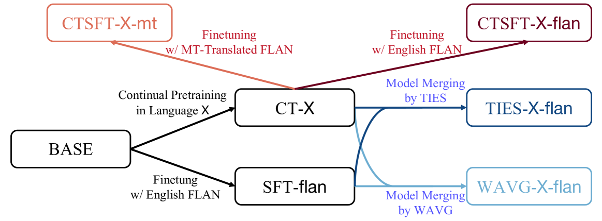
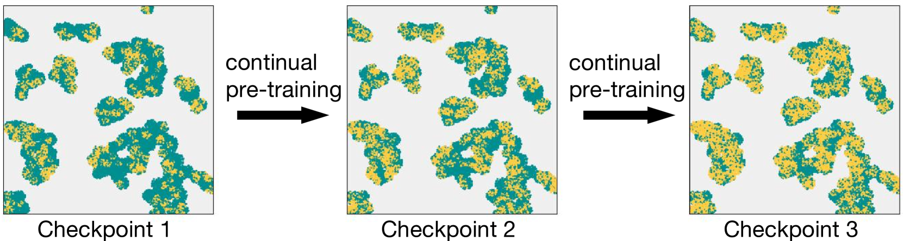

# 探索模型合并技术在低资源语言中的应用潜力

发布时间：2024年07月04日

`LLM应用` `语言技术` `人工智能`

> Unlocking the Potential of Model Merging for Low-Resource Languages

# 摘要

> 将大型语言模型适应新语言，传统上需要持续预训练后进行监督微调。但在低资源语言中，这一方法因数据有限而难以平衡语言建模与任务解决能力。为此，我们提出模型合并策略，无需额外训练即可融合不同能力的模型，为低资源语言打造任务解决型LLM。实验显示，在数据极度匮乏的情况下，模型合并显著提升LLM的任务解决能力，超越传统方法。我们还通过引入松弛变量优化合并算法，减少关键参数损失，进一步提升性能。我们期待模型合并能以更高的数据效率，助力更多数据稀缺的语言。

> Adapting large language models (LLMs) to new languages typically involves continual pre-training (CT) followed by supervised fine-tuning (SFT). However, this CT-then-SFT approach struggles with limited data in the context of low-resource languages, failing to balance language modeling and task-solving capabilities. We thus propose model merging as an alternative for low-resource languages, combining models with distinct capabilities into a single model without additional training. We use model merging to develop task-solving LLMs for low-resource languages without SFT data in the target languages. Our experiments based on Llama-2-7B demonstrate that model merging effectively endows LLMs for low-resource languages with task-solving abilities, outperforming CT-then-SFT in scenarios with extremely scarce data. Observing performance saturation in model merging with more training tokens, we further analyze the merging process and introduce a slack variable to the model merging algorithm to mitigate the loss of important parameters, thereby enhancing performance. We hope that model merging can benefit more human languages suffering from data scarcity with its higher data efficiency.

[Arxiv](https://arxiv.org/abs/2407.03994)