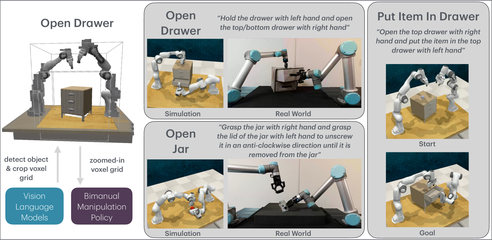
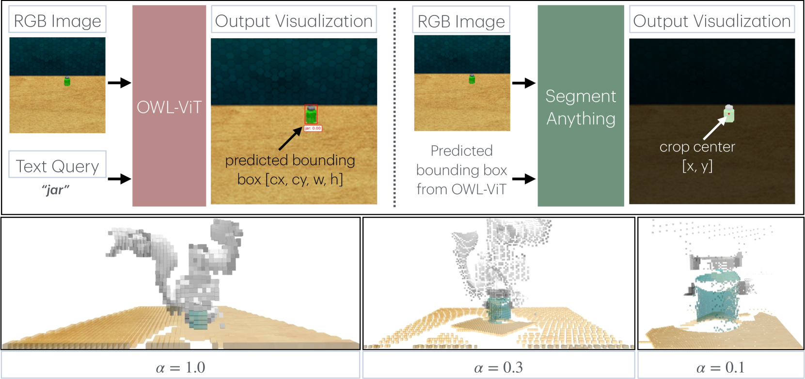
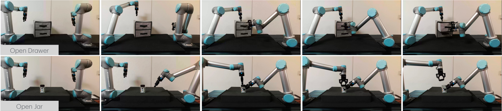

# VoxAct-B：一种基于体素的双臂操作动作与稳定策略

发布时间：2024年07月04日

`Agent` `机器人` `自动化`

> VoxAct-B: Voxel-Based Acting and Stabilizing Policy for Bimanual Manipulation

# 摘要

> 双手操作在机器人领域至关重要。与单臂操作相比，双手操作因其高维动作空间而更具挑战性。以往方法依赖大量数据和基础动作，但存在样本效率低和泛化能力有限的问题。为此，我们提出VoxAct-B，一种结合语言条件和体素技术的方法，利用视觉语言模型优先处理关键场景区域并构建体素网格。该网格用于指导双手操作策略，学习有效动作和稳定技巧，从而提高策略学习效率并增强任务泛化能力。模拟实验表明，VoxAct-B在精细双手操作任务中表现优异。此外，我们通过两台UR5机器人，在实际环境中成功演示了抽屉和罐子的开启任务。相关代码、数据及演示视频将在https://voxact-b.github.io发布。

> Bimanual manipulation is critical to many robotics applications. In contrast to single-arm manipulation, bimanual manipulation tasks are challenging due to higher-dimensional action spaces. Prior works leverage large amounts of data and primitive actions to address this problem, but may suffer from sample inefficiency and limited generalization across various tasks. To this end, we propose VoxAct-B, a language-conditioned, voxel-based method that leverages Vision Language Models (VLMs) to prioritize key regions within the scene and reconstruct a voxel grid. We provide this voxel grid to our bimanual manipulation policy to learn acting and stabilizing actions. This approach enables more efficient policy learning from voxels and is generalizable to different tasks. In simulation, we show that VoxAct-B outperforms strong baselines on fine-grained bimanual manipulation tasks. Furthermore, we demonstrate VoxAct-B on real-world $\texttt{Open Drawer}$ and $\texttt{Open Jar}$ tasks using two UR5s. Code, data, and videos will be available at https://voxact-b.github.io.

[Arxiv](https://arxiv.org/abs/2407.04152)