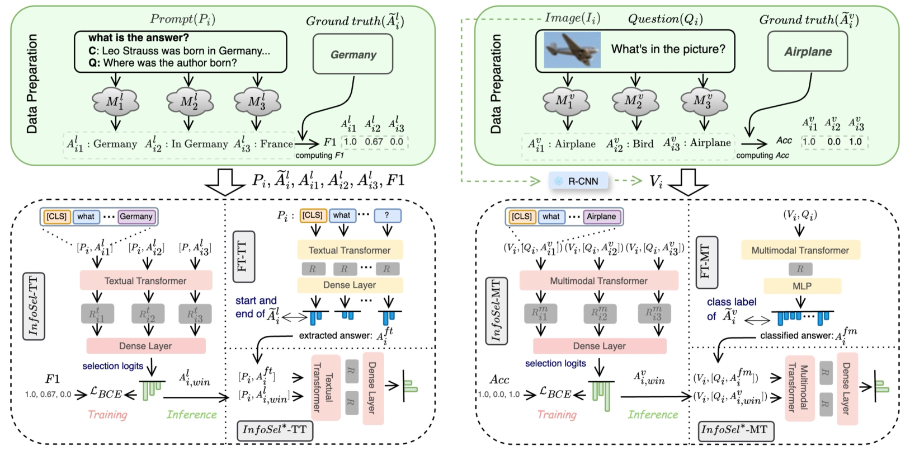
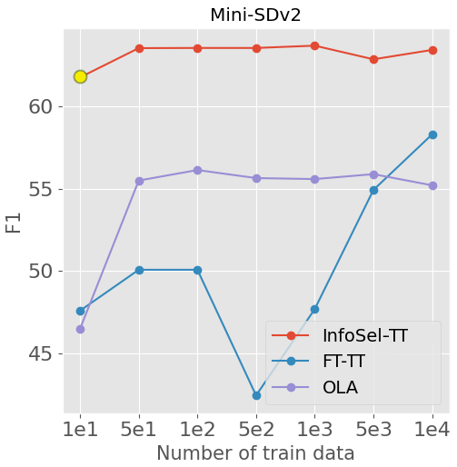
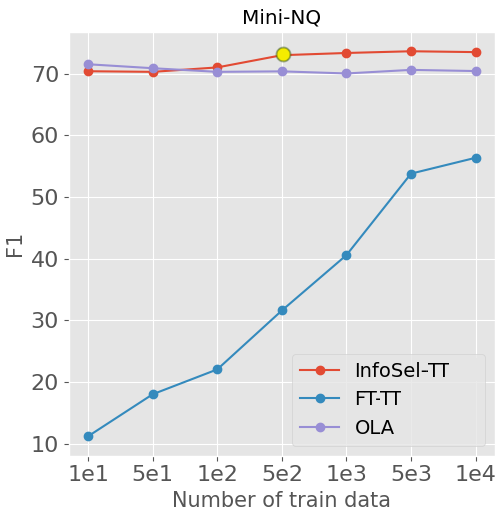
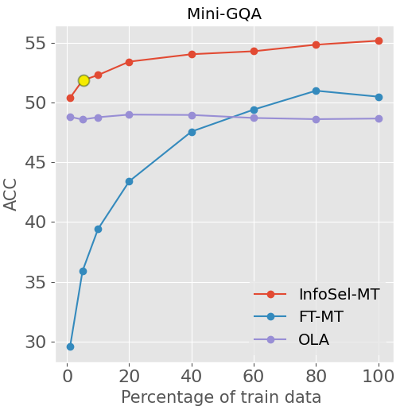
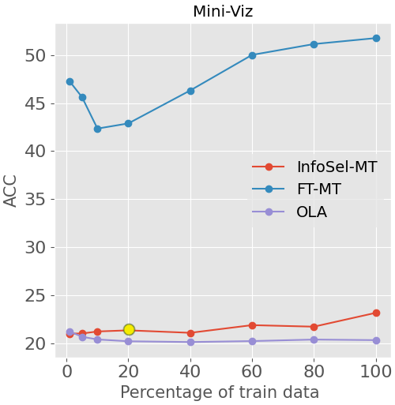
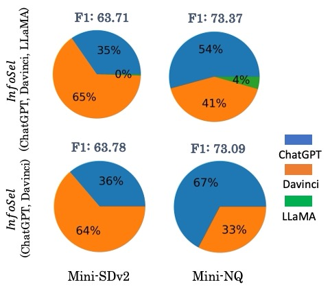

# 当语言模型意见分歧时，如何是好？本文探讨了应用于文本与视觉问答任务的黑盒模型集成方法。

发布时间：2024年07月04日

`LLM应用` `人工智能` `计算机视觉`

> What to do if language models disagree? Black-box model ensembling for textual and visual question answering

# 摘要

> 针对文本和视觉问答任务，我们开发了如ChatGPT和BLIP等多样化的LLMs和VQA模型。然而，这些模型在特定任务数据集上的应用面临挑战，微调要么因API访问而困难重重，要么因参数众多而成本高昂。为此，我们创新性地提出了InfoSel方法，这是一种高效且轻量的集成技术，它能从现有黑箱模型中智能挑选出最佳预测模型。不同于传统依赖预测概率或置信度的集成方法，InfoSel在黑箱模型中也能游刃有余。实验显示，在四个数据集上，我们的方法相较于单一LLMs，F1分数提升了高达5.27%，且仅用1K训练样本和110M参数就实现了这一突破。

> A diverse range of large language models (LLMs), e.g., ChatGPT, and visual question answering (VQA) models, e.g., BLIP, have been developed for solving textual and visual question answering tasks. However, both LLMs and VQA models encounter challenges when applied to task-specific datasets. Fine-tuning these models is either difficult, as it requires access via APIs, rendering them as black-boxes, or costly due to the need of tuning a large number of parameters. To address this, we introduce InfoSel, a data-efficient and lightweight ensemble method that learns to dynamically pick the winner from existing black-box models for predictions on both textual and multimodal visual question answering tasks. Unlike traditional ensemble models, InfoSel does not rely on prediction probabilities or confidences, which typically are not available in black-box models. Experimental results on four datasets demonstrate that our approach achieves an absolute increase of up to +5.27% in the F1-score compared to standalone LLMs. Remarkably, this improvement is achieved by utilizing only 1K training instances and 110M model parameters for training task-specific ensemble models.

[Arxiv](https://arxiv.org/abs/2407.12841)