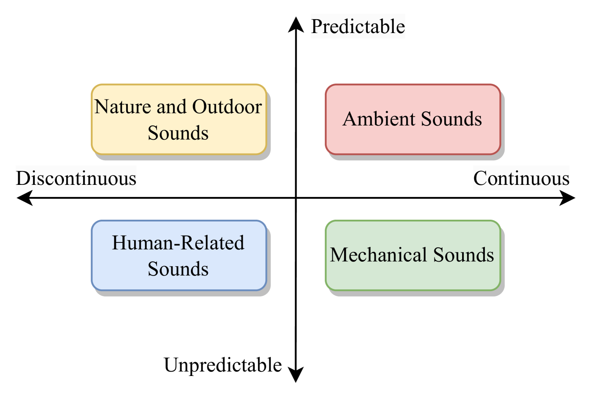
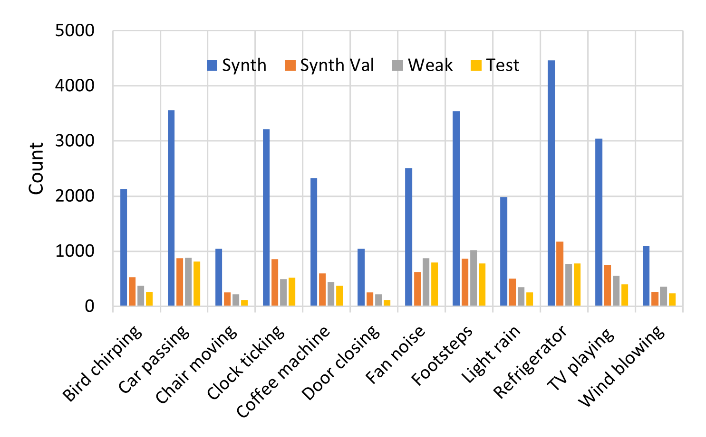
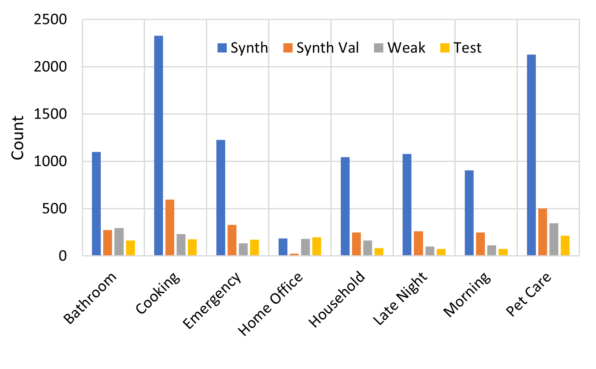

# WildDESED：一款由 LLM 驱动，专为家庭环境声音事件检测系统打造的数据集

发布时间：2024年07月04日

`LLM应用` `家庭环境` `声音事件检测`

> WildDESED: An LLM-Powered Dataset for Wild Domestic Environment Sound Event Detection System

# 摘要

> 本研究通过引入由大型语言模型支持的新数据集 WildDESED，旨在推动声音事件检测研究。作为 DESED 的扩展，WildDESED 反映了家庭环境中的多样化声学变异和复杂噪音。我们利用 LLMs 生成了八种家庭场景，并精心混合了来自 AudioSet 的噪音，确保与目标声音无重叠。采用卷积神经循环网络研究 WildDESED，揭示其挑战性。通过逐步增加噪音复杂性的课程学习，我们提升了模型在不同噪音环境下的泛化能力。实验结果表明，在嘈杂环境中性能提升，验证了 WildDESED 在促进噪音鲁棒性 SED 方面的有效性。

> This work aims to advance sound event detection (SED) research by presenting a new large language model (LLM)-powered dataset namely wild domestic environment sound event detection (WildDESED). It is crafted as an extension to the original DESED dataset to reflect diverse acoustic variability and complex noises in home settings. We leveraged LLMs to generate eight different domestic scenarios based on target sound categories of the DESED dataset. Then we enriched the scenarios with a carefully tailored mixture of noises selected from AudioSet and ensured no overlap with target sound. We consider widely popular convolutional neural recurrent network to study WildDESED dataset, which depicts its challenging nature. We then apply curriculum learning by gradually increasing noise complexity to enhance the model's generalization capabilities across various noise levels. Our results with this approach show improvements within the noisy environment, validating the effectiveness on the WildDESED dataset promoting noise-robust SED advancements.

[Arxiv](https://arxiv.org/abs/2407.03656)