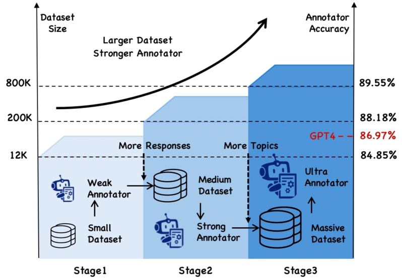
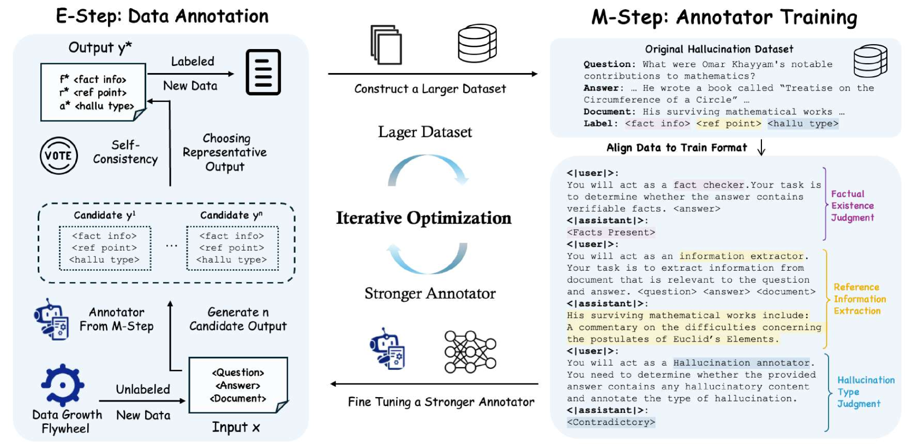
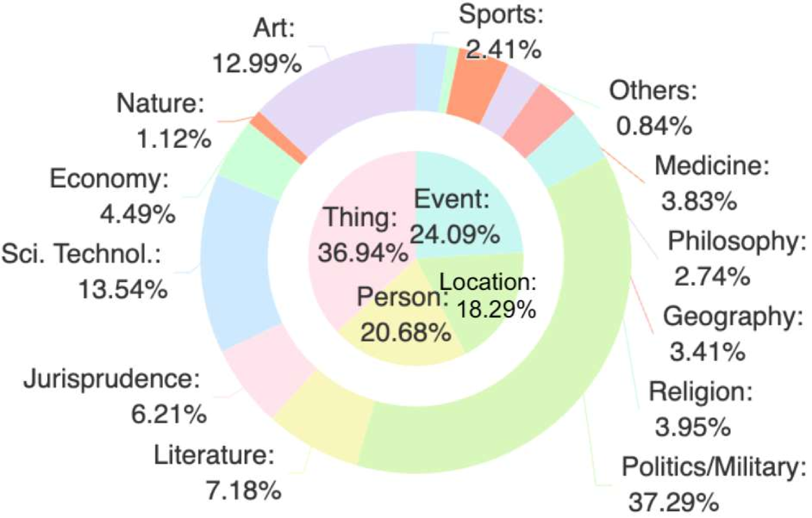

# ANAH-v2：大型语言模型分析性幻觉注释的扩展

发布时间：2024年07月05日

`LLM应用` `人工智能`

> ANAH-v2: Scaling Analytical Hallucination Annotation of Large Language Models

# 摘要

> 大型语言模型在长篇问答任务中常出现幻觉现象，但现有的幻觉检测数据集受限于领域和规模，难以扩展。为此，本文提出一个迭代自训练框架，通过逐步扩展注释数据集和提升注释器准确性，有效监督 LLM 幻觉。实验显示，该框架训练出的 7B 参数注释器性能超越 GPT-4，在 HaluEval 和 HalluQA 上实现顶尖幻觉检测，并能提升 NLI 指标至 37%，助力减轻 LLM 幻觉问题。

> Large language models (LLMs) exhibit hallucinations in long-form question-answering tasks across various domains and wide applications. Current hallucination detection and mitigation datasets are limited in domains and sizes, which struggle to scale due to prohibitive labor costs and insufficient reliability of existing hallucination annotators. To facilitate the scalable oversight of LLM hallucinations, this paper introduces an iterative self-training framework that simultaneously and progressively scales up the hallucination annotation dataset and improves the accuracy of the hallucination annotator. Based on the Expectation Maximization (EM) algorithm, in each iteration, the framework first applies a hallucination annotation pipeline to annotate a scaled dataset and then trains a more accurate hallucination annotator on the dataset. This new hallucination annotator is adopted in the hallucination annotation pipeline used for the next iteration. Extensive experimental results demonstrate that the finally obtained hallucination annotator with only 7B parameters surpasses the performance of GPT-4 and obtains new state-of-the-art hallucination detection results on HaluEval and HalluQA by zero-shot inference. Such an annotator can not only evaluate the hallucination levels of various LLMs on the large-scale dataset but also help to mitigate the hallucination of LLMs generations, with the Natural Language Inference (NLI) metric increasing from 25% to 37% on HaluEval.

[Arxiv](https://arxiv.org/abs/2407.04693)