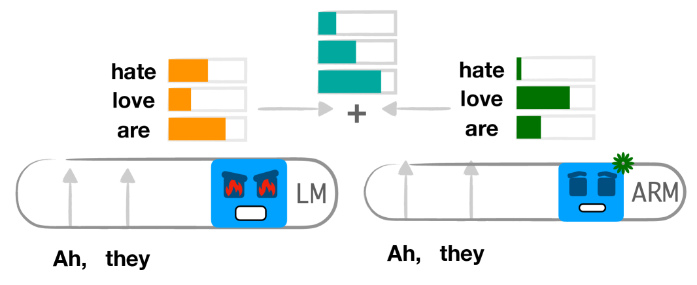
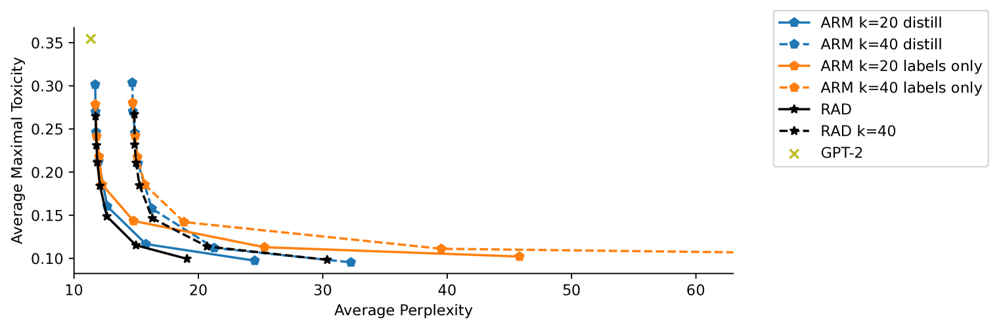
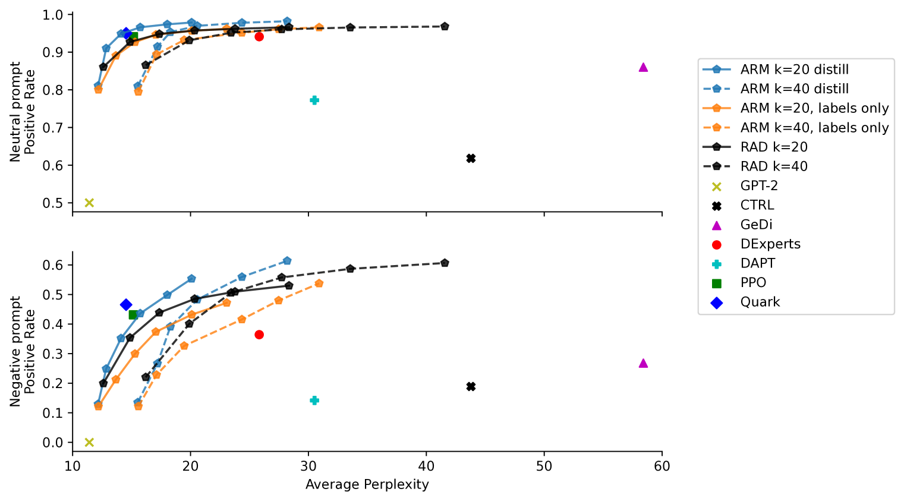
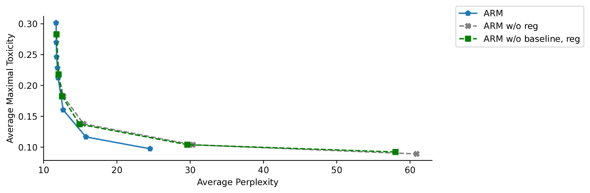
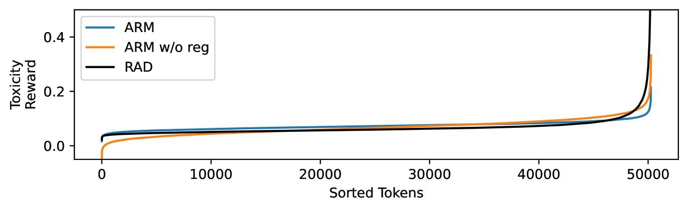
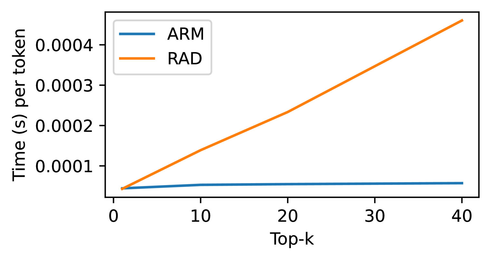
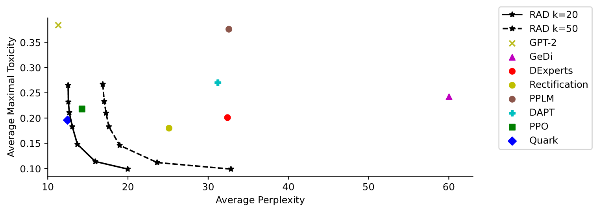

# ARM：通过自回归奖励模型实现高效引导解码

发布时间：2024年07月05日

`LLM应用` `人工智能` `数据安全`

> ARM: Efficient Guided Decoding with Autoregressive Reward Models

# 摘要

> 为了确保在大量数据上训练的语言模型能够安全应用于现实世界，我们需要对其进行细致的调整。我们重新探讨了引导解码的方法，旨在通过任务特定奖励模型的分数来优化基础语言模型的输出。我们设计了一种既简单又高效的自动回归奖励模型参数化方案，使得引导解码既迅速又有效。实验表明，在去毒化和情感控制等任务中，我们的方法与效率较低但功能强大的RAD方法表现不相上下。

> Language models trained on large amounts of data require careful tuning to be safely deployed in real world. We revisit the guided decoding paradigm, where the goal is to augment the logits of the base language model using the scores from a task-specific reward model. We propose a simple but efficient parameterization of the autoregressive reward model enabling fast and effective guided decoding. On detoxification and sentiment control tasks, we show that our efficient parameterization performs on par with RAD, a strong but less efficient guided decoding approach.

[Arxiv](https://arxiv.org/abs/2407.04615)