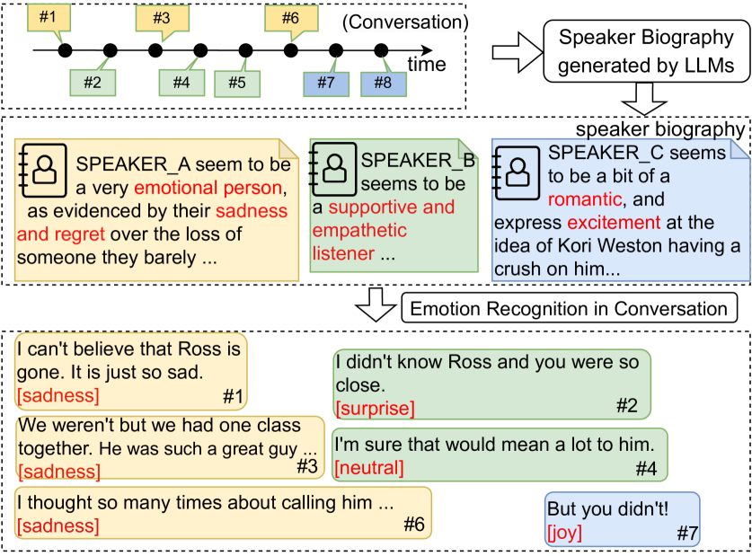
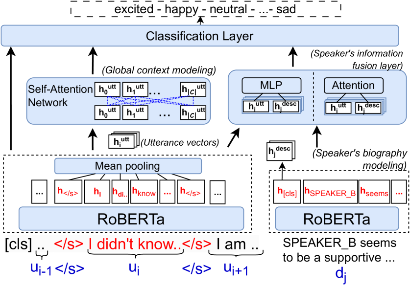

# BiosERC：结合 LLM 辅助的传记演讲者，提升 ERC 任务表现

发布时间：2024年07月05日

`LLM应用` `情感分析` `对话系统`

> BiosERC: Integrating Biography Speakers Supported by LLMs for ERC Tasks

# 摘要

> 在对话情感识别领域，最新研究通过注意力机制深入剖析了说话者间及内部的语句关系，以捕捉情感交流。然而，说话者的个性特质等要素尚未得到充分挖掘，且在跨任务应用和模型架构兼容性方面面临挑战。为此，我们推出了BiosERC框架，专注于对话中的说话者特征研究。借助大型语言模型，我们提取对话中的说话者“传记信息”，将其作为辅助知识融入模型，以精准分类语句情感。该方法在IEMOCAP、MELD和EmoryNLP三大权威数据集上创下佳绩，彰显了模型的卓越性能与广泛适用性，预示着其在多样对话分析任务中的广阔前景。源代码已公开，详见https://github.com/yingjie7/BiosERC。

> In the Emotion Recognition in Conversation task, recent investigations have utilized attention mechanisms exploring relationships among utterances from intra- and inter-speakers for modeling emotional interaction between them. However, attributes such as speaker personality traits remain unexplored and present challenges in terms of their applicability to other tasks or compatibility with diverse model architectures. Therefore, this work introduces a novel framework named BiosERC, which investigates speaker characteristics in a conversation. By employing Large Language Models (LLMs), we extract the "biographical information" of the speaker within a conversation as supplementary knowledge injected into the model to classify emotional labels for each utterance. Our proposed method achieved state-of-the-art (SOTA) results on three famous benchmark datasets: IEMOCAP, MELD, and EmoryNLP, demonstrating the effectiveness and generalization of our model and showcasing its potential for adaptation to various conversation analysis tasks. Our source code is available at https://github.com/yingjie7/BiosERC.

[Arxiv](https://arxiv.org/abs/2407.04279)