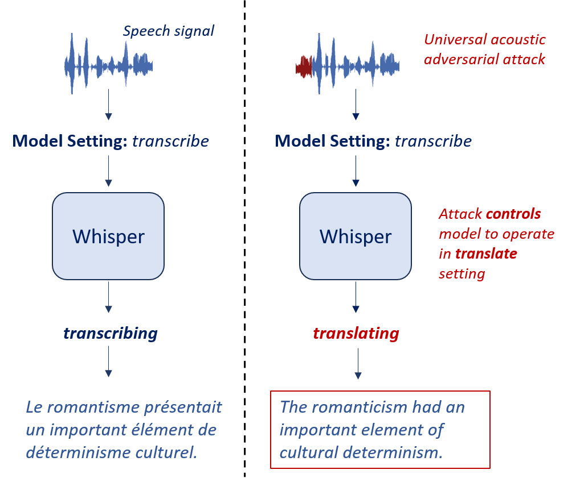
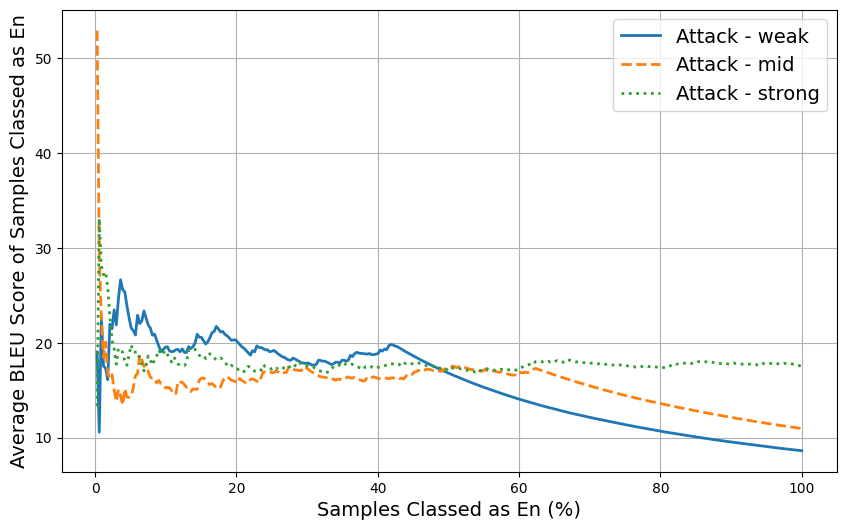
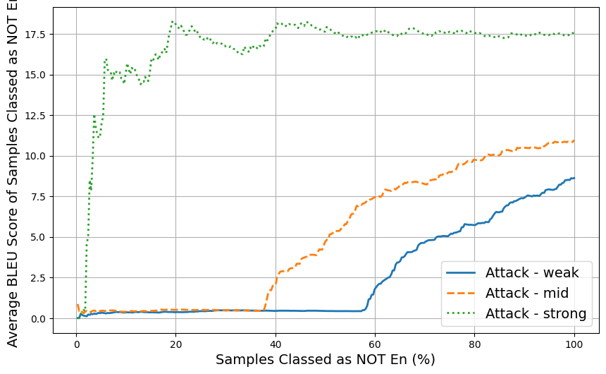
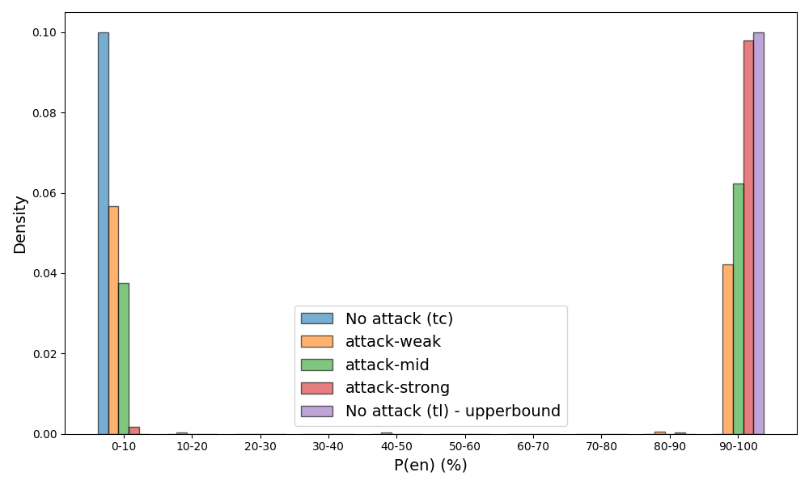
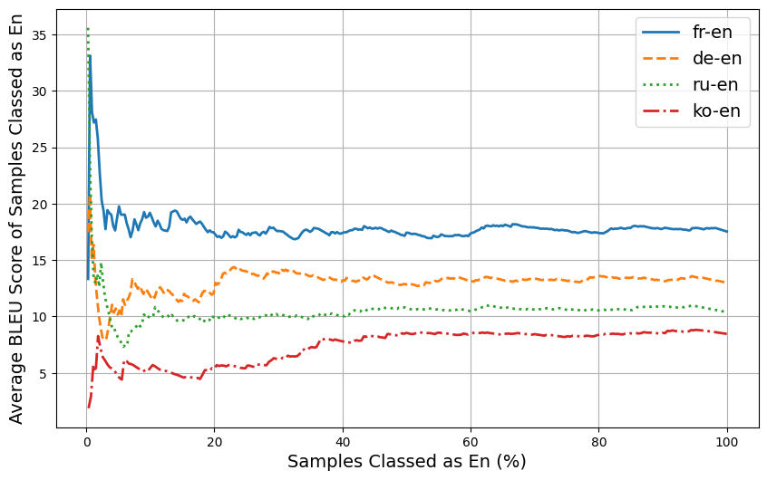
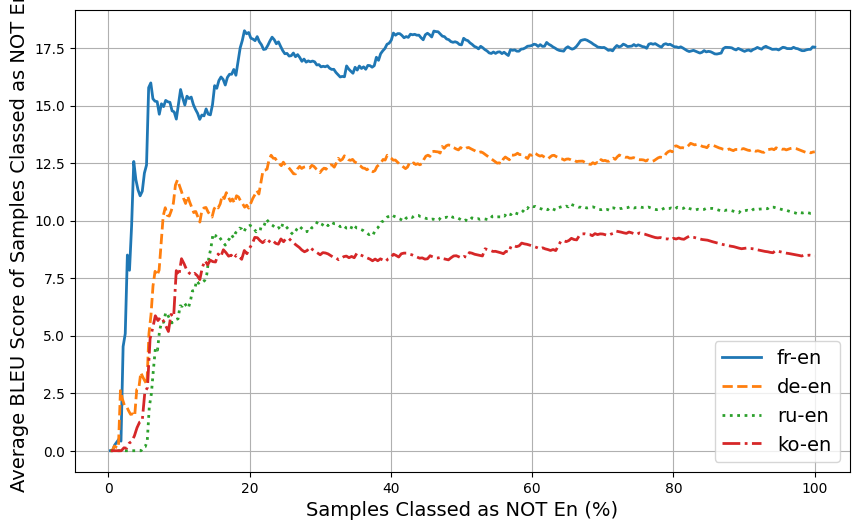

# 操控“耳语”：针对语音基础模型的通用声学对抗策略

发布时间：2024年07月05日

`LLM应用` `语音识别`

> Controlling Whisper: Universal Acoustic Adversarial Attacks to Control Speech Foundation Models

# 摘要

> 语音基础模型，无论是灵活的语音识别系统还是音频提示的大型语言模型（LLM），正日益流行。这些模型的独特之处在于，它们能通过适当提示执行自动语音识别（ASR）之外的任务，如OpenAI的Whisper模型既能转录音频也能翻译语音。随着音频提示LLM的发展，我们有望获得更多控制选项。然而，本研究揭示了这种灵活性可能使系统易受模型控制对抗攻击的影响。即使不接触模型提示，通过调整音频输入，也能改变系统行为。我们通过实验证明，只需在任何语音信号前添加一个短的通用对抗声学段，就能覆盖ASR基础模型的提示设置，例如让Whisper无视设定，始终执行语音翻译。这项研究揭示了多任务语音基础模型面临的新型对抗攻击，提醒我们在部署此类模型前需谨慎考虑。

> Speech enabled foundation models, either in the form of flexible speech recognition based systems or audio-prompted large language models (LLMs), are becoming increasingly popular. One of the interesting aspects of these models is their ability to perform tasks other than automatic speech recognition (ASR) using an appropriate prompt. For example, the OpenAI Whisper model can perform both speech transcription and speech translation. With the development of audio-prompted LLMs there is the potential for even greater control options. In this work we demonstrate that with this greater flexibility the systems can be susceptible to model-control adversarial attacks. Without any access to the model prompt it is possible to modify the behaviour of the system by appropriately changing the audio input. To illustrate this risk, we demonstrate that it is possible to prepend a short universal adversarial acoustic segment to any input speech signal to override the prompt setting of an ASR foundation model. Specifically, we successfully use a universal adversarial acoustic segment to control Whisper to always perform speech translation, despite being set to perform speech transcription. Overall, this work demonstrates a new form of adversarial attack on multi-tasking speech enabled foundation models that needs to be considered prior to the deployment of this form of model.

[Arxiv](https://arxiv.org/abs/2407.04482)