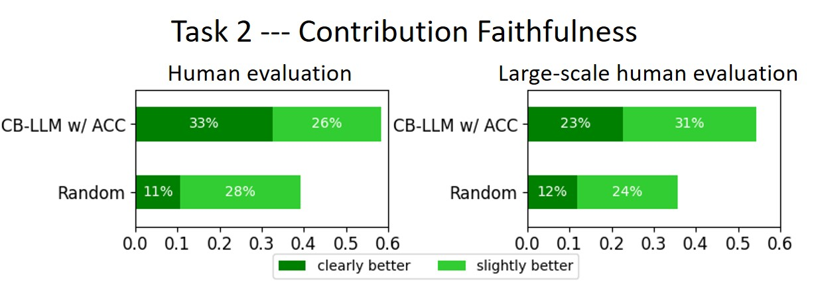

# 构建提升可解释性的大型语言模型

发布时间：2024年07月05日

`LLM理论` `人工智能` `语言模型`

> Crafting Large Language Models for Enhanced Interpretability

# 摘要

> 我们推出的 CB-LLM，是一种革命性的 LLM 构建方法，它不仅具备内在的可解释性，还能提供清晰、准确的解释。与那些依赖后验解释的传统黑箱模型相比，CB-LLM 以其内置的可解释性和可扩展性，为语言模型领域树立了新标杆。通过独特的自动概念校正策略，CB-LLM 成功缩小了与传统模型的性能差距，使其在保持高准确性的同时，还拥有了传统模型所缺乏的清晰可解释性。这一创新不仅提升了模型的透明度，更增强了其在实际应用中的有效性。

> We introduce the Concept Bottleneck Large Language Model (CB-LLM), a pioneering approach to creating inherently interpretable Large Language Models (LLMs). Unlike traditional black-box LLMs that rely on post-hoc interpretation methods with limited neuron function insights, CB-LLM sets a new standard with its built-in interpretability, scalability, and ability to provide clear, accurate explanations. This innovation not only advances transparency in language models but also enhances their effectiveness. Our unique Automatic Concept Correction (ACC) strategy successfully narrows the performance gap with conventional black-box LLMs, positioning CB-LLM as a model that combines the high accuracy of traditional LLMs with the added benefit of clear interpretability -- a feature markedly absent in existing LLMs.

[Arxiv](https://arxiv.org/abs/2407.04307)